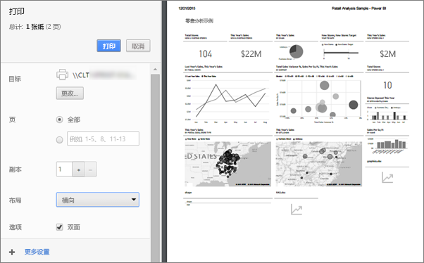

# 从 Power BI 服务打印
从 Power BI 服务打印整个仪表板、 仪表板磁贴、 报表页或报表视觉对象。 一次只能打印一页报表，而不能一次打印整个报表。

   > [!NOTE]
   > 你看到的打印对话框将取决于所使用的浏览器。
   > 
## 打印仪表板
1. 打开你想要打印的仪表板。
2. 在左上角，选择导出并选择**打印此页**。
   
    
3. 将打开浏览器的“打印”窗口。 选择设置和打印目标，然后选择“打印”  。
   

   
    

## 打印仪表板磁贴
1. 打开中的仪表板[全屏幕模式下](end-user-focus.md)通过选择全屏图标上部菜单栏中。
3. [在焦点模式下打开磁贴](end-user-focus.md)通过将鼠标悬停以显示省略号 （...），然后选择**在焦点模式下打开**或焦点图标。
   
    
4. 将鼠标悬停在该磁贴以显示“选项”菜单。
   
    
4. 选择“打印”图标 。     
   

## 打印报表页
报表可以一次打印一个页面。

1. 打开报表并选择**导出** > **打印**打印当前报表页。
   
    
3. 将打开浏览器的“打印”窗口。
   

## 打印报表视觉对象
1. 通过将鼠标悬停在磁贴上方并选择右上角的“焦点”图标 ，[在焦点模式下打开视觉对象](end-user-focus.md)。

2. 从左上角，选择**导出** > **打印**打印视觉对象。

    

## 注意事项和疑难解答

* 问：一次无法打印所有报表页。    
* 答：这是正确的。 一次只能打印一页报表页。
* 问：无法打印为 PDF。    
* 答：只有已在你的浏览器中配置 PDF 驱动程序时，才会看到此选项。    
* 问：选择“打印”  时所显示的内容与此处显示的内容不匹配。    
* 答：打印屏幕因浏览器和软件的版本而有所不同。
* 问：打印输出缩放不正确。  仪表板不适合页面。 其他缩放比例和方向的问题。    
* 答：我们无法保证，打印的副本将是完全相同的 Power BI 服务中所示。 类似缩放、边距、视觉对象详细信息、方向和大小等不受 Power BI 控制。 有关此类问题的帮助，请参阅你的特定浏览器文档。      

## 后续步骤
[与同事和其他人共享仪表板和报表](../service-share-dashboards.md)

更多问题？ [尝试参与 Power BI 社区](http://community.powerbi.com/)

