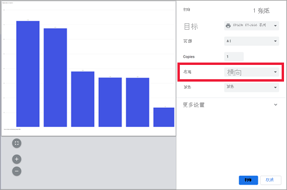
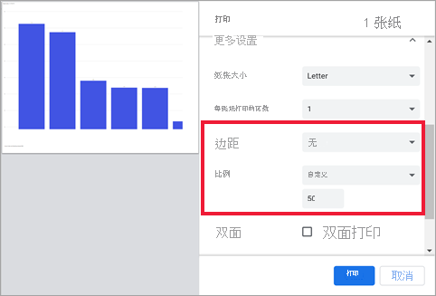
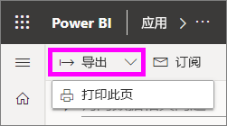
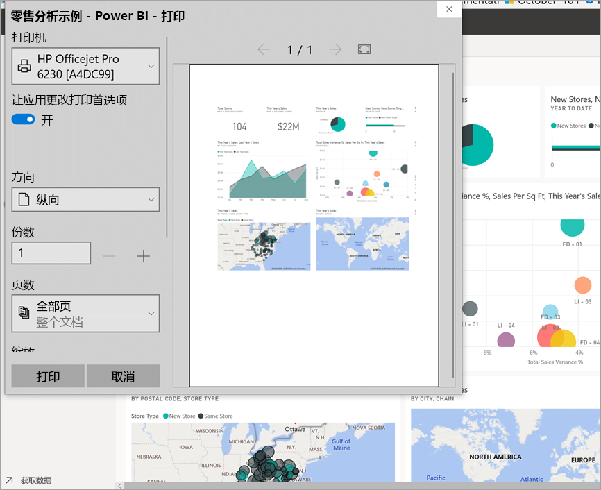
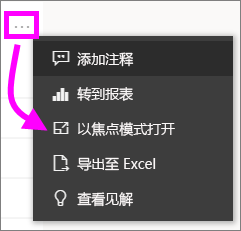
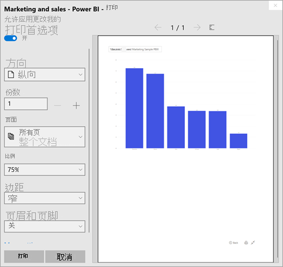
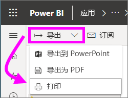

# 使用 Power BI 服务打印

[!INCLUDE[consumer-appliesto-yynn](../includes/consumer-appliesto-yynn.md)]
## 可打印的内容
[!INCLUDE [power-bi-service-new-look-include](../includes/power-bi-service-new-look-include.md)]

使用 Power BI 服务打印整个仪表板、仪表板磁贴、报表页或报表视觉对象。 如果报表有多页，则需要分别打印每一页。 

## 打印注意事项

大多数 Power BI 仪表板和报表都由报表设计者创建，供在线使用，并且在各种设备上显示时看起来都很棒  。 打印报表时，内容在纸张上的显示方式由浏览器控制。 

你可以使用浏览器设置来调整打印输出，但仍可能无法获得所需的结果。 请考虑先[导出为 PDF](end-user-pdf.md)，然后改为打印 PDF。 

## 调整浏览器打印设置
从 Power BI 打印时，浏览器将打开“打印”窗口。 各浏览器的“打印”窗口互不相同。 但是你会发现它们都有类似的选项，可供你用来控制打印输出的外观。 

下面是一些可用于设置打印输出格式的快速提示。

   > 
1. 如果仪表板、报表或视觉对象的宽度大于高度，请考虑使用“横向”布局  。 

   

2. 要更适合打印页面，请调整边距和缩放等。 

    

试验特定浏览器的设置，直到获得所需的外观。 某些浏览器甚至还有打印背景图形的选项。 

## 打印仪表板
1. 打开你想要打印的仪表板。
2. 在左上角，选择“导出”并选择“打印此页”  。
   
    

3. 将打开浏览器的“打印”窗口。 选择设置。 例如，如果仪表板的宽度大于长度，则可能需要将布局更改为“横向”  。 选择“打印”  。
   
    

## 打印仪表板磁贴
1. 通过从上方菜单栏中选择全屏图标 ，以[全屏模式](end-user-focus.md)打开仪表板。

3. 通过将鼠标悬停在其上方以显示“更多选项”(…)，并选择“以焦点模式打开”或焦点图标，从而[以焦点模式打开该磁贴](end-user-focus.md)   。
   
    

4. 将鼠标悬停在该磁贴以显示“选项”菜单。
   
    

4. 选择“打印”图标 。     

5. 将打开浏览器的“打印”窗口。 选择设置。 例如，如果磁贴不在页面上，则可能需要将缩放更改为 75%。 选择“打印”  。

     

> [!TIP]
> 如果已执行了所有这些步骤，但磁贴仍未以所需的方式显示，请尝试以下操作。
> 1. 打开“打印”窗口，更改你认为将获得最佳打印输出的打印设置。 例如，更改布局、边距和缩放。 
> 2. 但请选择“取消”，而不是打印  。 
> 3. 再次完成步骤 1-5。 磁贴将调整为新的“打印”窗口设置，并准备打印。

## 打印报表页
报表可以一次打印一个页面。

1. 打开报表，并选择“导出” > “打印”，打印当前报表页   。
   
    
2. 将打开浏览器的“打印”窗口。

3. 按照上述“打印仪表板”中的打印步骤进行操作  。
   

## 打印报表视觉对象
1. 通过将鼠标悬停在磁贴上方并选择右上角的“焦点”图标 ，[在焦点模式下打开视觉对象](end-user-focus.md)。

2. 在左上角，选择“导出” > “打印”，打印视觉对象   。

    

3. 按照上面“打印仪表板”中的打印步骤进行操作  。

## 注意事项和疑难解答

* 问：一次无法打印所有报表页。    
* 答：这是正确的。 一次只能打印一页报表页。
* 问：无法打印为 PDF。    
* 答：只有已在你的浏览器中配置 PDF 驱动程序时，才会看到此选项。    
* 问：选择“打印”  时所显示的内容与此处显示的内容不匹配。    
* 答：打印屏幕因浏览器和软件的版本而有所不同。
* 问：打印输出缩放不正确。  仪表板不适合页面。 其他缩放比例和方向的问题。    
* 答：我们无法保证打印的副本与 Power BI 服务中所显示的效果完全相同。 类似缩放、边距、视觉对象详细信息、方向和大小等不受 Power BI 控制。 尝试调整浏览器的打印设置。 上面建议的部分方法是页面方向（纵向或横向）、边距大小和缩放。 如果这些方法没有帮助，请参阅特定浏览器的文档。      
* 问：当我从全屏模式打印时，鼠标悬停在视觉对象上时，看不到打印选项。   
* 答：返回到仪表板或报表的默认视图，在焦点模式下重新打开视觉对象，然后重新打开全屏模式。 

## 后续步骤
[与同事和其他人共享仪表板和报表](../collaborate-share/service-share-dashboards.md)

更多问题？ [尝试参与 Power BI 社区](https://community.powerbi.com/)
