# 面向 Power BI 商务用户的问答

[!INCLUDE[consumer-appliesto-yyny](../includes/consumer-appliesto-yyny.md)]

[!INCLUDE [power-bi-service-new-look-include](../includes/power-bi-service-new-look-include.md)]

## “问答”是什么？
有时从你的数据中获得答案的最快方法是使用自然语言提问。 例如，“去年的销售总额是多少”。

使用“问答”来利用直观、自然的语言功能浏览数据并接收图表和图形形式的答案。 “问答”与搜索引擎不同 --“问答”仅提供有关 Power BI 中的数据的结果。

## 问答使用哪些可视化效果？
问答会根据要显示的数据选取最佳的可视化效果。 有时，可将基础数据集中的数据定义为特定类型或类别，以帮助 Q&A 识别如何显示数据。 例如，如果数据被定义为日期类型，则该数据很有可能显示为线图。 如果将数据分类为城市，则很有可能显示为地图。

还可以将视觉对象添加到问题中，指示问答要使用哪个视觉对象。 但请注意，问答并非总能显示你请求使用的视觉对象类型中的数据。 问答会提示你提供可显示的视觉对象类型列表。

## 在哪里可以使用问答？
问答位于 Power BI 服务中的仪表板上，以及 Power BI 移动版的仪表板底部。 只有在设计者授予编辑权限后，才能使用 Power BI 问答浏览数据，但无法保存通过 Power BI 问答创建的任何可视化效果。

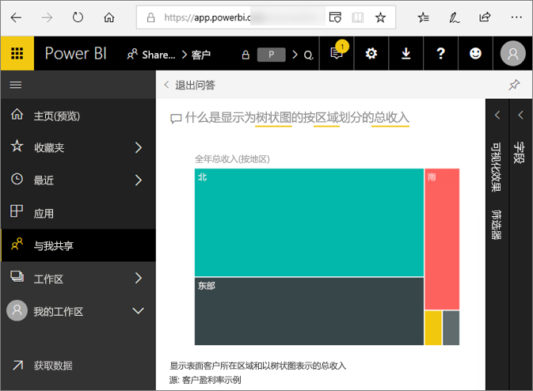

如果报表设计者增加了一个 [Q&A 视觉对象](../visuals/power-bi-visualization-q-and-a.md)，你也会发现报表上的 Q&A  。   

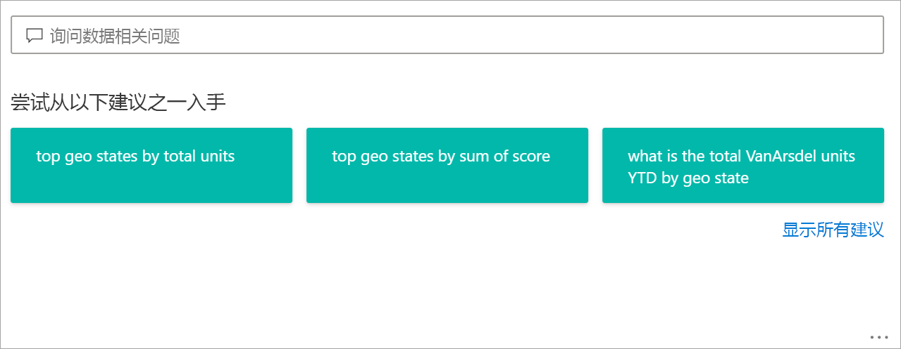

## 仪表板上的 Q&A

使用专业版或高级版许可证可访问“Power BI 问答”  。  [Power BI 移动应用中的问答](mobile/mobile-apps-ios-qna.md)和 [Power BI Embedded 中的问答](../developer/embedded/qanda.md)通过单独的文章进行了介绍。 目前，Power BI 问答  只支持回答用英语询问的自然语言查询，尽管有西班牙语预览版问答可供 Power BI 管理员启用。

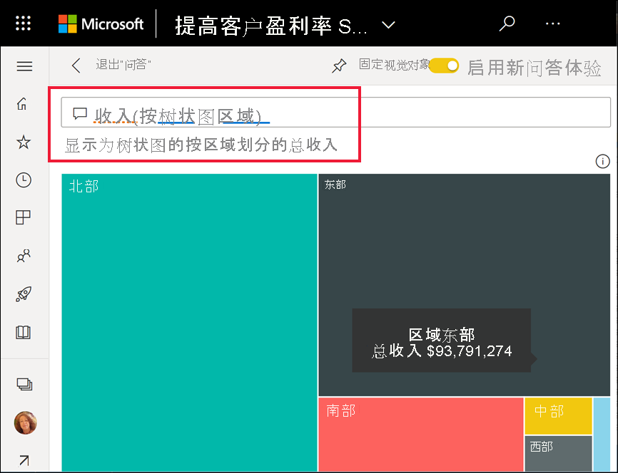

提问仅仅是个开始。  在完善数据或扩展问题、发现可信的新信息、专注细节以及缩小以获得更宽广的视野的过程中找到乐趣吧。 你会为自己的见解和发现而感到高兴。

体验是真正的交互式…并且快速！ 由内存存储提供支持，响应几乎瞬时完成。

## 在 Power BI 服务中的仪表板上使用问答
在 Power BI 服务 (app.powerbi.com) 中，由于仪表板包含从一个或多个数据集固定的磁贴，因此可以就其中任一数据集中的任何数据提问。 要查看曾用于创建仪表板的报表和数据集，请选择“更多操作”下拉菜单栏中的“查看相关项”。

## 如何开始使用该功能？
首先，熟悉内容。 查看仪表板和报表中的视觉对象。 了解可用的数据类型和范围。 

例如：

* 如果视觉对象的坐标轴标签和值包括“销售额”、“帐户”、“月份”和“商机”，你可以有把握地提出以下问题：“哪个帐户  的商机  最大”或“以条形图的形式按月显示销售额  ”。

* 如果可以通过 Google Analytics（Google 分析）获取网站性能数据，则可以向“问答”提出关于花在网页上的时间、独特网页访问数以及用户参与度方面的问题。 或者，若要查询人口统计数据，可以按位置就年龄和家庭收入提问。

熟悉数据后，立即返回到仪表板，并将光标放在问题框中。 这会打开问答屏幕。

 

在开始键入前，“问答”会显示新的屏幕，上面有帮助你提问的一些建议。 你会看到，包含基础数据集中表名称的短语和问题，甚至还会看到由数据集所有者创建的特别推荐  问题。

可以选择其中任一问题，将其添加到问题框中，然后优化问题，以找到具体答案。 

 

Power BI 帮助你提问的另一种方式是通过提示、自动完成和视觉提示等功能。Power BI 为仪表板上的问答以及问答视觉对象提供此帮助。 我们将在下面的“[通过键入自然语言查询创建问答视觉对象](#create-a-visual-using-your-own-qa-question)”部分详细介绍这些功能

## Power BI 报表中的问答视觉对象

使用 Q&A 视觉对象，你可以提出自然语言问题并以视觉对象的形式获得答案。 问答视觉对象与报表中的其他视觉对像一样，可以进行交叉筛选/交叉突出显示，并且支持书签和评论。 

你可通过顶部的问题框来识别一个 Q&A 视觉对象。 可以使用自然语言输入或键入问题。 可以反复使用 Q&A 视觉对象来询问有关数据的问题。 离开报表后，Q&A 会将视觉对象重置为其默认值。 

## 使用问答 
要使用仪表板上的问答或使用报表中的问答视觉对象，请选择其中一个建议的问题或键入自己的自然语言问题。 

### 使用建议问题创建视觉对象

此处，我们已经根据总单位数选择了排名靠前的地理位置  。 Power BI 会尽量选择要使用的视觉对象类型。 本例选择的是一个基本图。

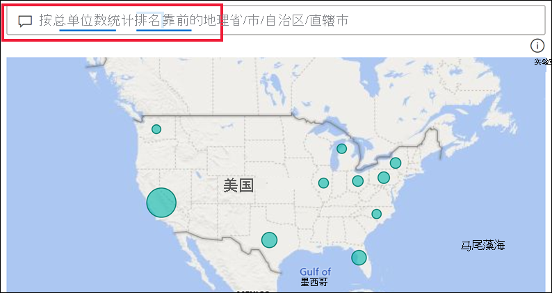

但你可通过将 Power BI 添加到自然语言查询中来告知 Power BI 使用哪种视觉对象类型。 请记住，并非所有视觉对象类型都能对数据起作用或有意义。 例如，该数据不会产生有意义的散点图。 但它可以用作着色地图。

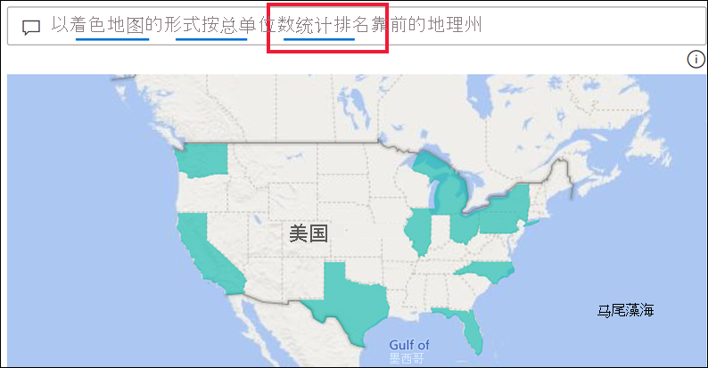

如果不确定要使用哪种类型的问题或术语，请展开“显示所有建议”或查看报表中的其他视觉对象****。 这将使你熟悉数据集的术语和内容。

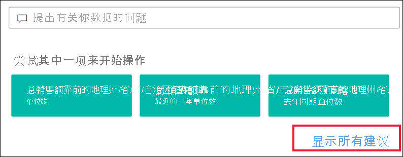

### 使用自己的问答问题创建视觉对象

1. 使用自然语言在“Q&A”字段中键入问题。 键入问题时，Power BI 会帮助你进行自动完成、视觉提示和反馈。

    自动完成**** - 在你键入问题时，Power BI 问答会显示符合语境的相关建议，以帮助你使用自然语言迅速提高工作效率。 键入时，会立即获得反馈和结果。 体验类似于在搜索引擎中键入内容。

    在此示例中，我们需要的建议是最后一个。 

    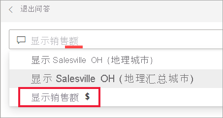

    **实线和虚线下划线** - Power BI 问答显示带下划线的字词，有助于你了解 Power BI 可以识别或无法识别的字词。 

    蓝色实线下划线指示 Power BI 已识别出该单词。 以下示例展示了问答识别出字词“销售事实情绪”和“区域”。

    

    红色双下划线表示 Power BI 根本识别不了的字词。 例如，你使用了“地理”一词，而该词并不存在于数据中。 该词存在于在英文字典中，但问答会用红色下划线标记它。 Power BI 问答无法创建可视化效果，并建议你要求报表设计者添加此术语。  

    

    如果 Power BI 不能确定某个字词，你会看到出现虚线。 选择该字词即可查看建议列表。 例如“位置”一词。 可能有多个字段包含“位置”一词，因此系统会提示你选择所指的字段。  

    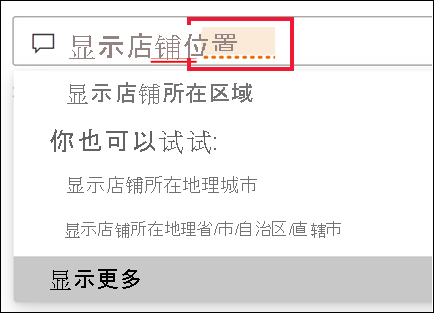

    
    
    由于集成了必应和 Office，Power BI 问答可以识别同义词。 问答会为该字词添下划线，告诉你显示的不是直接匹配项

    

    **建议** - 当你键入更多问题时，Power BI 遇到不理解的问题时会提示你，并尝试提供帮助。 在以下示例中，Power BI 建议为“VanArsdel”识别两个不同的字段。 

    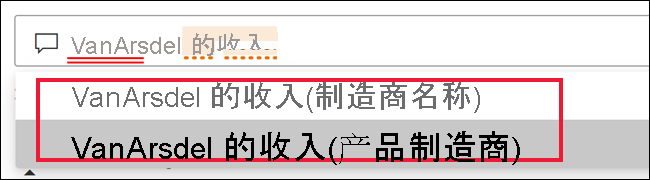

    选择 Power BI 的更正后，请注意，系统会识别所有字词并添加蓝色下划线。 结果显示为折线图。 

    

    不过，也可以将折线图更改为另一种视觉对象类型。  

    

## 注意事项和疑难解答

**问题**：我在仪表板上未看到“问答”。    
**回答 1**：如果你没有看见问题框，首先应检查你的设置。 为此请在 Power BI 工具栏的右上角或者从**更多选项 (...) 下拉菜单选择齿轮图标。   

然后选择“设置” > “仪表板” 。 请确保“在此仪表板上显示问答搜索框”旁有复选标记****。    
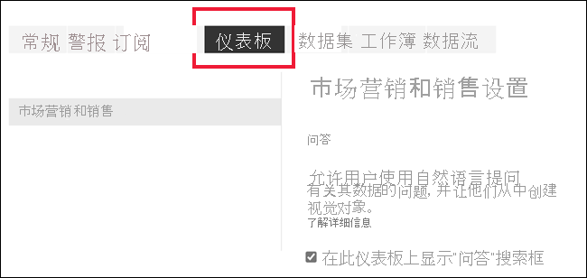  

**回答 2**：有时你将无法访问这些设置。 如果仪表板所有者或管理员关闭了问答，请与他们确认是否可以重新打开。 若要查找所有者，请从顶部菜单栏中选择仪表板的名称。

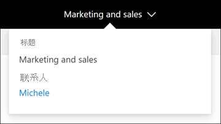    

**问题**：输入问题时未得到希望看到的结果。    
**回答**：选择与报表或仪表板所有者联系的选项。 你可直接在“Q&A”仪表板页或“Q&A”视觉对象中进行此操作。 也可在 Power BI 标头中查找所有者。  所有者可以执行许多操作来改善问答结果。 例如，所有者可以将数据集中的列重命名为易于理解的术语（例如改为 `CustomerFirstName`，而不是 `CustFN`）。 所有者非常了解数据集，因此，他们也会提出有用的问题并将其添加到问答的建议问题中。

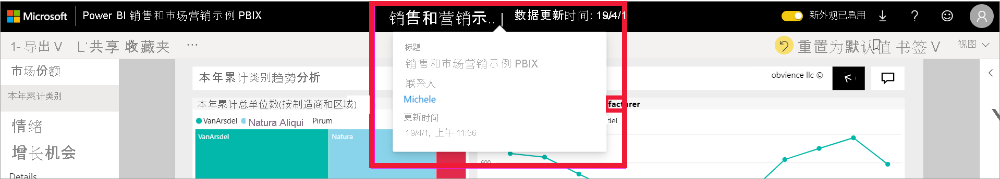

## 隐私

Microsoft 可能会使用你的问题来改进 Power BI。 有关详细信息，请查看 [Microsoft 隐私声明](https://go.microsoft.com/fwlink/?LinkId=521839)。

## 后续步骤
要了解报表设计者是如何创建和管理 Q&A 视觉对象的，请参阅 [Q&A 视觉对象类型](../visuals/power-bi-visualization-q-and-a.md)**。
