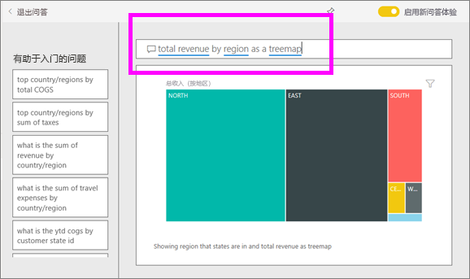
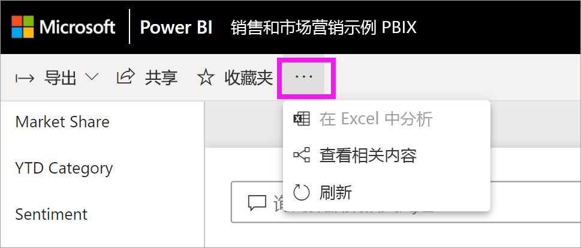
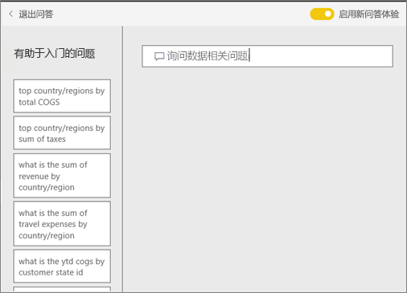
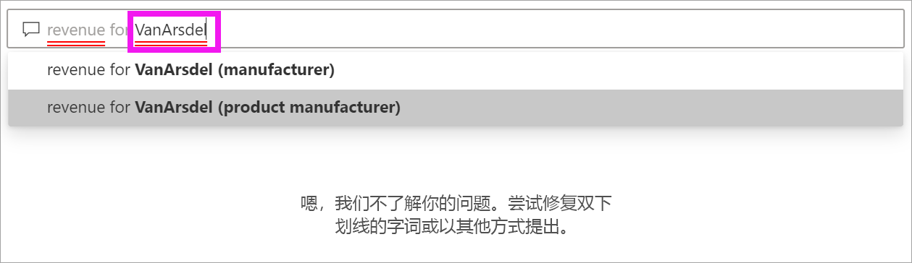
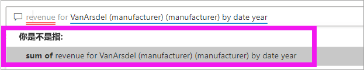
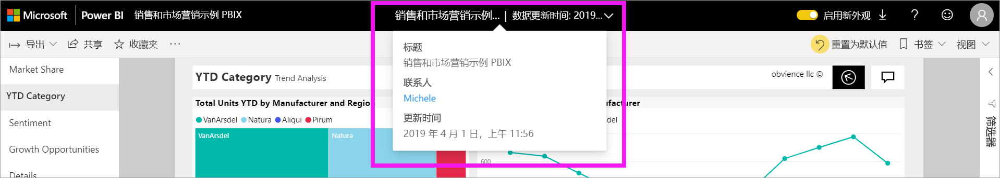

# 面向 Power BI 使用者的问答 

[!INCLUDE [power-bi-service-new-look-include](../includes/power-bi-service-new-look-include.md)]

## “问答”是什么？
有时从你的数据中获得答案的最快方法是使用自然语言提问。 例如，“去年的销售总额是多少”。

使用“问答”来利用直观、自然的语言功能浏览数据并接收图表和图形形式的答案。 “问答”与搜索引擎不同 --“问答”仅提供有关 Power BI 中的数据的结果。

## 问答使用哪些可视化效果？
问答会根据要显示的数据选取最佳的可视化效果。 有时，可将基础数据集中的数据定义为特定类型或类别，以帮助 Q&A 识别如何显示数据。 例如，如果数据被定义为日期类型，则该数据很有可能显示为线图。 如果将数据分类为城市，则很有可能显示为地图。

还可以将视觉对象添加到问题中，指示问答要使用哪个视觉对象。 但请注意，问答并非总能显示你请求使用的视觉对象类型中的数据。 问答会提示你提供可显示的视觉对象类型列表。

## 在哪里可以使用问答？
问答位于 Power BI 服务中的仪表板上，以及 Power BI 移动版的仪表板底部。 只有在设计者授予编辑权限后，才能使用 Power BI 问答浏览数据，但无法保存通过 Power BI 问答创建的任何可视化效果。

如果报表设计者增加了一个 [Q&A 视觉对象](../visuals/power-bi-visualization-q-and-a.md)，你也会发现报表上的 Q&A  。   

## 仪表板上的 Q&A

使用专业版或高级版许可证可访问“Power BI 问答”  。  [Power BI 移动应用中的问答](mobile/mobile-apps-ios-qna.md)和 [Power BI Embedded 中的问答](../developer/qanda.md)通过单独的文章进行了介绍。 目前，Power BI 问答  只支持回答用英语询问的自然语言查询，尽管有西班牙语预览版问答可供 Power BI 管理员启用。

提问仅仅是个开始。  在完善数据或扩展问题、发现可信的新信息、专注细节以及缩小以获得更宽广的视野的过程中找到乐趣吧。 你将会满意你的见解和发现。

体验是真正的交互式…并且快速！ 由内存存储提供支持，响应几乎瞬时完成。

## 在 Power BI 服务中的仪表板上使用问答
在 Power BI 服务 (app.powerbi.com) 中，由于仪表板包含从一个或多个数据集固定的磁贴，因此可以就其中任一数据集中的任何数据提问。 要查看用于创建仪表板的报表和数据集，请选择下拉菜单栏中“更多操作”中的“查看相关项”   。

## 如何开始使用该功能？
首先，熟悉内容。 查看仪表板和报表中的视觉对象。 了解可用的数据类型和范围。 

例如：

* 如果视觉对象的坐标轴标签和值包括“销售额”、“帐户”、“月份”和“商机”，你可以有把握地提出以下问题：“哪个帐户  的商机  最大”或“以条形图的形式按月显示销售额  ”。

* 如果可以通过 Google Analytics（Google 分析）获取网站性能数据，则可以向“问答”提出关于花在网页上的时间、独特网页访问数以及用户参与度方面的问题。 如果你要查询地理数据，则可以按位置就年龄和家庭收入提问。

熟悉数据后，立即返回到仪表板，并将光标放在问题框中。 这会打开问答屏幕。

 

在开始键入前，“问答”会显示新的屏幕，上面有帮助你提问的一些建议。 你会看到，包含基础数据集中表名称的短语和问题，甚至还会看到由数据集所有者创建的特别推荐  问题。

可以选择其中任一问题，将其添加到问题框中，然后优化问题，以找到具体答案。 

Q&A 帮助你提问的另一种方式是通过提示、自动完成和视觉提示。 

<!--  -->

## Q&A 视觉对象

使用 Q&A 视觉对象，你可以提出自然语言问题并以视觉对象的形式获得答案。 Q&A 视觉对象与其他视觉对像一样，可以进行交叉筛选/交叉突出显示，并且支持书签和评论。 

你可通过顶部的问题框来识别一个 Q&A 视觉对象。 可以使用自然语言输入或键入问题。 可以反复使用 Q&A 视觉对象来询问有关数据的问题。 离开报表后，Q&A 会将视觉对象重置为其默认值。 

## 使用 Q&A 视觉对象
要使用 Q&A 视觉对象，请选择其中一个建议的问题或键入自己的自然语言问题。 

### 使用建议的问题创建 Q&A 视觉对象

此处，我们已经根据总单位数选择了排名靠前的地理位置  。 Power BI 会尽量选择要使用的视觉对象类型。 在本例中，选择的是地图。

但你可通过将 Power BI 添加到自然语言查询中来告知 Power BI 使用哪种视觉对象类型。 请记住，并非所有视觉对象类型都能对数据起作用或有意义。 例如，该数据不会产生有意义的散点图。 但它可以用作着色地图。

### 通过键入自然语言查询来创建 Q&A 视觉对象

如果不确定要使用哪种类型的问题或术语，请展开“显示所有建议”或查看报表中的其他视觉对象  。 这将使你熟悉数据集的术语和内容。

1. 使用自然语言在“Q&A”字段中键入问题。 键入问题时，Power BI 会帮助你进行自动完成、建议和反馈。

    - 红色下划线用于标出 Power BI 无法识别的字词。 Power BI 将尽可能帮助你定义这些字词。 如果看到正确的定义，请从下拉列表中选择它。  

        

    - 如果没有任何定义是正确的，请尝试另一个术语或选择带红色下划线的字词，以要求报表所有者添加该字词。

        

    - 当你键入更多问题时，Power BI 遇到不理解的问题时会提示你，并尝试提供帮助。 在下面的示例中，Power BI 问“你是否指…”，并提出了一种使用数据集中术语表达问题的方法。 

        

2. 选择 Power BI 更正后，结果将显示为折线图。 

    

3. 不过，也可以将折线图更改为另一种视觉对象类型。  

    

## 注意事项和疑难解答

**问题**：我在仪表板上未看到“问答”。    
**回答 1**：如果你没有看见问题框，首先应检查你的设置。 为此请在 Power BI 工具栏的右上角选择齿轮图标。   

然后选择“设置” > “仪表板”   。 请确保“在此仪表板上显示问答搜索框”旁有复选标记  。    
  

**回答 2**：有时你将无法访问这些设置。 如果仪表板设计者或管理员关闭了 Q&A，请与他们确认是否可以重新打开  。   

**问题**：输入问题时未得到希望看到的结果。    
**回答**：选择与报表或仪表板所有者联系的选项。 你可直接在“Q&A”仪表板页或“Q&A”视觉对象中进行此操作。 也可在 Power BI 标头中查找所有者。  设计者可以执行许多操作来改善问答结果。 例如，设计者可以将数据集中的列重命名为易于理解的术语（`CustomerFirstName`而不是 `CustFN`）。 设计者非常了解数据集，因此，他也可以提出有用的问题并将其添加到 Q&A 建议的问题中。

## 后续步骤
要了解报表设计者是如何创建和管理 Q&A 视觉对象的，请参阅 [Q&A 视觉对象类型](../visuals/power-bi-visualization-q-and-a.md)  。
