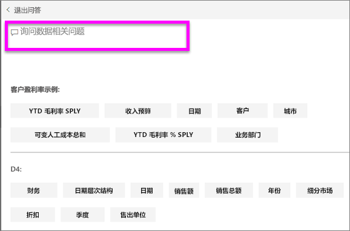
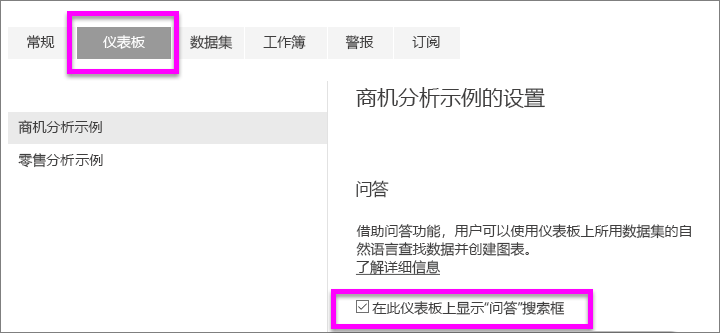

# 面向 Power BI 使用者的问答
## “问答”是什么？
有时从你的数据中获得答案的最快方法是使用自然语言提问。 例如，“去年的销售总额是多少”。  
使用“问答”来利用直观、自然的语言功能浏览数据并接收图表和图形形式的答案。 “问答”与搜索引擎不同 --“问答”仅提供有关 Power BI 中的数据的结果。

Power BI 问答仅支持回答用英文提问的自然语言查询。 可通过 Power BI 管理员启用西班牙语预览版。

使用专业版或高级版许可证可访问“Power BI 问答”。 
>

提问仅仅是个开始。  在完善数据或扩展问题、发现可信的新信息、专注细节以及缩小以获得更宽广的视野的过程中找到乐趣吧。 你将会满意你的见解和发现。

体验是真正的交互式…并且快速！ 由内存存储提供支持，响应几乎瞬时完成。

## 在哪里可以使用问答？
“问答”位于 Power BI 服务中的仪表板上、Power BI 移动版的仪表板底部以及 Power BI Embedded 中的可视化效果上方。 只有在设计者授予编辑权限后，才能使用 Power BI 问答浏览数据，但无法保存通过 Power BI 问答创建的任何可视化效果。

## 问答如何知道怎样回答问题？
“问答”在与仪表板关联的所有数据集中查找答案。 如果数据集在仪表板上有一个磁贴，“问答”将在该数据集中查找答案。 

## 如何开始使用该功能？
首先，熟悉内容。 查看仪表板和报表中的可视化效果。 了解可用的数据类型和范围。 然后返回仪表板并将光标放在问题框中。 这会打开问答屏幕。

 

* 如果可视化效果的轴标签和值包括“销售额”、“帐户”、“月份”和“商机”，则可以有把握地提出以下问题：“哪个帐户的商机最大”或“以条形图的形式按月显示销售额”。

* 如果可以通过 Google Analytics（Google 分析）获取网站性能数据，则可以向“问答”提出关于花在网页上的时间、独特网页访问数以及用户参与度方面的问题。 如果你要查询地理数据，则可以按位置就年龄和家庭收入提问。

在屏幕的底部，将看到其他有用的项目。 对于每个数据集，问答都会显示关键字，有时甚至会显示一些示例或建议的问题。 选择其中任何一个，将其添加到问题框。 

问答帮助你提问的另一种方式是通过提示、自动完成和视觉提示。 

 

### 问答使用哪些可视化效果？
问答会根据要显示的数据选取最佳的可视化效果。 有时，可将基础数据集中的数据定义为特定类型或类别，以帮助问答识别如何显示数据。 例如，如果数据被定义为日期类型，则该数据很有可能显示为线图。 如果将数据分类为城市，则很有可能显示为地图。

通过将可视化效果添加到你的问题，还可以告知“问答”要使用哪个可视化效果。 但请记住，“问答”并非总能显示你请求的可视化效果类型中的数据。 问答提供一个可行的可视化类型列表，给你提示。

## 注意事项和疑难解答
**问题**：我在仪表板上未看到“问答”。    
**回答 1**：如果你没有看见问题框，首先应检查你的设置。 为此请在 Power BI 工具栏的右上角选择齿轮图标。   

然后选择“设置” > “仪表板”。 请确保“在此仪表板上显示问答搜索框”旁有复选标记。
  

**回答 2**：有时仪表板设计者或你的管理员关闭了问答。 与他们核实，了解是否可以重新打开问答。   

**问题**：输入问题时未得到希望看到的结果。    
**回答**：与仪表板设计者沟通。 设计者可以执行许多操作来改善问答结果。 例如，设计者可以将数据集中的列重命名为易于理解的术语（`CustomerFirstName`而不是 `CustFN`）。 设计者非常了解数据集，因此，他也可以提出有用的问题并将其添加到问答画布中。

## 后续步骤

