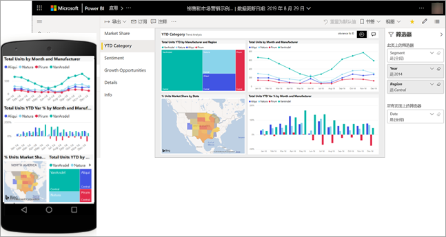
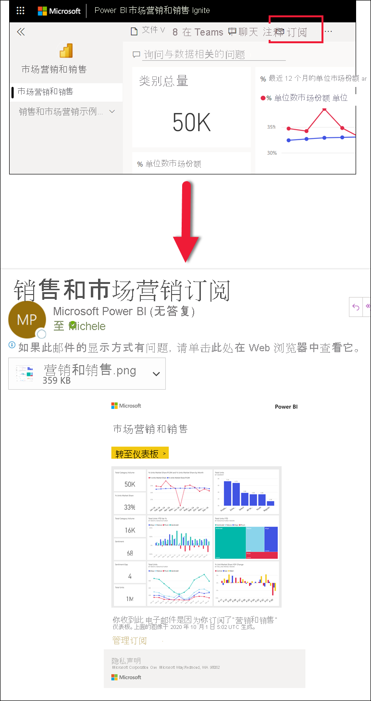
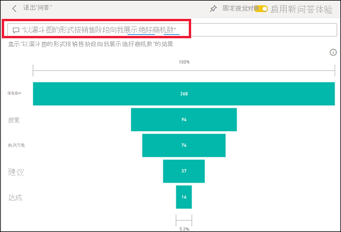
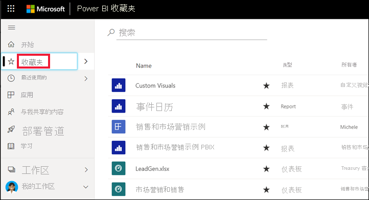
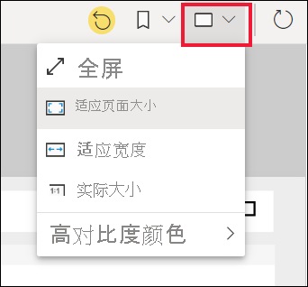
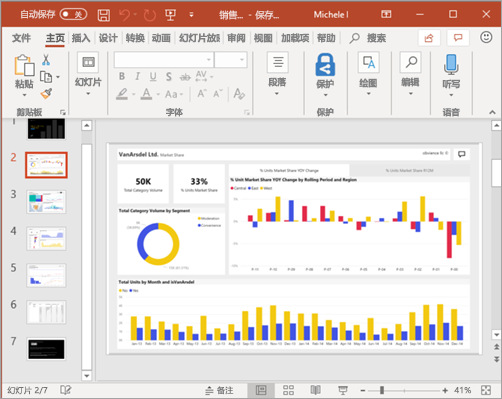

# 快速入门：了解面向商务用户的 Power BI 功能

[!INCLUDE[consumer-appliesto-ynny](../includes/consumer-appliesto-ynny.md)]

本快速入门将介绍如何与 Power BI 交互，以发现数据驱动业务见解。 本文并不打算深入探讨，只是快速概述了 Power BI 商务用户可以执行的许多操作。

如果未注册 Power BI，请[免费注册](https://app.powerbi.com/signupredirect?pbi_source=web)后再进行操作。

## 什么是 Power BI？ 
Power BI 是软件服务、应用和连接器的集合，它们协同工作以将相关数据来源转换为连贯的视觉逼真的交互式见解。 无论你的数据是简单的 Excel 电子表格，还是来自不同数据源的数据集合，使用 Power BI 都可以轻松地连接到数据源，直观看到（或发现）重要内容，并与选定的任何人共享。 

在浏览器或移动设备上，打开 Power BI 服务。 你和你的同事即可通过同一受信任的应用、仪表板和报表工作，它们可以自动更新和刷新，因此使用的内容始终都是最新的。   

## 阅读视图
与 Power BI 服务中的报表进行交互的模式有两种：编辑视图和阅读视图。  如果你是商务用户，则更有可能使用阅读视图来使用其他人创建的报表。 编辑视图由报表设计者使用，他们创建报表，并与你共享报表。 阅读视图是你浏览同事创建的报表并与之交互的方式。 

即使在阅读视图中，内容也不是静态的。 你可以深入挖掘来获取趋势、见解和其他商业智能。 切分内容并对内容进行切片，甚至使用自己的话语向其提问。 或者，不采取任何操作，让数据发现你感兴趣的见解、在数据更改时向你发送警报并按所设置的计划向你发送电子邮件。 任何时间、任何设备、云中或本地的所有数据。 

请继续阅读下文，了解更多这些功能。

## Power BI 内容
当我们在 Power BI 中使用“内容”这一术语时，我们指的是报表、仪表板和应用。 这些是你将用于探索数据并做出业务决策的构建块。 

> [!NOTE]
> 在移动设备上也可以查看和共享仪表板、报表和应用。

###  应用

应用是一种将相关仪表板和报表组合在一个地方的 Power BI 内容类型。 应用可以将一个或多个仪表板和一个或多个报表捆绑在一起。 应用是由 Power BI 设计者创建的，他们将应用分发和共享给像你一样的商务用户。 

查看应用的一种方法是从导航窗格中选择“应用”，然后选择要打开的应用。

若要详细了解如何查看应用，请参阅 [Power BI 应用](end-user-apps.md)

### 报表

Power BI 报表是对数据集的多角度审视，它使用视觉对象来表示数据集呈现的各种结果和见解。 报表可包含单个视觉对象，也可包含充满视觉对象的多个页面。 报表是由 Power BI 设计者创建的，他们将报表分发和共享给像你一样的商务用户。

要了解如何查看报表，请参阅 [Power BI 报告](end-user-reports.md)

### 仪表板

Power BI 仪表板是单个页面，通常称为画布，使用可视化效果来讲述故事。 因为它被限制为一页，精心设计的仪表板仅包含该故事的最重要元素。

仪表板上显示的可视化效果称为“磁贴”，它们被报表设计师固定到仪表板上。 在大多数情况下，选择磁贴后，即可转到创建可视化效果的报表页。 

要了解如何查看仪表板，请参阅 [Power BI 仪表板](end-user-dashboards.md)
 
## Power BI 服务中的交互

### 与同事协作
跳过电子邮件。 在该仪表板上添加个人注释或与同事就仪表板开始对话。 注释功能只是你与他人协作的方式之一。 

详细了解[注释](end-user-comment.md)

### 坐下来休息，让 Power BI 为你工作
Power BI 服务为你提供服务的两种方式是使用订阅和警报。 

#### 订阅仪表板（或报表）
无需打开 Power BI，即可监视仪表板。  可以改为订阅，Power BI 会按照你设置的计划向你发送相应仪表板的快照。 

 了解有关 [Power BI 订阅](end-user-subscribe.md)的详细信息

#### 当数据达到阈值时获取警报
数据是实时的，视觉对象会自动更新以反映这一情况。 如果希望在数据更改高于或低于设置的阈值时收到通知，请使用数据警报。 警报适用于仪表、KPI 和卡片。    

Power BI 会在值增加或减少超过设置的限制时，向你发送电子邮件。  

详细了解 [Power BI 警报](end-user-alerts.md)

### 使用问答功能通过自然语言提问
有时从你的数据中获得答案的最快方法是使用自然语言提问。 问答问题框位于仪表板顶部。 例如，“以漏斗图的形式按销售阶段向我展示绝好商机数。” 

详细了解 [Power BI Q&A](end-user-q-and-a.md)

### 在可视化效果中显示详细信息
视觉对象由数据点组成，通过将鼠标悬停在数据点上，可以查看详细信息。

### 收藏仪表板
在收藏内容后，就能够从[主页](end-user-home.md)和导航窗格中访问它。 在 Power BI 服务中的几乎每个区域都可以看到导航窗格。 收藏的通常是你最常访问的仪表板、报表页和应用。

若要将内容保存为收藏项，请选择 Power BI 服务右上角的星形图标。 
   

若要查看收藏夹，请选择导航窗格中的“收藏夹”。

看看可以使用菜单栏执行的其他操作。  我们不会在本文中介绍所有操作，但会在其他文章中介绍。  使用 Power BI 目录或“搜索”字段了解详细信息。 

详细了解[收藏夹和特色](end-user-favorite.md)

### 调整显示尺寸
可以在许多不同的设备上查看报表，这些设备具有不同的屏幕大小和纵横比。  默认的呈现方式可能并不是你想在设备上看到的方式。  

若要进行调整，请选择右上方菜单栏中的“视图”图标，然后选择其中一个显示选项。 

### 了解页面上的所有视觉对象是如何互连的
交叉突出显示和交叉筛选报表页面上的相关可视化效果。 单个报表页上的可视化效果全部都是相互“连接”的。  也就是说，如果选择一个可视化效果中的一个或多个值，其他使用相同值的可视化效果也会随你的选择一起变化。

> 

详细了解[视觉对象交互](end-user-interactions.md)

<!-- ###  Open the **Selection** pane
Easily navigate between the visualizations on the report page. 

1. Select **View > Selection pane** to open the Selection pane. Toggle **Selection pane** to On.

    

2. The Selection pane opens on your report canvas. Select a visual from the list to make it active.

     -->

### 放大单个视觉对象
将鼠标悬停在视觉对象上并选择“焦点模式”图标。 在焦点模式下查看可视化效果时，它将展开以填充整个报表画布，如下所示。

若要显示相同的可视化效果而不受菜单栏、“筛选器”窗格和其他部件版式的干扰，请从“视图”下拉列表中选择“全屏”。   

详细了解[焦点模式和全屏模式](end-user-focus.md)

### 对可视化效果进行排序
可以对报表页上的视觉对象进行排序，并将视觉对象与应用的更改一起保存。 

将鼠标悬停在视觉对象上使其处于活动状态，并选择“更多选项”(…) 以打开排序选项。

 

详细了解[对视觉对象进行排序](end-user-search-sort.md)

### 显示用于创建可视化效果的数据
Power BI 可视化效果是使用基础数据集中的数据构造而成。 如果你对幕后感兴趣，可以使用 Power BI *显示* 用于创建视觉对象的数据。 在你选择“以表的形式显示”后，Power BI 在可视化效果的下面（或旁边）显示数据。

在视觉对象处于活动状态下，依次选择“更多选项”(…) 和“以表的形式显示”。
   
   

### 将数据导出到 Excel
除了显示用于创建视觉对象的数据之外，还可以导出该数据并在 Microsoft Excel 中查看该数据。 导出到 Excel 时，需要创建一个单独的文档，一个不属于 Power BI 的电子表格。 在 Excel 文件中所做的任何更改都不会影响 Power BI 中的数据。 无论你是要详细查看数据，还是想在其他应用程序中或出于其他目的使用数据，借助 Power BI 你都可以灵活应对。

<!-- Exporting isn't limited to individual visuals; you can export entire reports to PowerPoint or PDF to share with your colleagues.

 -->

本文只是对商务用户可以使用 Power BI 服务执行的一些操作的快速概述。  

## 清理资源
- 如果已连接到应用，请从导航窗格中选择“应用”，以打开“应用内容”列表。 将鼠标悬停在要删除的应用之上，再选择“垃圾桶”图标。

- 如果已导入或连接到 Power BI 示例报表，请通过导航窗格打开“我的工作区”。 使用顶部的选项卡找到仪表板、报表和数据集，再选择每一项的“垃圾桶”图标。

## 后续步骤
[适用于业务用户的 Power BI](end-user-consumer.md)

