<!-- once the sample apps are live, change this so consumers can follow along -->
# 快速入门：了解面向使用者的 Power BI 功能
本快速入门将介绍如何与 Power BI 交互，以发现数据驱动业务见解。 本文未做深入探讨，只是快速概述了 Power BI 使用者可执行的许多操作。

如果未注册 Power BI，请[免费注册](https://app.powerbi.com/signupredirect?pbi_source=web)后再进行操作。

## 先决条件
- Power BI 服务 (app.powerbi.com)
<!-- app from AppSource -->

## 阅读视图
Power BI 服务向报表使用者提供了阅读视图。 借助阅读视图，可浏览同事与你共享的报表，并与之交互。 

Power BI 服务中的另一种报表模式是，向报表设计者提供的[编辑视图](../service-interact-with-a-report-in-editing-view.md)。  

阅读视图是强大且安全的仪表板和报表浏览方式。 当你对别人与你共享的仪表板和报表进行切片和切块时，基础数据集保持不变，不会发生任何变化。 

在阅读视图中，可以对页面上的视觉对象执行交叉突出显示和交叉筛选等操作。  只要突出显示或在视觉对象中选择一个值，就会立即看到其对其他视觉对象的影响。 使用“筛选器”窗格添加和修改报表页中的筛选器，并更改值在可视化效果中的排序方式。 这些只是 Power BI 中面向使用者的功能中的一小部分。  请继续阅读下文，了解更多这些功能。

 
### 查看应用
在 Power BI 中，应用将相关仪表板和报表汇总到一处。

1. 依次选择“应用” > “获取应用”。 
   
     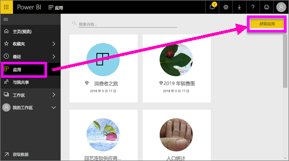
2. 在 AppSource 的“我的组织”下，可以进行搜索以缩小结果范围，并查找所需的应用。
   
     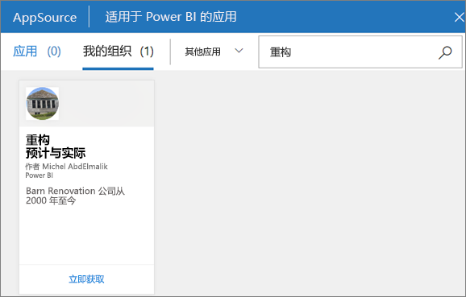
3. 选择“立即获取”，将它添加到应用容器中。 

### 查看仪表板
此应用打开的是仪表板。 Power BI ***仪表板***是单个页面，通常称为画布，使用可视化效果来讲述故事。 因为它被限制为一页，精心设计的仪表板仅包含该故事的最重要元素。

你在仪表板上看到的可视化效果称为磁贴，并且固定到报表中的仪表板。

### 订阅仪表板（或报表）
无需打开 Power BI，即可监视仪表板。  可以改为订阅，Power BI 会按照你设置的计划向你发送相应仪表板的快照。 

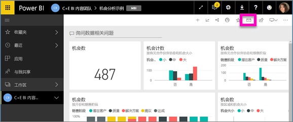。

1. 在顶部菜单栏中，选择“订阅”或信封图标 。
   
   

3. 使用黄色滑块可启用和禁用订阅。  填写电子邮件详细信息（可选）。 

    在以下屏幕截图中，请注意订阅报表实际上订阅的是报表页。  要订阅报表中的多个页，请选择“添加其他订阅”并选择另一页。 
      
   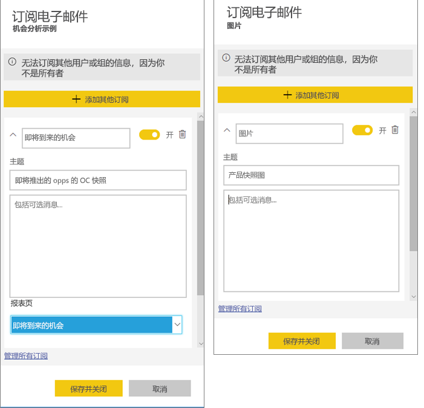
   
    刷新报表页不会刷新数据集。 只有数据集所有者能够手动刷新数据集。 要查找基础数据集的名称，请从顶部菜单栏中选择“查看相关”。

### 查看相关内容
“相关内容”窗格显示了 Power BI 服务内容（仪表板、报表和数据集）的互连方式。 在此窗格中，不仅可以查看相关内容，还可以对内容执行操作，并轻松地在相关内容之间进行导航。

在仪表板或报表中，选择顶部菜单栏中的“相关视图”。

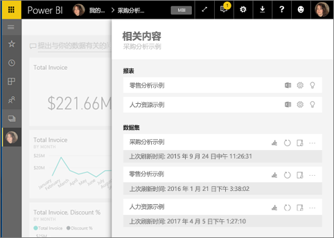

### 使用问答功能通过自然语言提问
有时从你的数据中获得答案的最快方法是使用自然语言提问。 问答问题框位于仪表板顶部。 例如，“以漏斗图的形式按销售阶段向我展示绝好商机数。” 

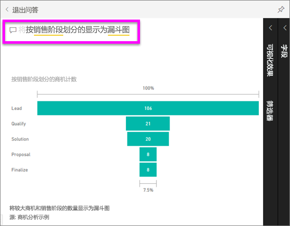

### 收藏仪表板
收藏内容后，便能从左侧导航栏访问内容。 左侧导航栏在 Power BI 中的几乎每个区域都可见。 收藏的通常是你最常访问的仪表板、报表页和应用。

1. 退出问答功能，以返回到仪表板。    
2. 从 Power BI 服务右上角选择“收藏”或星形  图标。
   
   

### 打开并查看报表和报表页
报表由一页或多页的视觉对象组成。 报表是由 Power BI 报表设计者创建，[并直接与使用者共享](end-user-shared-with-me.md)或作为[应用](end-user-apps.md)的一部分共享。 

可以从仪表板中打开报表。 大多数仪表板磁贴都是从报表固定的。 选择磁贴将打开用于创建此磁贴的报表。 

1. 从仪表板中，选择一个磁贴。 此示例已选择“收入”柱形图磁贴。

    

2.  关联的报表将打开。 请注意，现位于“收入概述”页上。 这是包含我们从仪表板中选择的柱形图的报表页。

    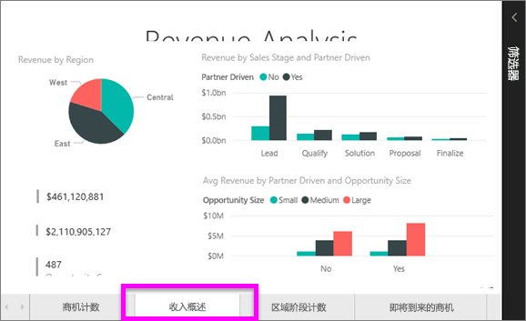

### 调整显示尺寸
可以在许多不同的设备上查看报表，这些设备具有不同的屏幕大小和纵横比。  默认的呈现方式可能并不是你想在设备上看到的方式。  

1. 若要调整，请选择顶部菜单栏中的“视图”。

    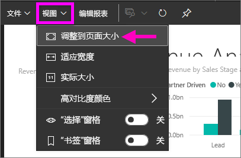

2.  选择一个显示选项。 此示例已选择“调整到页面大小”。

    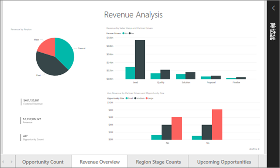    

### 使用报表“筛选器”窗格
如果报表创建者将筛选器添加到报表页中，你便能与筛选器进行交互，并将更改与报表一起保存。

1. 选择右上角的“筛选器”图标。
   
     

2. 选择视觉对象，将其激活。 此时，系统显示跨整个报表页（页面级筛选器）和跨整个报表（报表级筛选器）已应用到相应视觉对象（视觉对象级筛选器）的所有筛选器。
   
   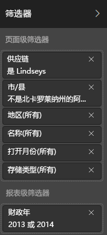

3. 将鼠标悬停在筛选器上，然后通过选择向下箭头展开它。
   
   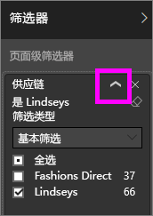

4. 对筛选器进行更改，并查看如何影响视觉对象。  
   
     
     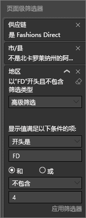

### 了解页面上的所有视觉对象是如何互连的
交叉突出显示和交叉筛选页面上的相关可视化效果。 单个报表页上的可视化效果全部都是相互“连接”的。  也就是说，如果选择一个可视化效果中的一个或多个值，其他使用相同值的可视化效果也会随你的选择一起变化。

> 
### 在可视化效果中显示详细信息
将鼠标悬停在可视化元素，以查看详细信息

### 对可视化效果进行排序
可以对报表页上的视觉对象进行排序，并将视觉对象与应用的更改一起保存。 

1. 将鼠标悬停在视觉对象之上，以选中它。    
2. 选择省略号 (...)，以打开排序选项。

     

###  打开“选择”窗格
在报表页面上的可视化对象之间轻松导航。 

1. 依次选择“视图”>“选择窗格”，以打开“选择窗格”。 将“选择窗格”切换为“开”。

    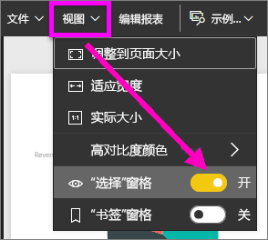

2. 此时，“选择窗格”在报表画布中打开。 从列表中选择视觉对象，以选中它。

    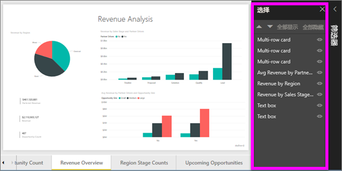

### 放大单个视觉对象
将鼠标悬停在视觉对象上并选择“焦点模式”图标。 在焦点模式下查看可视化效果时，它将展开以填充整个报表画布，如下所示。

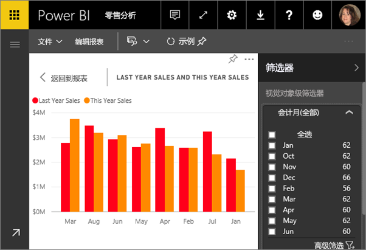

若要显示相同的可视化效果而不受菜单栏、筛选器窗格和其他部件的干扰，请从顶部菜单栏选择“全屏”图标。

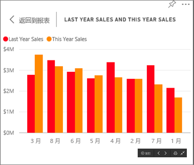

### 显示用于创建可视化效果的数据
Power BI 可视化效果是使用基础数据集中的数据构造而成。 如果你对幕后感兴趣，可以使用 Power BI *显示* 用于创建视觉对象的数据。 在用户选择“显示数据”后，Power BI 在可视化效果下方（或旁边）显示数据。

1. 在 Power BI 服务中，打开报表并选择视觉对象。  
2. 若要显示视觉对象背后的数据，请依次选择省略号 (...) 和“显示数据”。
   
   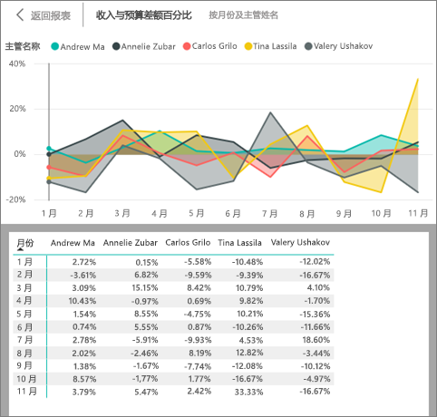

本文快速概述了使用者可以使用 Power BI 服务执行的一些操作。  

## 清理资源
- 如果已连接到应用，请选择左侧导航栏中的“应用”，以打开“应用内容”列表。 将鼠标悬停在要删除的应用之上，再选择“垃圾桶”图标。

- 如果已导入或连接到 Power BI 示例报表，请通过左侧导航栏打开“我的工作区”。 使用顶部的选项卡找到仪表板、报表和数据集，再选择每一项的“垃圾桶”图标。

## 后续步骤

