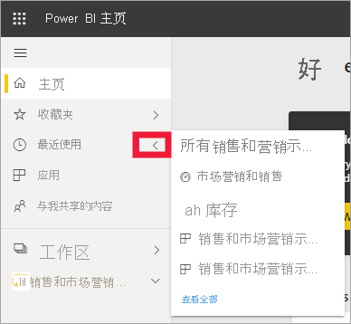
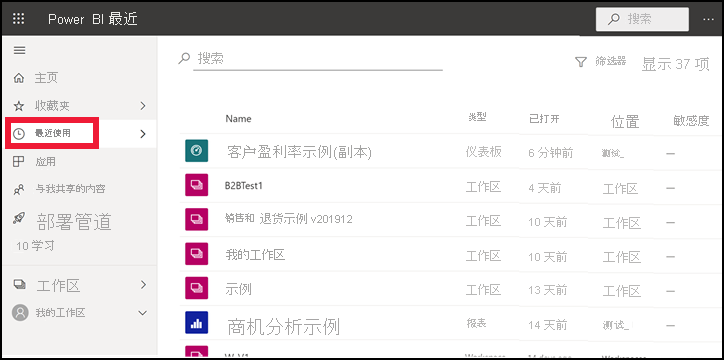
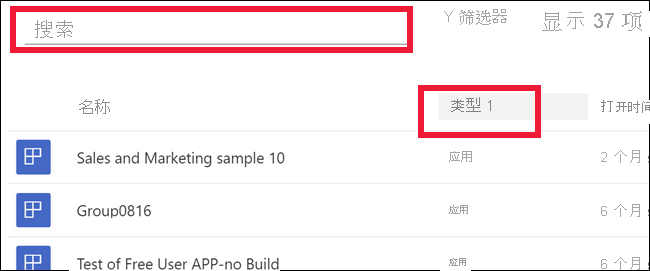

# Power BI 服务中 **最近访问的** 内容

[!INCLUDE[consumer-appliesto-yyny](../includes/consumer-appliesto-yyny.md)]

**最近访问的** 内容包含你在 Power BI 服务中访问的最近项目。 其中包括：仪表板、报表、应用、工作区和工作簿。 从导航栏中选择“最近访问”时，Power BI 按日期降序显示此内容。  若要更改排序顺序，请选择其中一个标题，然后选择“升序”或“降序”。

请注意，有两个项是[收藏项](end-user-favorite.md)，它们有一个星形图标。 一个项（客户盈利率示例）存储在[高级容量](end-user-license.md)中。

## 查看最近访问的五个项

若只要显示最近访问的五个项，请在导航窗格中选择“最近访问”右侧的箭头。  从这里选择要打开的内容。 

## 查看最近访问的所有内容

如果最近访问的项超过五个，请选择“全部查看”以打开“最近访问”屏幕 。 正如本文开头所述，你可以跳过浮出控件，通过从导航窗格中选择“最近访问”文字或其图标  来打开“最近访问”屏幕。

## 搜索最近访问的内容的列表并对其排序

如果列表过长，请[使用搜索字段和排序找到所需的内容](end-user-search-sort.md)。 若要确定是否可以对列进行排序，请将鼠标悬停以查看是否显示箭头。 在此示例中，将鼠标指针悬停在“类型”上会显示一个箭头 -- 可以根据内容类型按字母顺序对最近访问的内容排序。 

请观看下面的视频，Amanda 将演示如何填充 Power BI 服务“最新动态”内容列表。然后，按照视频下方的分步说明操作，自行进行尝试。

<iframe width="560" height="315" src="https://www.youtube.com/embed/G26dr2PsEpk" frameborder="0" allowfullscreen></iframe>

> [!NOTE]
> 此视频使用较旧版本的 Power BI 服务。

<!--
## Actions available from the **Recent** content list
The actions available to you will depend on the settings assigned by the content *designer*. Some of your options may include:
* Select the star icon to [favorite a dashboard, report, or app](end-user-favorite.md) .
* Some dashboards and reports can be re-shared  .
* [Open the report in Excel](end-user-export.md)  
* [View insights](end-user-insights.md) that Power BI finds in the data . -->

## 后续步骤
[Power BI 服务应用](end-user-apps.md)

更多问题？ [尝试参与 Power BI 社区](https://community.powerbi.com/)

