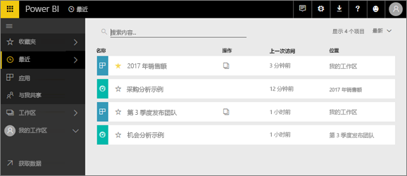
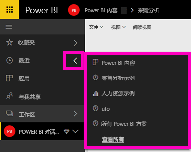
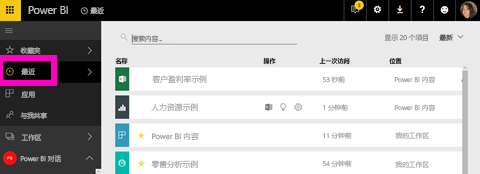

# Power BI 服务中**最近访问的**内容
最近的内容是上次在 Power BI 服务中访问的项目，最多显示 20 个项目。  其中包括：跨所有工作区的仪表板、报表、应用和工作簿。

请观看下面的视频，Amanda 将演示如何填充 Power BI 服务“最新动态”内容列表。然后，按照视频下方的分步说明操作，自行进行尝试。

<iframe width="560" height="315" src="https://www.youtube.com/embed/G26dr2PsEpk" frameborder="0" allowfullscreen></iframe>

## 显示最近访问的内容
若要查看最近访问的五个项目，从左侧导航栏中，选择“最近访问”右侧的箭头。  你可以在此处选择最近访问的内容来打开它。 仅列出最近访问的五个项目。

如果你最近访问的项目超过五个，请选择“查看所有”以打开“最近访问”屏幕（请参阅下方）。 还可以从左侧导航栏中选择“最近访问”，或“最近访问” 图标。

在此处，你可以按照在各个[**仪表板**](end-user-dashboards.md)、[**报表**](end-user-reports.md)和**工作簿**选项卡以及在<!--[**Apps**](end-user-apps.md)-->应用屏幕上操作的方式与内容进行交互。

## 后续步骤
<!--[Power BI service Apps](end-user-apps.md)-->

更多问题？ [尝试参与 Power BI 社区](http://community.powerbi.com/)

