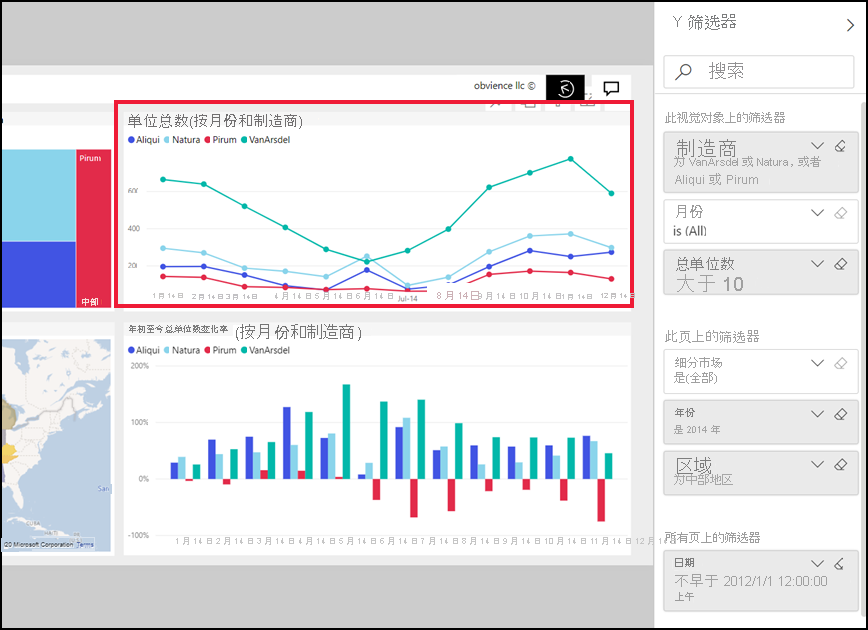

# 浏览报表“筛选器”窗格
本文将在 Power BI 服务中查看报表筛选器窗格。 使用筛选器以发现数据中的新见解。

在 Power BI 中可以使用多种不同的方式筛选数据，我们建议首先阅读 [关于筛选器和突出显示](../power-bi-reports-filters-and-highlighting.md)。

## 使用报表“筛选器”窗格
当同事与你共享报表时，请务必找到“筛选器”  窗格。 有时它在报表右侧处于折叠状态。 选择它以将其展开。   

“筛选器”窗格中包含报告设计者  添加到报表中的筛选器。 *使用者*像您一样，可以进行交互的现有筛选器并保存所做的更改，但不能向报表添加新的筛选器。 例如，在上面的屏幕截图中，设计者添加了两个页面级筛选器：细分，并运行年。 可以与这些筛选器进行交互，并能更改它们，但无法添加第三个页面级筛选器。

在 Power BI 服务中，将报告保留在筛选器窗格中，进行任何更改，这些更改通过传递到报表的移动版本。 要将“筛选器”窗格重置为设计者的默认值，请从顶部菜单栏中选择“重置为默认值”  。  

   

## 查看报表页的所有筛选器
筛选器窗格将显示所有筛选器添加到的报表*设计器*。 筛选器窗格也是可以在其中查看有关筛选器的信息并与之交互的区域。 您可以保存的更改执行或使用**重置为默认值**若要还原到原始的筛选器设置。

如果你想要保存的更改，您还可以创建个人书签。  有关详细信息，请参阅[向报表添加书签](end-user-bookmarks.md)。

有几种类型的报表筛选器显示和筛选器窗格中，从管理的那些应用于视觉对象、 报表页，以及整个报表。

在此示例中，我们选择了 2 个筛选器的视觉对象。 报表页也有筛选器，下列出**此页上的筛选器**标题。 和整个报表也有日期筛选器。

部分筛选器旁有“全部”  字样，这意味着所有值都包含在一个筛选器中。  例如， **Segment(All)** 在上面的屏幕截图中告诉我们该报表页包括有关产品的所有段的数据。  另一方面，页面级别筛选的**西部区域是**告诉我们，报告页面仅包含西部区域的数据。

查看此报表的任何人都可与这些筛选器进行交互。

### 查看仅应用于视觉对象这些筛选器
若要获取应用于特定的视觉对象的筛选器进一步了解，悬停在视觉对象以显示筛选器图标。 选择该筛选器图标以查看包含所有筛选器、 切片器和等等，会影响该视觉对象的弹出窗口。 在弹出式窗口中的筛选器是相同的筛选器上显示**筛选器**窗格。 

 
以下是此视图可以显示筛选器的类型：
- 基本筛选器
- 切片器
- 交叉突出显示
- 交叉筛选
- 高级筛选器
- 前 N 个筛选器
- 相对日期筛选器
- 同步切片器
- 包括/排除筛选器
- 通过 URL 传递的筛选器

在示例中，如下：
1. 我们可以看到已交叉筛选柱形图。
2. **包含**告诉我们交叉筛选适用**段**，三个包含和。 
3. 切片器应用于**季度**。
4. **区域**是筛选器应用于此报表页，并
5. **划分的 Vanarsdel**并**年**是筛选器应用于此视觉对象。

### 在筛选器中搜索
有时一个筛选器可以具有值的长列表。 使用搜索框查找和选择所需的值。 

### 显示筛选器详细信息
若要了解筛选器，看一看的可用值和计数。  悬停鼠标并选择筛选器名称旁边的箭头可查看筛选器的详细信息。 
  

### 更改所选筛选器
搜索数据的见解的一种方法是与筛选器交互。 您可以更改所选筛选器使用的字段名称旁边的下拉箭头。  根据筛选器和筛选的数据类型，您的选项的范围可以从列表中确定的日期或数字范围的简单选项。 在以下高级筛选器中，我们已更改了筛选器**总单位 YTD**在树状图介于 2000 和 3000 之间。 请注意，这将从树状图中移除 Prirum。 
  

> [!TIP]
> 若要一次选择多个筛选器值，请按住 CTRL 键。 大多数筛选器支持多选。 

### 重置为默认值的筛选器
如果你想要退出所有更改对所做的筛选器，选择**重置为默认值**从顶部菜单栏。  这将恢复到其原始状态，筛选器，所设置的报表*设计器*。 

    
### 清除筛选器
是否想要设置的只是一个筛选器 **（全部）** ，通过选择橡皮擦图标清除筛选器名称旁边。
  
<!--  too much detail for consumers

## Types of filters: text field filters
### List mode
Ticking a checkbox either selects or deselects the value. The **All** checkbox can be used to toggle the state of all checkboxes on or off. The checkboxes represent all the available values for that field.  As you adjust the filter, the restatement updates to reflect your choices. 

Note how the restatement now says "is Mar, Apr or May".

### Advanced mode
Select **Advanced Filtering** to switch to advanced mode. Use the dropdown controls and text boxes to identify which fields to include. By choosing between **And** and **Or**, you can build complex filter expressions. Select the **Apply Filter** button when you've set the values you want.  

## Types of filters: numeric field filters
### List mode
If the values are finite, selecting the field name displays a list.  See **Text field filters** &gt; **List mode** above for help using checkboxes.   

### Advanced mode
If the values are infinite or represent a range, selecting the field name opens the advanced filter mode. Use the dropdown and text boxes to specify a range of values that you want to see. 

By choosing between **And** and **Or**, you can build complex filter expressions. Select the **Apply Filter** button when you've set the values you want.

## Types of filters: date and time
### List mode
If the values are finite, selecting the field name displays a list.  See **Text field filters** &gt; **List mode** above for help using checkboxes.   

### Advanced mode
If the field values represent date or time, you can specify a start/end time when using Date/Time filters.  

-->

## 后续步骤
[了解视觉对象在报表页上如何交叉筛选和交叉突出显示及其原因](end-user-interactions.md)