# 浏览报表“筛选器”窗格
本文将介绍 Power BI 服务中的报表“筛选器”窗格。

在 Power BI 中可以使用多种不同的方式筛选数据，我们建议首先阅读 [关于筛选器和突出显示](../power-bi-reports-filters-and-highlighting.md)。

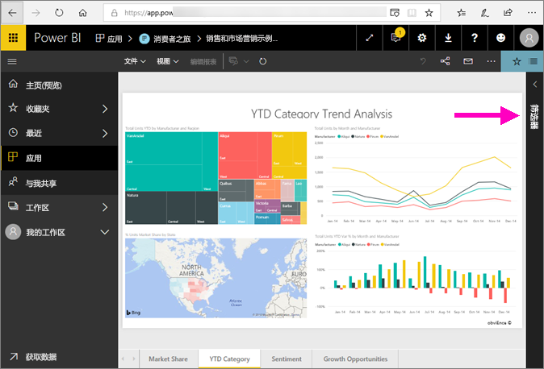

## 使用报表“筛选器”窗格
当同事与你共享报表时，请务必找到“筛选器”窗格。 有时它在报表右侧处于折叠状态。 选择它以将其展开。   

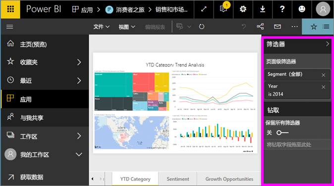

“筛选器”窗格中包含报告设计者添加到报表中的筛选器。 像你这样的使用者可与这些筛选器交互并保存更改，但不能向报表添加新的筛选器。 例如，在上面的屏幕截图中，设计者添加了两个页面级筛选器：“细分”和“年份”。 可以与这些筛选器进行交互，并能更改它们，但无法添加第三个页面级筛选器。

在 Power BI 服务中，报表会保留你在“筛选器”窗格中做出的所有更改，并且这些更改会保留至该报表的移动版本。 要将“筛选器”窗格重置为设计者的默认值，请从顶部菜单栏中选择“重置为默认值”。     

## 打开“筛选器”窗格
打开报表时，“筛选器”窗格显示在报表画布的右侧。 如果未看到窗格，请选择右上角的箭头以将其展开。  

在此示例中，我们选择了具有 6 个筛选器的视觉对象。 报表页也有筛选器，列于“页面级筛选器”标题下。 有一个[钻取筛选器](../power-bi-report-add-filter.md)，整个报表也有筛选器：“会计年度”为 2013 或 2014。

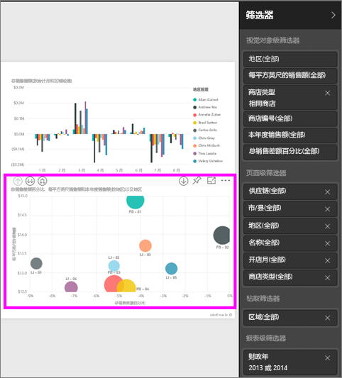

部分筛选器旁有“全部”字样，这意味着所有值都包含在一个筛选器中。  例如，上面屏幕截图中的“连锁(全部)”指明，此报表页包含所有连锁店的数据。  从另一方面来说，“**FiscalYear 为 2013 或 2014**”的报表级别筛选器告诉我们该报表仅包括 2013 和 2014 的财政年的数据。

查看此报表的任何人都可与这些筛选器进行交互。

- 在页面、视觉对象、报表和钻取筛选器中搜索，以查找并选择所需的值。 

    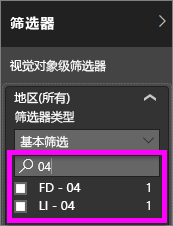

- 悬停鼠标并选择筛选器旁的箭头可查看该筛选器的详细信息。
  
   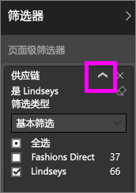
* 更改筛选器，例如，将“Lindseys”更改为“Fashions Direct”。
  
     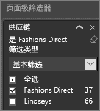

* 通过从顶部菜单栏选择“还原为默认值”，将筛选器还原为原始状态。    
    
    
* 选择筛选器名称旁的“x”删除筛选器。
  
    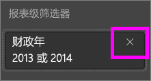

  删除筛选器将其从列表删除，但并不会删除报表的数据。  例如，如果删除“FiscalYear 为 2013 或 2014”筛选器，财务年度数据仍将保留在报表中，但将不再筛选为仅显示 2013 和 2014，而是显示数据包含的所有财务年度。  但是，一旦删除筛选器后，将无法再对其修改，因为它已从列表删除。 最好是通过选择橡皮擦图标  来清除筛选器。
  
  

## 清除筛选器
 在高级或基本筛选模式中，选择橡皮擦图标   来清除筛选器。 

## 筛选器类型：文本字段筛选器
### 列表模式
勾选复选框将选择或取消选择值。 **全部**复选框可用于切换所有复选框的状态（“启用”或“取消”）。 这些复选框表示该字段的所有可用值。  调整筛选器时，重述将更新以反映你的选择。 

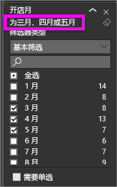

请注意，重述现在为“是 3 月、4 月或 5 月”。

### 高级模式
选择**高级筛选**以切换到高级模式。 使用下拉控件和文本框来标识要包括哪些字段。 通过在**且**和**或**之间选择，可以生成复杂的筛选器表达式。 设置所需值后，选择**应用筛选器**按钮。  

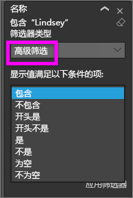

## 筛选器类型：数值字段筛选器
### 列表模式
如果这些值是有限的，则选择字段名称将显示一个列表。  请参阅前述**文本字段筛选**&gt;**列表模式**来帮助使用复选框。   

### 高级模式
如果这些值有限或表示一个范围，则选择字段名称将打开高级筛选器模式。 使用下拉列表和文本框来指定想要查看的值的范围。 

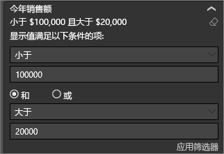

通过在**且**和**或**之间选择，可以生成复杂的筛选器表达式。 设置所需值后，选择**应用筛选器**按钮。

## 筛选器类型：日期和时间
### 列表模式
如果这些值是有限的，则选择字段名称将显示一个列表。  请参阅前述**文本字段筛选**&gt;**列表模式**来帮助使用复选框。   

### 高级模式
如果字段值表示日期或时间，可以使用“日期/时间”筛选器指定开始/结束时间。  

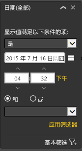

## 后续步骤
[了解视觉对象在报表页上如何交叉筛选和交叉突出显示及其原因](end-user-interactions.md)