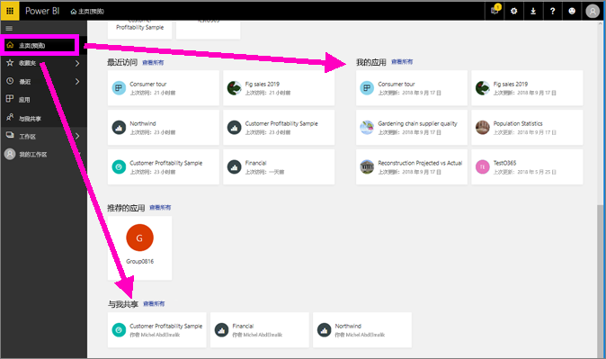
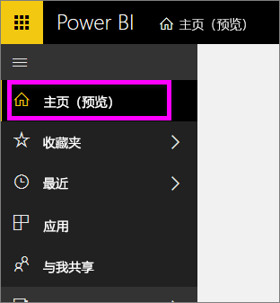
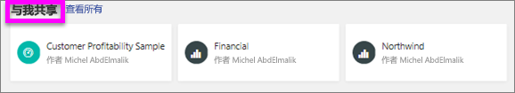
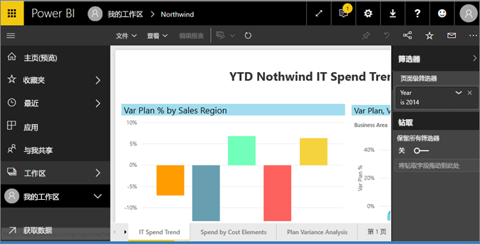
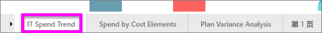
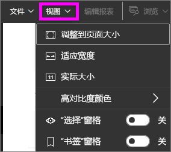
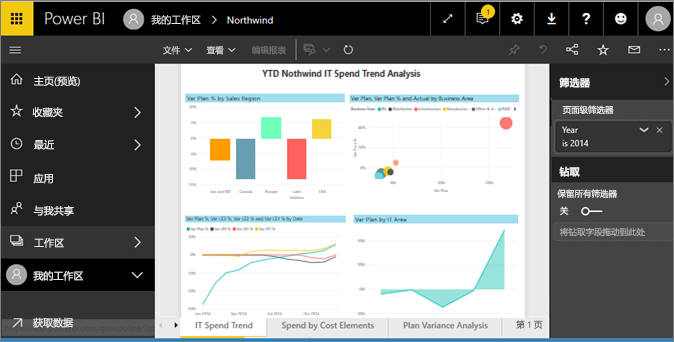
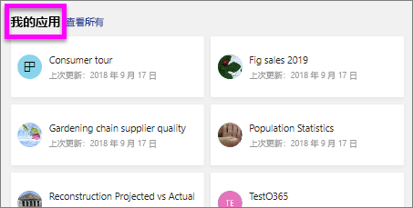
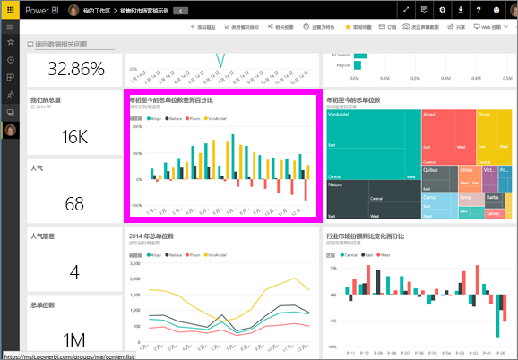
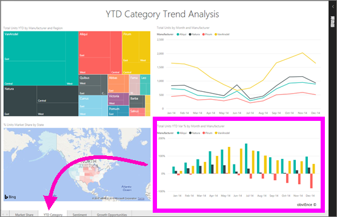

# 在面向使用者的 Power BI 服务中查看报表
报表由一页或多页的视觉对象组成。 报表是由 Power BI 报表设计者创建，[并直接与使用者共享](end-user-shared-with-me.md)或作为[应用](end-user-apps.md)的一部分共享。 

打开报表有许多不同的方式，我们将介绍其中两种：从“主页”页面打开以及从“仪表板”打开。 

<!-- add art-->

## 从“主页”页面打开报表
让我们打开一个已直接与你共享的报表，然后打开一个已作为应用一部分共享的报表。

   

### 打开已与你共享的报表
Power BI 设计器可以直接与你共享报表，方法是单击顶部菜单栏上的“共享”按钮。 通过此方式共享的内容显示在左侧导航栏上的“与我共享”容器中以及“主页”页面上的“与我共享”部分中。

1. 打开 Power BI 服务 (app.powerbi.com)。

2. 从左侧的导航栏中，选择“主页(预览)”以打开“主页”页面。  

   
   
3. 向下滚动，直至看到“与我共享”为止。 查找报表图标 。 在此屏幕截图中，我们有两个报表：Financial 和 Northwind。 
   
   

4. 只需选择一个报表卡即可打开该报表。

   

5. 请注意底部的选项卡。 每个选项卡表示一个报表页。 我们目前打开了“IT 支出趋势”页。 选择其他选项卡以打开该报表页。 

   

6. 现在，我们只能看到报表页的一部分。 若要更改页面的显示（缩放），请选择“视图” > “调整到页面大小”。

   

   

### 打开属于应用一部分的报告
如果你收到了来自同事或 AppSource 的应用，则可以从左侧导航栏上的“主页”页面和“应用”容器中获取这些应用。 [应用](end-user-apps.md)是一捆仪表板和报表。

1. 从左侧导航栏选择“主页(预览)”以回到“主页”页面。

7. 向下滚动，直至看到“我的应用”为止。

   

8. 选择其中一个应用以将其打开。 根据应用设计器设置的选项，应用将打开一个仪表板，一个报表或一个应用内容列表。 如果选择应用后：
    - 打开的是报表，这就行了。
    - 打开的是仪表板，请参阅下面的[从仪表板中打开报表](#Open-a-report-from-a-dashboard)。
    - 打开应用内容列表，在“报表”下选择报表以打开它。

## 从仪表板中打开报表
可以从仪表板中打开报表。 大多数仪表板磁贴都是从报表固定的。 选择磁贴将打开用于创建此磁贴的报表。 

1. 从仪表板中，选择一个磁贴。 在此示例中，我们已选择“本年累计单位总计...”柱形图磁贴。

    

2.  关联的报表将打开。 请注意，我们当前的位置为“本年累计类别”页。 这是包含我们从仪表板中选择的柱形图的报表页。

    

> [!NOTE]
> 并非所有磁贴都会打开报表。 如果你选择了[使用问答创建](end-user-q-and-a.md)的磁贴，则问答屏幕将打开。 如果选择[使用仪表板“添加磁贴”小组件创建的](../service-dashboard-add-widget.md)磁贴，可能出现几种不同的情况。  

##  其他打开报表的更多方法
随着你能够更为熟练地导航 Power BI 服务，即可找到最适合自己的工作流。 下面是访问报表的其他几种方法：
- 从左侧导航窗格中使用“收藏夹”和“最近”    
- 使用[相关视图](end-user-related.md)    
- 在电子邮件中，有人[与你共享](../service-share-reports.md)或你已[设置警报](end-user-alerts.md)时    
- 从你的[通知中心](end-user-notification-center.md)    
- 其他更多方法

## 后续步骤
有[多种方式与报表进行交互](end-user-reading-view.md)。  先从选择报表画布底部的各个选项卡开始浏览。

