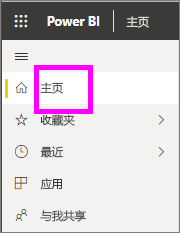
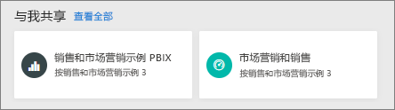
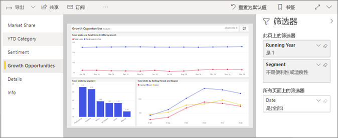
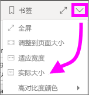

# 在面向使用者的 Power BI 服务中查看报表 
报表由一页或多页的视觉对象组成。 通过 Power BI 创建报表*设计器*并[与共享*使用者*直接](end-user-shared-with-me.md)或作为的一部分[应用](end-user-apps.md)。 

有许多不同的方法来打开报表，我们将向您展示其中的两个： 从主页打开，并从仪表板中打开。 

<!-- add art-->

## 从主页 Power BI 中打开报表
让我们打开一个已直接与你共享的报表，然后打开一个已作为应用一部分共享的报表。

   

### 打开已与你共享的报表
Power BI*设计器*可以直接与你共享报表。 此方式共享的内容显示在**与我共享**条形图和中的导航栏上的容器**与我共享**主页画布的部分。

1. 打开 Power BI 服务 (app.powerbi.com)。

2. 从导航栏中，选择**主页**显示主页画布。  

   
   
3. 向下滚动，直至看到“与我共享”为止  。 查找报表图标 。 在此屏幕截图中有一个仪表板和一个名为的报表*销售和市场营销示例*。 
   
   

4. 只需选择的报表*卡*以打开该报表。

   

5. 请注意，左侧的选项卡。  每个选项卡表示一个报表页  。 目前有*增长机会*页上打开。 选择*YTD 类别*选项卡，而是打开该报表页。 

   

6. 现在，我们发现整个报表页。 若要更改页面的显示 （缩放），请从右上角选择视图下拉列表 ( **>** )，然后选择**实际大小**。

   

   

### 打开属于应用一部分的报告
已收到来自同事或从 AppSource 应用这些应用是否可从主页以及从**应用**导航栏上的容器。 [应用](end-user-apps.md)是一捆仪表板和报表。

1. 返回到通过选择主页**主页**从导航栏。

7. 向下滚动，直至看到“我的应用”为止  。

   

8. 选择其中一个应用以将其打开。 根据应用设计器设置的选项，应用将打开一个仪表板，一个报表或一个应用内容列表  。 如果选择应用后：
    - 打开的是报表，这就行了。
    - 打开的是仪表板，请参阅下面的***从仪表板中打开报表***。
    - 打开应用内容列表，在“报表”下选择报表以打开它  。

## 从仪表板中打开报表
可以从仪表板中打开报表。 大多数仪表板磁贴都是从报表固定的  。 选择磁贴将打开用于创建此磁贴的报表。 

1. 从仪表板中，选择一个磁贴。 在此示例中，我们已选择“本年累计单位总计...”柱形图磁贴。

    

2.  关联的报表将打开。 请注意，我们当前的位置为“本年累计类别”页。 这是包含我们从仪表板中选择的柱形图的报表页。

    

> [!NOTE]
> 并非所有磁贴都会打开报表。 如果你选择了[使用问答创建](end-user-q-and-a.md)的磁贴，则问答屏幕将打开。 如果选择[使用仪表板“添加磁贴”小组件创建的](../service-dashboard-add-widget.md)磁贴，可能出现几种不同的情况  。  

##  其他打开报表的更多方法
在您能更轻松地导航 Power BI 服务，您将确定最适合您的工作流。 下面是访问报表的其他几种方法：
- 从导航栏使用**收藏夹**和**最近**    
- 使用[相关视图](end-user-related.md)    
- 在电子邮件中，有人[与你共享](../service-share-reports.md)或你已[设置警报](end-user-alerts.md)时    
- 从你的[通知中心](end-user-notification-center.md)    
- 其他更多方法

## 后续步骤
有[多种方式与报表进行交互](end-user-reading-view.md)。  开始探索通过选择报表画布的端到每个选项卡。

