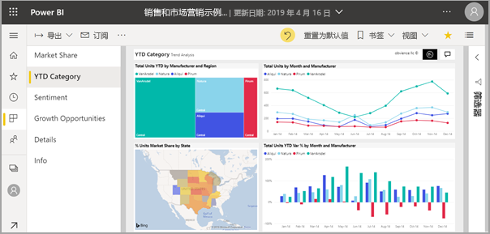
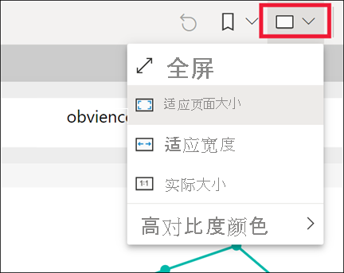
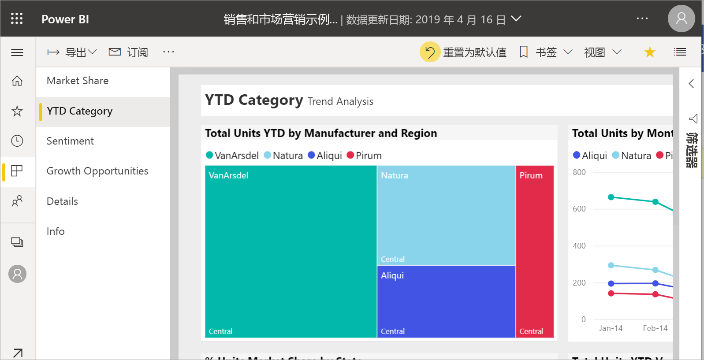
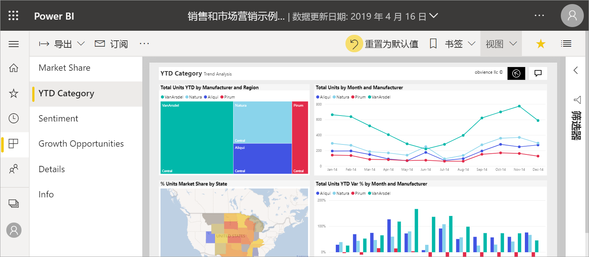
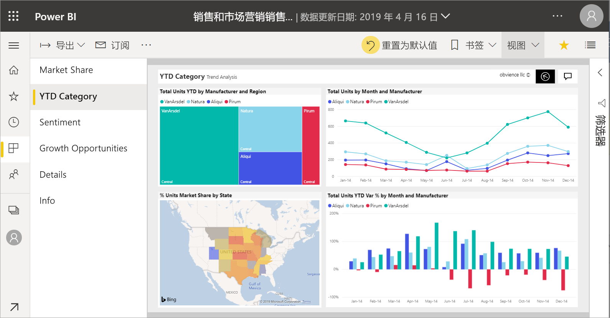
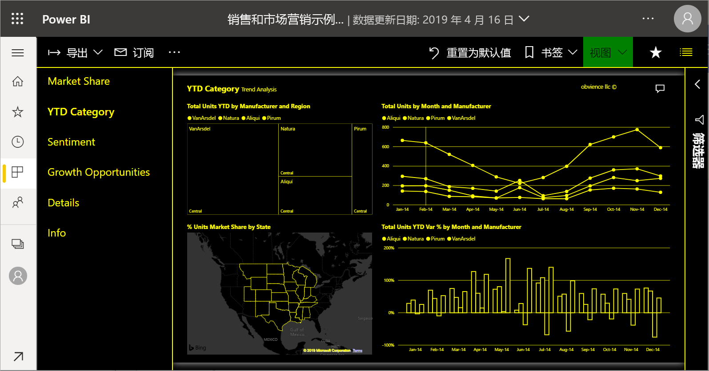
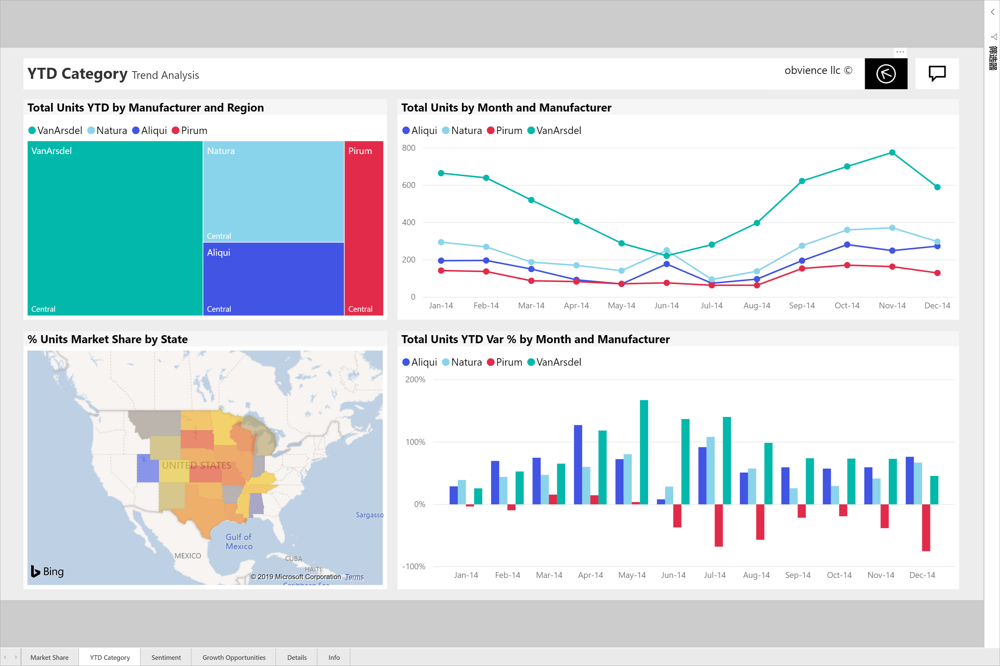
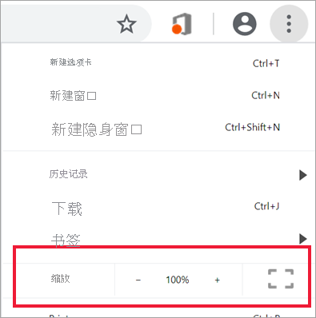
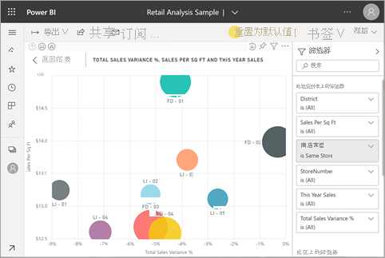

# 更改报表页的显示

[!INCLUDE[consumer-appliesto-yyny](../includes/consumer-appliesto-yyny.md)]

人们在屏幕大小和纵横比各异的众多不同设备上查看报表。 可更改报表页的显示方式，使其适应你的需求。

## 了解视图菜单

通过“视图”菜单中的选项，可灵活地按所选的大小和宽度显示报表页面  ：

- 假设你正在小型设备上查看报表，很难看到标题和图例。  可选择“视图” > “实际大小”，增加报表页的大小   。 使用滚动条在报表中移动。

    

- 还有一个选项是选择“适应宽度”，使报表适合屏幕宽度  。 由于只关乎宽度而未设置高度，因此可能仍需使用垂直滚动条。

  

- 如果不想要任何滚动条，但却希望充分利用屏幕尺寸，请选择“调整到页面大小”  。

   

- 此外，还有 4 种高对比度颜色可供选择  ：高对比度 #1、高对比度 #2、高对比度黑色和高对比度白色。 这是一项辅助功能，可用于让存在视力障碍的用户更好地查看报表。 下面的示例是高对比度 1。 

    

- 最后一个选项是“全屏”，它可显示没有菜单栏和标头的报表页  。 对于很难看清细节的小屏幕而言，全屏可能是一个不错的选择。  在将报表页面投影到大屏幕上供人们查看而非交互时，全屏也很不错。  

    

退出报表时，“视图”设置不保存，而是恢复到默认值  。 如果有必要保存这些设置，请使用[书签](end-user-bookmarks.md)。

## 使用浏览器更改页面显示

浏览器中的缩放控件可增加和减少可用的画布区域。 减小缩放比例可以显示更大的可用画布区域，增大比例则显示更小的区域。 

调整整个浏览器的大小是更改报表显示大小的另一种方法。 

## 放大视觉对象
有时很难看出视觉对象中的详细信息。 可以放大该视觉对象以仅显示它。 有关详细信息，请参阅[焦点模式和全屏模式](end-user-focus.md)

### 焦点  模式下的视觉对象

### 全屏  模式下的视觉对象

## 后续步骤

* [导览报表的“筛选器”窗格](end-user-report-filter.md)