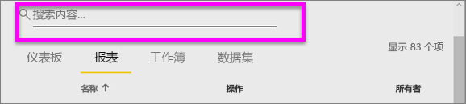
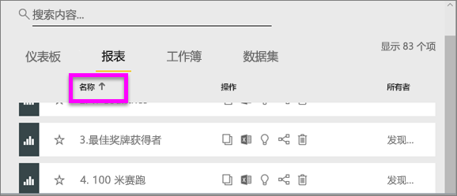
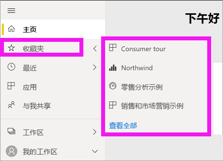

# 导航：在 Power BI 服务中搜索、查找和排序内容
可通过多种方法在 Power BI 服务中导航到相应内容。 工作区中的内容已按以下类型进行组织：仪表板和报表。  此外，内容已按使用情况进行组织：收藏夹、最近、应用、与我共享和特色。 为实现一站式导航，Power BI 主页将全部内容组织在同一页面上  。 通过这些不同的内容浏览途径可以在 Power BI 服务中快速找到所需的内容。  

## 在工作区中导航

Power BI 使用者  通常只有一个工作区：“我的工作区”  。 仅当下载了 Microsoft 示例，或创建或下载了自己的仪表板、报表或应用时，“我的工作区”中才会包含内容  。  

在我的工作区中，Power BI 服务按以下类型区分内容：仪表板、报表、工作簿和数据集  。 选择工作区时，可以看到这种组织形式。 在本示例中，“我的工作区”包含一个仪表板、一份报表、一个数据集，不包含工作簿  。

________________________________________
## 使用“搜索”字段导航
使用“我的工作区”内容视图对内容进行搜索、筛选和排序  。 在“搜索”字段中，键入仪表板、报表、工作簿或所有者的全部或部分名称。  

如果只有部分内容，那么就没有必要进行搜索和排序。  但是如果具有大量仪表板和报表，你将发现搜索和排序非常有用。 例如，下面的报表列表中包含 83 项。 

也可以按名称或所有者对内容进行排序。 注意“名称”右侧的向上箭头  。 目前，我们按照名字的字母顺序对 83 个项目进行排序（升序）。 若要将排序顺序更改为降序，请选择“名称”  。 将向上箭头更改为向下箭头。

不是所有列都可以进行排序。 将鼠标悬停在列标题上可发现哪些列可以进行排序。

___________________________________________________________________
## 使用左侧导航栏导航
左侧导航栏对内容进行分类，帮助你快速找到所需的内容。  

- “与我共享”中显示与你共享的内容  。
- “最近”中显示最近访问的内容  。 
- 选择“应用”可查找应用  。
- “主页”是单页视图，显示最重要的内容和推荐的内容及学习资源  。

此外，你可以标记作为内容[收藏](end-user-favorite.md)和[特色](end-user-featured.md)。 选取一个你希望经常查看的仪表板或报表，并将其设置为特色内容  。 每次打开 Power BI 服务时，会首先显示特色仪表板。 你是否有大量经常访问的仪表板和应用？ 通过将它们设置为收藏项，可以始终通过左侧导航栏进行访问。

。

## 注意事项和疑难解答
* 对于数据集，所有者无法使用排序依据  。

## 后续步骤
[对报表中的视觉对象排序](end-user-change-sort.md)

更多问题？ [尝试参与 Power BI 社区](http://community.powerbi.com/)
