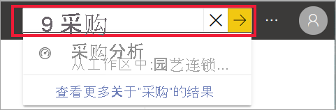
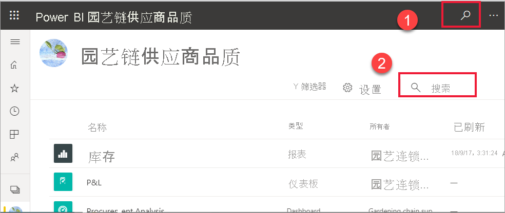
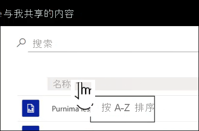
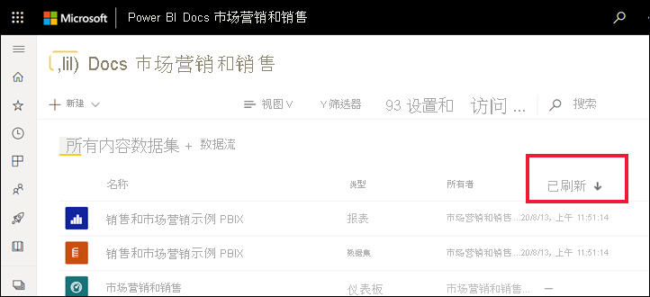

# 面向 Power BI 商务用户的导航：全局搜索

[!INCLUDE[consumer-appliesto-yyny](../includes/consumer-appliesto-yyny.md)]

[!INCLUDE [power-bi-service-new-look-include](../includes/power-bi-service-new-look-include.md)]

不熟悉 Power BI 服务时，你只有部分内容（仪表板、报表和应用）。 但是，随着同事开始与你共享内容以及你开始下载应用，你最终会获得很多内容。 那时你会发现搜索和排序非常有用。

## 搜索内容
 几乎可以从 Power BI 服务的每个部分进行搜索。 只需查找搜索框或搜索图标 。

 在“搜索”字段中，键入以下项的完整或部分名称：仪表板、报表、工作簿、工作区、应用或所有者。 Power BI 会搜索所有内容。 

  

 在 Power BI 的某些区域（如工作区）中，你会发现两个不同的搜索字段。 菜单栏中的搜索字段会搜索所有内容，而工作区画布上的搜索字段仅搜索该工作区。

  

## 排序内容列表

如果只有部分内容，则可能不需要进行排序。  但是，如果你有许多仪表板和报表，排序将能帮助你找到所需内容。 例如，此“与我共享的内容”内容列表包含 70 个项。 

现在，此内容列表是按名称的字母顺序从 Z 到 A 排序的。若要更改排序条件，请选择“名称(A-Z)”右侧的箭头。

还可以在工作区中进行排序。 在此示例中，内容按“刷新时间”日期排序。 若要为工作区设置排序条件，请选择列标题，然后再次选择来更改排序方向。 

不是所有列都可以进行排序。 将鼠标悬停在列标题上可发现哪些列可以进行排序。

## 筛选内容列表
另一种快速定位内容的方法是，使用内容列表中的“筛选器”。 通过选择右上角的“筛选器”来显示筛选器。 筛选器是否可用取决于你在 Power BI 服务中的位置。  下面的示例来自“最近使用”内容列表。  它可便于按内容类型筛选列表。  在“与我共享的内容”内容列表中，可用的“筛选器”包括“所有者”和“内容类型”。

## 后续步骤
[对报表中的视觉对象排序](end-user-change-sort.md)

[对视觉对象中的数据进行排序](end-user-change-sort.md)

更多问题？ [尝试参与 Power BI 社区](https://community.powerbi.com/)
