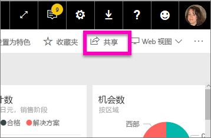
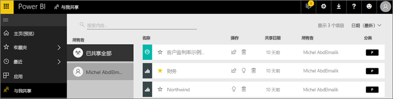
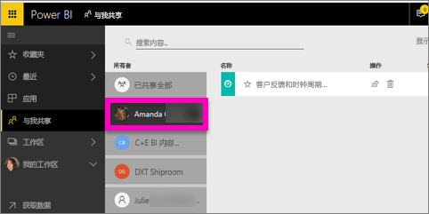

# 显示已与我共享的仪表板和报表
## 与我共享

当同事使用“共享”按钮与你共享内容时，该内容将出现在“与我共享”容器中。 仪表板或报表只能从“与我共享”中获取，无法从“应用”中获取。

请观看下面的视频，Amanda 将介绍“与我共享”内容列表，并演示如何导航和筛选此列表。 然后按照视频下面的分步说明来自己尝试一下。 要查看与你共享的仪表板，你需要具有 Power BI Pro 许可证。 请阅读[什么是 Power BI Premium？](../service-premium.md)了解详细信息。

<iframe width="560" height="315" src="https://www.youtube.com/embed/G26dr2PsEpk" frameborder="0" allowfullscreen></iframe>

有多项用于与仪表板和报告进行交互的选项，具体取决于设计器所提供的权限。 其中包括能够创建仪表板的副本、在[阅读视图](end-user-reading-view.md)中打开报表，以及重新与其他同事共享。

## 可在“与我共享的内容”容器中执行的操作
* 选择星形图标[将仪表板或报表添加到收藏夹](end-user-favorite.md)。
* 删除仪表板或报表  
* 可重新共享某些仪表板和报表  
* 另外，如果列表过长，请[使用搜索字段和排序找到所需的仪表板](end-user-search-sort.md)。
  
  > [!NOTE]
  > 有关 EGRC 分类的信息，请选择分类按钮或[访问仪表板数据分类](../service-data-classification.md)。
  > 
  > 
* 选择要打开并浏览的仪表板名称。 打开共享仪表板后，可以使用问答对基础数据进行提问，或者选择磁贴以打开阅读视图中的报表并与其进行交互。

## 由所有者筛选共享仪表板
“与我共享的内容”屏幕中的内容可以由内容所有者进一步筛选。 例如，如果我选择“Amanda”，将只看到 Amanda 与我共享的仪表板。

