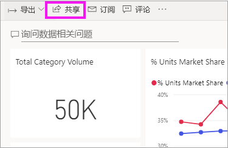
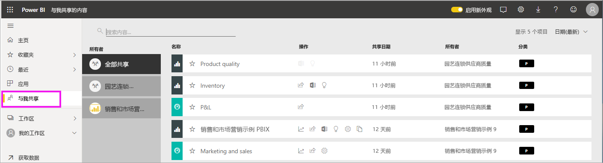
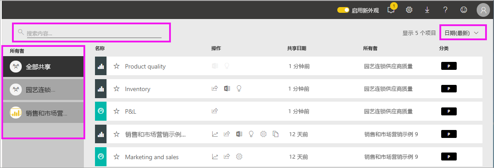

# 显示已与我共享的仪表板和报表

[!INCLUDE [power-bi-service-new-look-include](../includes/power-bi-service-new-look-include.md)]

当同事使用“共享”按钮与你共享内容时，该内容将出现在“与我共享”容器中   。 仪表板或报表只能从“与我共享”中获取，无法从“应用”中获取   。

请观看下面的视频，Amanda 将介绍“与我共享”  内容列表，并演示如何导航和筛选此列表。 然后按照视频下面的分步说明来自己尝试一下。 要查看与你共享的仪表板，你需要具有 Power BI Pro 许可证。 请阅读[什么是 Power BI Premium？](../service-premium-what-is.md)了解详细信息。
    

> [!NOTE]
> 此视频使用较旧版本的 Power BI 服务。
    

<iframe width="560" height="315" src="https://www.youtube.com/embed/G26dr2PsEpk" frameborder="0" allowfullscreen></iframe>

## 与共享内容交互

有多项用于与共享仪表板和报表进行交互的选项，具体取决于*设计者*所提供的权限。 其中包括能够创建仪表板的副本、在[阅读视图](end-user-reading-view.md)中打开报表，以及重新与其他同事共享。

### 可在“与我共享的内容”容器中执行的操作 
可供使用的操作取决于内容*设计者*分配的设置。 一些选项可能包括：
* 选择星形图标以[将仪表板或报表添加到收藏夹](end-user-favorite.md) 。
* 删除仪表板或报表  。
* 可重新共享某些仪表板和报表  。
* [在 Excel 中打开报表](end-user-export.md)  
* [查看](end-user-insights.md) Power BI 在数据中发现的见解 。
  
  > [!NOTE]
  > 有关 EGRC 分类的信息，请选择“分类”按钮或[访问仪表板数据分类](../service-data-classification.md)  。
  > 

## 搜索和排序共享仪表板
如果内容列表很长，可通过多个选项来查找所需的内容。 可使用搜索字段、按日期排序，也可以从“所有者”列中进行选择  。    

