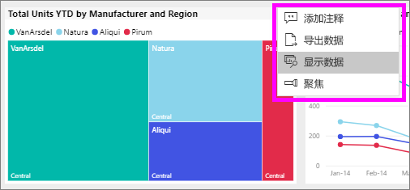
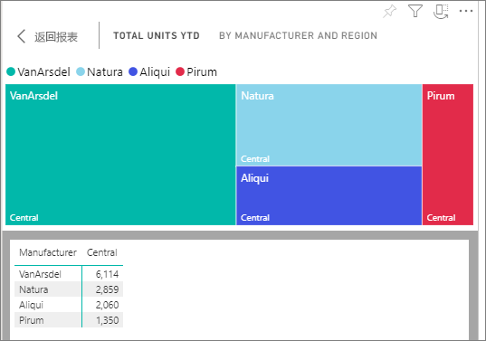
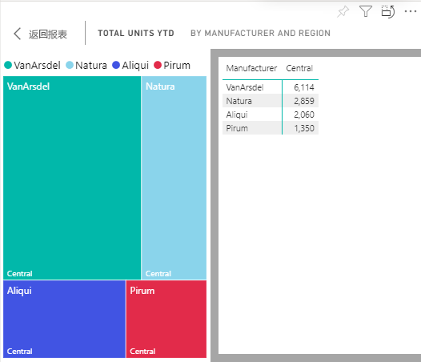

# 显示用于创建视觉对象的数据

Power BI 视觉对象是使用基础数据集中的数据构造而成的。 如果你对幕后感兴趣，可以使用 Power BI *显示* 用于创建视觉对象的数据。 在用户选择“显示数据”后，Power BI 在视觉对象下方（或旁边）显示数据  。

1. 在 Power BI 服务中，[打开报表](end-user-report-open.md)并选择视觉对象。  
2. 若要显示视觉对象背后的数据，请依次选择省略号 (...) 和“显示数据”  。
   
   
3. 默认情况下，该数据将显示以下视觉对象。
   
   

4. 若要更改方向，可从可视化效果的右上角  选择垂直布局。
   
   

## 后续步骤
[Power BI 报表中的视觉对象](../visuals/power-bi-report-visualizations.md)    
[Power BI 报表](end-user-reports.md)    
