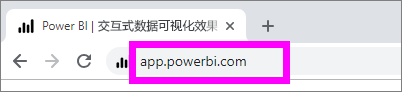
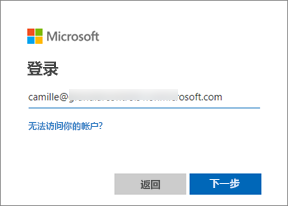
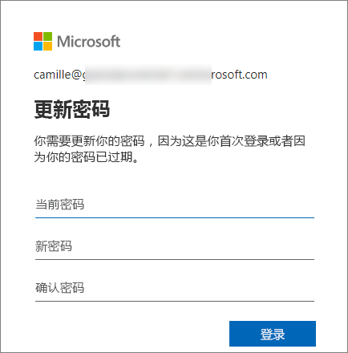
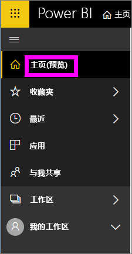
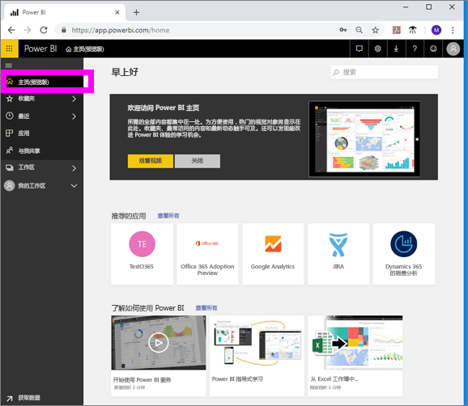
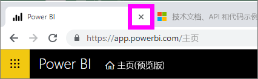
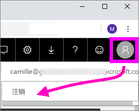

# 登录 Power BI 服务

## Power BI 帐户
首先需要一个帐户，然后才能登录 Power BI。 有两种方法可用于获取 Power BI 帐户。 第一种是公司为其员工购买 Power BI 许可证。 第二种是个人注册免费试用版或个人许可证。 本文涵盖第一种方案。

## 首次登录

### 第一步：打开浏览器
Power BI 服务在浏览器中运行。  因此，第一步是打开偏好的浏览器并输入 app.powerbi.com  。

### 第二步：输入电子邮件地址
首次登录时，系统会要求输入电子邮件地址。  这是用于注册 Power BI 的工作或学校电子邮件地址。  

可在收件箱中查找来自 Power BI 管理员的电子邮件。 大多数管理员会发送欢迎电子邮件，其中包含临时密码。 使用此电子邮件帐户进行登录。 

 
### 第三步：创建新密码
如果 Power BI 管理员发送了临时密码，请在“当前密码”  字段中输入它。 如果尚未在电子邮件中收到此密码，请与 Power BI 管理员联系。

Power BI 会记住凭据，你无需在下次登录时输入用户名（电子邮件地址）。 

### 第四步：查看主页
进行首次访问之后，Power BI 会打开你的“主页”  。 如果“主页”  未打开，请从左侧导航窗格选择它。 

在“主页”上可以看到有权使用的所有内容。 起初，“主页”上可能不会有太多内容，但不要担心，在你开始与同事一起使用 Power BI 时，这种情况会发生变化。 

如果不希望 Power BI 打开到“主页”，则可以改为[设置“特色”  仪表板或报表](end-user-featured.md)进行打开。 

## 安全地与内容交互
作为使用者，其他人会与你共享内容，而你会与该内容交互以浏览数据并进行业务决策。  进行筛选、切片、订阅、导出和调整大小时，不要担心 — 你的工作不会影响基础数据集或原始共享内容（仪表板和报表）。 Power BI 是供你进行探索和试验的安全空间。 这并不意味着无法保存更改 — 可以保存。 但这些更改只会影响你的  内容视图。 还原为原始默认视图如同单击按钮一样简单。

## 注销 Power BI 服务
关闭或注销 Power BI 时，更改会保存，因此可以就在离开的位置处继续。

若要关闭 Power BI，只需关闭所使用的浏览器选项卡。 

 

如果共享计算机，则建议在每次关闭 Power BI 时注销。  若要注销，请从右上角选择个人资料图片，然后选择“注销”  。否则在完成时，只需关闭浏览器选项卡。

 

## 疑难解答和注意事项
- 如果已作为个人注册了 Power BI，请通过用于注册的电子邮件地址登录。

- 如果通过多个帐户使用 Power BI，则在登录时系统会提示从列表中选择一个帐户，并输入密码。 

## 后续步骤
[查看 Power BI 应用](end-user-app-view.md)
