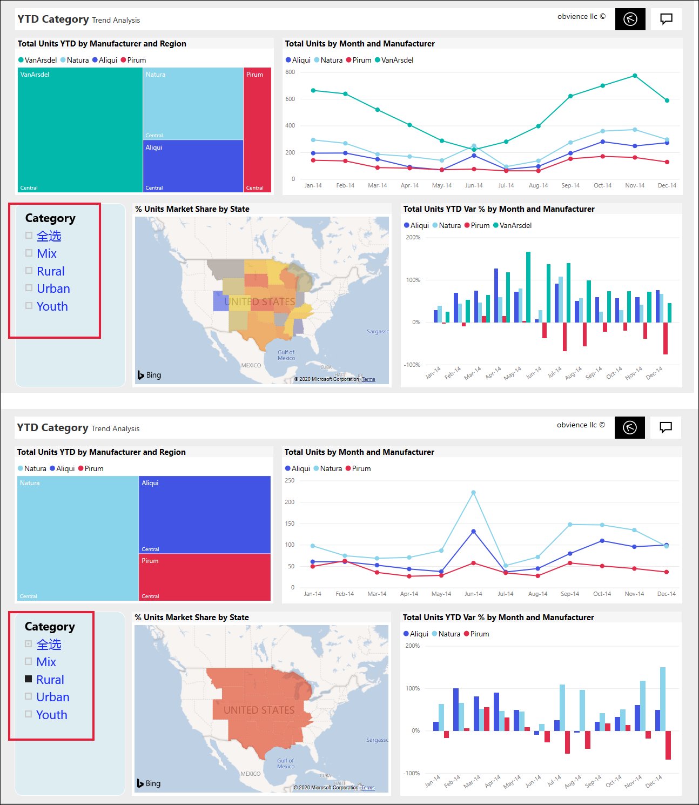
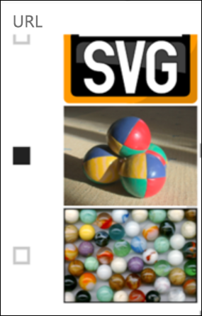
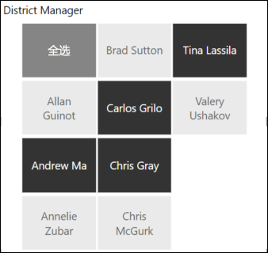
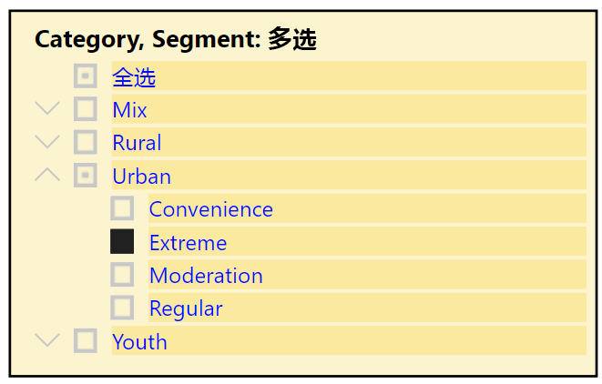
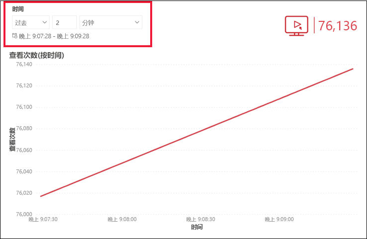

# Power BI 服务中的切片器

[!INCLUDE[consumer-appliesto-ynnn](../includes/consumer-appliesto-yynn.md)]

切片器是可筛选报表页上其他视觉对象的视觉对象类型。 使用 Power BI 报表时将发现许多类型的切片器。 上图显示了相同的切片器，但有不同的选择。 请注意每种选择可如何筛选页面上的其他视觉对象。  

## 如何使用切片器
创建报表时，设计人员可添加切片器来帮助讲述故事，并提供用于探索数据的工具  。

### 数值范围切片器
 数值范围切片器可以帮助你通过地理位置、库存单位和订单日期了解定量数据，例如总销售额。 使用句柄选择范围。 

### 基本垂直复选框切片器

在基本复选框切片器中，选择一个或多个复选框以查看对页面上其他视觉效果的影响。 若要选择多个复选框，请使用 Ctrl-select。 有时，报表设计人员会将切片器设置为一次只允许选择一个值  。 

### 图像和形状切片器
当切片器选项是图像或形状时，进行选择与使用复选框的效果相似。 可以选择一个或多个图像或形状来将切片器应用于页面上的其他视觉效果。 

    

    

### 层次结构切片器

在具有层次结构的切片器中，使用 V 形图标来展开和折叠层次结构。 标头将更新以显示所做的选择。

### 相对时间切片器
随着快速刷新方案的出现，筛选到较小时段的功能可能非常有用。
使用相对时间切片器，可以将基于时间的筛选器应用于报表中的任何日期或时间数据。 例如，可以使用相对时间切片器来只显示最近 2 天、几小时甚至几分钟内的视频视图。 

## 停用切片器
若要停用切片器，请选择橡皮擦图标。

## 后续步骤
有关详细信息，请参阅以下文章：

[Power BI 中的可视化效果类型](end-user-visualizations.md)

