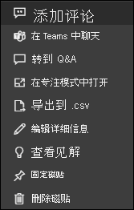

# Power BI 中的仪表板磁贴

[!INCLUDE[consumer-appliesto-yyny](../includes/consumer-appliesto-ynny.md)]

[!INCLUDE [power-bi-service-new-look-include](../includes/power-bi-service-new-look-include.md)]

磁贴是数据的快照，由“设计者”固定到仪表板。 设计者  可以从报表、数据集、仪表板、问答问题框、Excel 和 SQL Server Reporting Services (SSRS) 等位置创建磁贴。  此屏幕截图显示了固定到仪表板的许多不同的磁贴。

除了从报表中固定磁贴，“设计者”可以使用“添加磁贴”直接在仪表板上添加独立磁贴   。 独立磁贴包含：文本框、图像、视频、流数据和 Web 内容。

是否需要了解构成 Power BI 的构建块的帮助？  请参阅 [Power BI - 基本概念](end-user-basic-concepts.md)。

## 与仪表板上的磁贴进行交互

1. 将鼠标悬停在磁贴上以显示省略号。
   
    
2. 选择省略号以打开磁贴操作菜单。 可用选项不尽相同，具体取决于你的权限、视觉对象类型和用于创建磁贴的方法。 例如，可用于从问答固定的磁贴的菜单项与可用于从报表固定的磁贴的菜单项不同。 下面是使用问答创建的磁贴的“操作”菜单。

   
    

   
    这些菜单中提供的一些操作包括：
   
   * [打开用于创建磁贴的报表](end-user-reports.md)   
   
   * [打开用于创建此磁贴的问答问题](end-user-reports.md)   
   

   * [打开用于创建磁贴的工作簿](end-user-reports.md)   
   * [在焦点模式下查看磁贴](end-user-focus.md)   
   * [查看见解](end-user-insights.md) 
   * [添加评论并开始讨论](end-user-comment.md) 
   * [管理仪表板磁贴上设置的警报](end-user-alerts.md) 
   * [在 Excel 中打开数据](end-user-export.md) 

3. 若要关闭操作菜单，请在画布中选择空白区域。

### 选择（单击）磁贴
选择磁贴时，下一步会发生什么情况取决于创建该磁贴的方式以及其是否有[自定义链接](../create-reports/service-dashboard-edit-tile.md)。 如果它有自定义链接，则选择该磁贴将转到该链接。 否则，选择磁贴将转到报表、Excel 联机工作簿、本地 SSRS 报表或用于创建该磁贴的问答问题。

> [!NOTE]
> 这种情况的例外是，设计器将视频磁贴添加到仪表板。 选择视频磁贴（以这种方式创建的）将导致视频直接在仪表板上播放。   
> 
> 

## 注意事项和疑难解答
* 如果选择（单击）磁贴时未执行任何操作，或者你收到错误消息，则可能是由于以下原因：
  - 用于创建可视化效果的报表未保存或已被删除。
  - 磁贴是从 Excel Online 工作簿创建的，你甚至不具备该工作簿的“读取”权限。
  - 如果磁贴是从 SSRS 创建的，则你没有对 SSRS 报表的权限，或者你无权访问 SSRS 服务器所在的网络。
* 对于使用 **添加磁贴** 直接在仪表板上创建的磁贴，如果已经设置了自定义超链接，则选择标题、副标题或磁贴都将打开该 URL。  或者，默认情况下，选择直接在仪表板上创建的磁贴的图像、Web 代码或文本框都不会产生任何操作。
* 如果原始可视化效果用于创建磁贴更改，则磁贴不会更改。  例如，如果“设计者”从报表固定一个折线图，然后将折线图更改为条形图，则仪表板磁贴将继续显示为折线图  。 数据将会刷新，但可视化效果类型不会。

## 后续步骤
[数据刷新](../connect-data/refresh-data.md)

[Power BI - 基本概念](end-user-basic-concepts.md)

