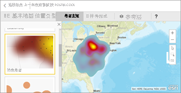
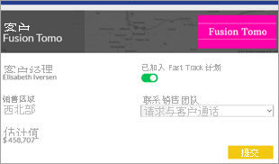
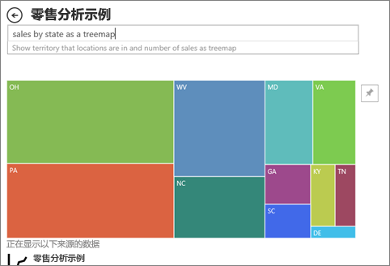

# Power BI 中的视觉对象类型

[!INCLUDE[consumer-appliesto-yynn](../includes/consumer-appliesto-yynn.md)]

你会在报表、仪表板和问答中找到视觉对象。 其中某些视觉对象类型使用 Power BI 进行打包，而另一些视觉对象类型是 Power BI 视觉对象  。 自定义视觉对象在 Power BI 外部创建，其创建方式使报表设计器  可以将它们添加到 Power BI 报表和仪表板。 

本文是与 Power BI 服务打包在一起的视觉对象的概述。  这些是最常遇到的视觉对象。 有关这些视觉对象的详细信息，请参阅[有关视觉对象类型的 Power BI 报表设计器文档](../visuals/power-bi-visualization-types-for-reports-and-q-and-a.md) 

> [!NOTE]
> 要了解 Power BI 视觉对象，请在 [Microsoft AppSource](https://appsource.microsoft.com/marketplace/apps?product=power-bi-visuals) 的“Power BI 视觉对象”  部分中搜索它们。 对于每个视觉对象，你会找到说明、创建者信息以及屏幕截图或视频。 

## Power BI 支持的视觉对象列表
所有这些视觉对象都可以在 Power BI 仪表板和报表中找到，并[在问答中指定](end-user-q-and-a.md)。 若要了解如何与视觉对象进行交互，请参阅[与报表、仪表板和应用中的视觉对象交互](end-user-visualizations.md)

### 分区图：基本（分层）和堆积

基本分区图是在折线图的基础上增加了坐标轴和填充的线之间的区域。 分区图强调变化随时间推移的度量值，可以用于吸引人们关注某个趋势间的总值。 例如，可以在分区图中绘制表示随时间推移的利润的数据以强调总利润。

### 条形图和柱形图

 

条形图是查看跨不同类别的特定值的标准格式。

### 卡片：单个数字

单个数字卡片显示单个事实、单个数据点。 有时在 Power BI 仪表板或报表中想要跟踪的最重要的信息就是一个数字，例如总销售额、同比市场份额或商机总数。  

### 卡片：多行

多行卡片显示一个或多个数据点，每行一个。

### 组合图

组合图将柱形图和折线图结合在一起。 通过将两个图表合并为一个图表可以进行更快的数据比较。 组合图可以具有一个或两个 Y 轴，因此请务必仔细查看。 

组合图适用情况：
- 具有 X 轴相同的折线图和柱形图时。
- 比较具有不同值范围的多个度量值
- 若要在一个视觉对象中说明两个度量值之间的关联
- 检查一个度量值是否满足另一个度量值定义的目标
- 节省画布空间

### 圆环图

圆环图类似于饼图。  它们显示部分与整体的关系。 唯一的区别是中心为空，因而有空间可用于标签或图标。

### 漏斗图

漏斗图用于可视化包含阶段和从一个阶段按顺序流到下一个阶段的项目的流程。  一个示例是从潜在顾客开始，以采购履行结束的销售过程。

例如，销售漏斗图可跟踪各个阶段的客户：潜在客户 > 合格的潜在客户 > 预期客户 > 已签订合同的客户 > 已成交客户。 你可以一眼看出漏斗形状传达了你跟踪的流程的健康状况。
漏斗图的每个阶段代表总数的百分比。 因此，在大多数情况下，漏斗图的形状类似于一个漏斗 -- 第一阶段为最大值，每个后一阶段的值都小于其前一阶段的值。 梨形漏斗图也很有用 -- 它可以识别流程中的问题。 但是通常第一阶段，“进入”阶段为最大值。

### 仪表盘

径向仪表盘有一个圆弧，并且显示单个值，该值用于衡量针对目标/KPI 的进度。 使用直线（针）表示目标或目标值。 使用明暗度表示针对目标的进度。 表示进度的值在圆弧内以粗体显示。所有可能的值沿圆弧均匀分布，从最小值（最左边的值）到最大值（最右边的值）。

在上面的示例中，我们是汽车零售商，需要跟踪销售团队每月的平均销量。 我们的目标是 140，用黑色针表示。 可能的最小平均销量为 0，我们已将最大值设为 200。 蓝色显示本月的平均销量接近 120。 幸运的是，我们仍有一周的时间来实现这一目标。

径向仪表适用情况：
- 显示某个目标的进度
- 表示百分比指标值，如 KPI
- 显示单个指标的健康状况
- 显示可以快速扫描和理解的信息

 ### 关键影响因素图表

关键影响因素图表显示所选结果或值主要参与者。

关键影响因素是一个不错的选择，有助于你了解影响关键指标的因素。 例如，是什么影响客户再次下订单或去年 6 月份为什么有那么高的销售额  。 

### KPI

关键绩效指标 (KPI) 是一个视觉提示，用于传达针对可度量目标已完成的进度。 

当存在以下情况时，KPI 是一个不错的选择：
- 要衡量进度（我是超前了还是落后了？）
- 要衡量与目标的距离（我提前或落后了多少？）

### 折线图

强调一系列值的整体形状，通常以时间的推移来显示。

### 地图：基本地图

使用基本地图可将分类和定量信息与空间位置相关联。

### 地图：ArcGIS 地图

ArcGIS 地图和 Power BI 的结合将超越地图点表示法的地图绘制技术提升到全新水平。 可以使用“基本地图”、“位置类型”、“主题”、“符号样式”和“引用层”选项，创建极具描述性的地图视觉对象。 将地图上的权威数据层（如人口普查数据）与空间分析相结合，可以让用户更深入地了解视觉对象中的数据。

### 地图：着色地图（等值线图）

着色地图使用明暗度、颜色或图案来显示不同地理位置或区域之间的值在比例上有何不同。 使用从浅（不太频繁/较低）到深（较频繁/较多）的明暗度快速显示这些相对差异。

### 地图：形状地图

形状地图使用颜色比较地图上的区域。 形状地图无法在地图上显示数据点的精确地理位置。 相反，其主要目的是通过不同方式对地图上的区域着色来显示这些区域的相对比较。

### Matrix

矩阵视觉对象是一种支持渐变布局的表视觉对象类型（请参阅下面的“表”）。 通常，报表设计器在报表和仪表板中包括矩阵，以便使用户可以选择矩阵中的一个或多个元素（行、列、单元格）以在报表页上交叉突出其他视觉对象。  

### 饼图

饼图显示部分与整体的关系。 

### Power Apps 视觉对象

报表设计器可以创建一个 Power App，并将其嵌入到 Power BI 报表中。 使用者可以在 Power BI 报表中与该视觉对象进行交互。 

### 问答视觉对象

>[!TIP]
>与[仪表板上的问答体验](../power-bi-tutorial-q-and-a.md)相似，借助“问答”视觉对象，可以使用自然语言提出有关数据的问题。 

有关详细信息，请参阅 [Power BI 中的问答视觉对象](../visuals/power-bi-visualization-types-for-reports-and-q-and-a.md)。

### 带状图

功能区图表显示具有最高排名（最大值）的数据类别。 功能区图表能够高效地显示排名变化，并且会在每个时间段内始终将最高排名（值）显示在最顶部。

### 散点图、气泡图和点图

散点图始终具有两个数值轴以显示水平轴上的一组数值数据和垂直轴上的另一组数值数据。 图表在 x 和 y 数值的交叉处显示点，将这些值单独合并到各个数据点。 根据数据，这些数据点可能均衡或不均衡地分布在水平轴上。

气泡图将数据点替换为气泡，用气泡大小表示数据的其他维度。

点图类似于气泡图和散点图，只不过它可以沿 X 轴绘制数值或分类数据。 此示例恰好使用正方形而不是圆形，并沿 X 轴绘制销售额。

### 高密度散点图

根据定义，对高密度数据进行采样，以快速合理地创建能响应交互操作的视觉对象。 高密度采样使用的算法可消除重叠点，并确保数据集中的所有点都会在视觉对象中进行表示。 它不只是绘制数据的代表性示例。  

这可确保将整体数据集中重要点的响应、表示和清楚保存以最佳方式组合。

### 切片器

切片器是可以用于筛选页上的其他视觉对象的独立图表。 切片器有许多不同格式（类别、范围、日期等），可以进行格式设置以便可以选择仅仅一个、许多或所有可用值。 

对于以下情况，切片器是一个不错的选择：
- 在报表画布上显示常用或重要的筛选器，用以简化访问
- 更轻松地查看当前筛选的状态，而无需打开下拉列表
- 按数据表中不需要的和隐藏的列进行筛选
- 通过将切片器放置在重要的视觉对象旁边来创建更多报表

### 独立图像

独立图像是已添加到报表或仪表板的图形。 

### 表

表是以逻辑序列的行和列表示的包含相关数据的网格。 它还包含标头和合计行。 表格可以进行数量比较，可以在其中查看单个类别的多个值。 例如，该表显示了类别的五个不同的度量值。

在以下情况下选择表是不错的选择：
- 查看并比较详细数据和精确值（而不是可视化表示形式）时
- 以表格格式显示数据时
- 按类别显示数值数据时

### 树状图

包含带颜色的矩形的图，用矩形大小表示值。  具有层次结构，主矩形内可以嵌套矩形。 根据要度量的值分配每个矩形内部的空间。 矩形从左上方（最大）到右下方（最小）按大小排列。

当存在以下情况时，树状图是一个不错的选择：
- 要显示大量的分层数据
- 条形图不能有效地处理大量值
- 要显示每个部分与整体之间的比例
- 要显示层次结构中指标在各个类别层次的分布的模式
- 要使用大小和颜色编码显示属性
- 要发现模式、离群值、最重要因素和异常

### 瀑布图

瀑布图显示随着值的增加或减少的不断变化的总数。 该图对于了解一系列正值和负值更改如何影响初始值（例如，净收益）很有用。

列使用颜色编码，因此可以快速区分增加和减少。 初始值列和最终值列通常从水平轴开始，而中间值为浮动列。 由于该图的外观，瀑布图也被称为桥图。

瀑布图适用情况：
- 跨时间或不同类别更改指标
- 要审核对总值有影响的主要更改
- 要通过显示各种收入来源和计算总利润（或损失）绘制公司的的年利润图。
- 要说明一年中公司的起始和结束员工人数。
- 要可视化你每月的收入和支出，以及你的帐户的不断变化的余额。

## 告知问答要使用哪个视觉对象
使用 Power BI 问答键入自然语言查询时，可以在查询中指定视觉对象类型。  例如：

“***以树状图表示的每个州的销售额***”

## 后续步骤
[与报表、仪表板和应用中的视觉对象交互](end-user-visualizations.md)    
[sqlbi.com 中正确的视觉对象引用](https://www.sqlbi.com/wp-content/uploads/videotrainings/dashboarddesign/visuals-reference-may2017-A3.pdf)
