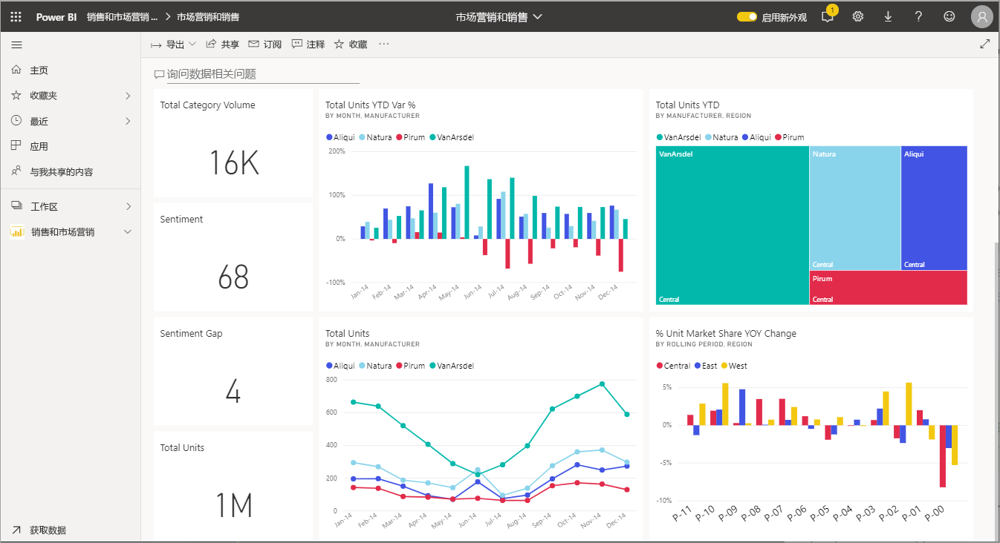

# 与报表、仪表板和应用中的视觉对象交互

[!INCLUDE[consumer-appliesto-ynny](../includes/consumer-appliesto-ynny.md)]

从最基本的含义来说，可视化效果（或视觉对象）是 Power BI 设计人员使用报表和数据集中的数据生成的一种图表。 

视觉对象可在仪表板上的报表中找到，并且可以使用 Power BI 问答实时创建。 当设计器在报表中创建视觉对象时，可以将该视觉对象固定到仪表板  。 [仪表板上的视觉对象被称为“磁贴”](end-user-tiles.md)。 此仪表板有八个磁贴。 

> [!TIP]
> 在阅读此详细内容之前，建议先阅读概述性主题，[面向企业用户的 Power BI 基本概念](end-user-basic-concepts.md)。

## 视觉对象有何用途？

视觉对象是由报表和仪表板设计者创建，并与同事共享的。 设计者根据同事使用报表或仪表板的方式，为他们分配不同的权限。 例如，分配给开发者的权限可能与分配给企业用户的权限不同。 

下表列出了面向企业用户最常见的任务，并提供了分步说明的链接。 企业用户可以通过多种方式与视觉对象进行交互，以发现见解和制定数据驱动的业务决策。  

对于其中的许多选项，管理员或设计器可以设置为禁止查看或使用这些功能。 其中一些功能仅适用于特定视觉对象类型。  如有任何疑问，请与管理员或报表或仪表板的所有者联系。 若要查找所有者，请选择仪表板或报表下拉列表。 

> [!IMPORTANT]
> 但这里先来简单介绍一下问答功能。 问答是 Power BI 的自然语言搜索工具。 你使用自然语言键入问题，问答以视觉对象的形式回答问题。 借助问答，企业用户可以随时创建自己的视觉对象。 不过，使用问答创建的视觉对象无法保存。 但是，如果需要从数据中了解某些特定信息，而设计器没有将其包含在报表或仪表板中，那么问答会是一个不错的选择。 要了解有关问答的详细信息，请参阅[企业用户问答](end-user-q-and-a.md)。

|任务  |在仪表板上  |在报表中  | 在问答中
|---------|---------|---------|--------|
|[在视觉对象中为你自己添加注释，或开始与同事进行有关视觉对象的对话](end-user-comment.md)。     |  是       |   是      |  否  |
|[打开并浏览其中创建了视觉对象的报表](end-user-tiles.md)。     |    是     |   na      |  否 |
|[查看影响视觉对象的筛选器和切片器的列表](end-user-report-filter.md)。     |    是否以焦点模式打开     |   是      |  否 |
|[在问答中打开并浏览视觉对象（如果设计器已使用问答创建视觉对象）](end-user-q-and-a.md)。     |   是      |   na      |  na  |
|[在问答中创建视觉对象（用于浏览，将无法保存该视觉对象）](end-user-q-and-a.md)。     |   是      |   如果设计器向报表添加了问答      |  是  |
|[让 Power BI 为你在视觉对象数据中查找相关事实或趋势](end-user-insights.md)。  这些自动生成的视觉对象被称为见解。     |    是，适用于磁贴    |  否       | 否   |
|[使用焦点模式一次仅查看一个视觉对象](end-user-focus.md)。     | 是，适用于磁贴        |   是，适用于视觉对象      | na  |
|[查找视觉对象的上次刷新时间](end-user-fresh.md)。     |  是       |    是     | na  |
|[使用全屏模式一次仅查看一个视觉对象（不含边框或导航窗格）](end-user-focus.md)。     |   是      |  是       | 默认  |
|[打印](end-user-print.md)。     |  是       |   是      | 否  |
|[通过添加和修改视觉对象筛选器来深入研究视觉对象](end-user-report-filter.md)。     |    否     |   是      | 否  |
|将鼠标悬停在视觉对象之上，以显示更多详细信息和工具提示。     |    是     |   是      | 是  |
|[交叉筛选和交叉突出显示报表页上的其他视觉对象](end-user-interactions.md)。    |   否      |   是      | na  |
|[显示用于创建视觉对象的数据](end-user-show-data.md)。     |  否       |   是      | 否  |
| [更改视觉对象的排序方式](end-user-change-sort.md)。 | 否  | 是  | 可以通过重新组织问题来更改排序  |
| [向视觉对象添加聚焦](end-user-spotlight.md)。 | 否  | 是  |  否 |
| [导出至 Excel](end-user-export.md)。 | 是 | 是 | 否|
| [创建警报](end-user-alerts.md)，以在值超过设置的阈值时通知你。  | 是  | 否  | 否 |
| [交叉筛选和交叉突出显示页面上的其他视觉对象](end-user-report-filter.md)。  | 否      | 是  | na |
| [钻取具有层次结构的视觉对象](end-user-drill.md)。  | 否  | 是   | 否 |

## 后续步骤
返回[面向企业用户的基本概念](end-user-basic-concepts.md)    
[选择视觉对象以打开报表](end-user-report-open.md)    
[Power BI 支持的视觉对象类型](end-user-visual-type.md)