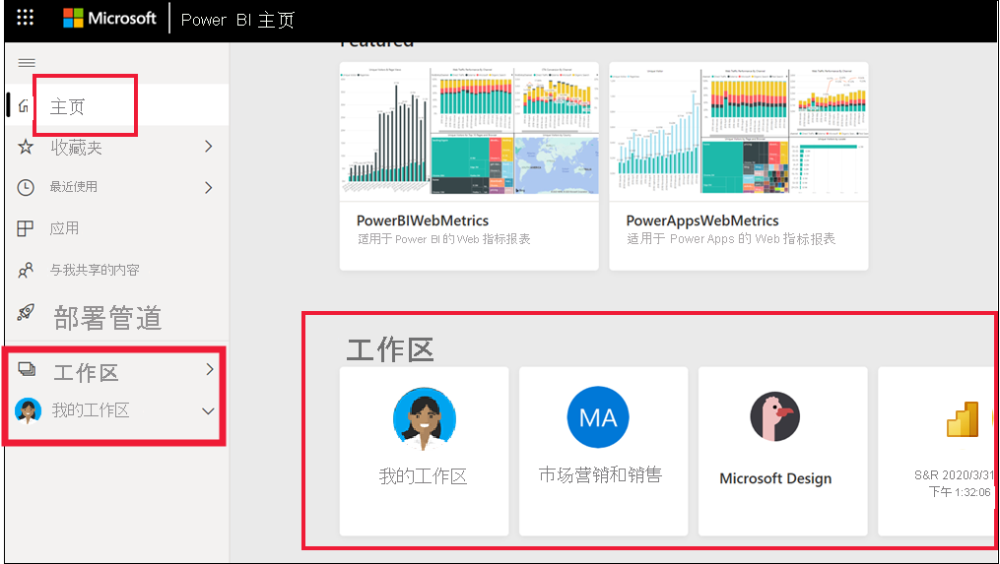

# 在工作区中协作

 在工作区中，可以与同事协作处理特定内容。 工作区是由 Power BI 设计人员创建，用于保留仪表板和报表的集合。 之后设计器可以与同事共享工作区。 设计器还可以将仪表板和报表的集合捆绑到应用并将其分发给整个社区、组织或特定人员或组。 安装某些类型的应用（称为“模板应用”）时将创建工作区。 [了解有关应用的详细信息](end-user-apps.md)。 

 使用 Power BI 服务的所有人还具有“我的工作区”。  “我的工作区”是个人沙盒，可以在其中为自己创建内容。

 可以在 Power BI“主页”查看工作区，或是通过从导航窗格中选择“工作区”查看。

 

## 工作区类型
“我的工作区”存储了你拥有和创建的所有内容。 可以将其作为你的个人沙盒或自己内容的工作区域。 对于很多 Power BI 企业用户来说，“我的工作区”仍然是空的，因为你的工作不涉及新建内容。 根据定义，企业用户会使用其他人创建的数据，并根据此数据做出业务决策。 如果你发现自己要创建内容，不妨改为阅读[面向设计人员的 Power BI 文档](../create-reports/index.yml)。

“工作区”包含特定应用的所有内容。 当设计人员创建一个应用时，他们会将使用该应用所必需的全部内容捆绑在一起。 内容可能包括仪表板、报表和数据集。 并非每个应用都包含这三项内容。 一个应用可能只包含一个仪表板、每种内容类型中包含三个，或者甚至包含 20 个报表。 这一切都取决于设计人员在应用中随附的内容。 通常，与企业用户共享的应用工作区不包含数据集。

下面的 Fig sales 工作区包含三个报表和一个仪表板。 

## 工作区中的权限

访问权限决定了可以在此工作区中执行什么操作，以便实现团队协作。  授予对新工作区的访问权限时，设计人员会将个人或组添加到以下工作区角色之一：查看者、成员、参与者或管理员。 

作为 Power BI 企业用户，你通常将使用查看者角色在工作区中进行交互。 但设计人员还可以将你分配到“成员”或“参与者”角色。 使用查看者角色，可以查看其他人创建并与你共享的内容（仪表板、报表、应用），并与之交互。 由于查看者角色无法访问基础数据集，因此这是一种与内容进行交互的安全方式，不必担心会“伤害”基础数据。

有关具有查看者角色的企业用户可以执行的操作的详细列表，请参阅[面向企业用户的 Power BI 功能](end-user-features.md)。

### 工作区权限和角色

下面是四个角色的功能：管理员、成员、参与者和查看者。 上述功能（查看项并与之交互除外）都需要 Power BI Pro 许可证。

[!INCLUDE[power-bi-workspace-roles-table](../includes/power-bi-workspace-roles-table.md)]

## 许可、工作区和容量
对于决定在工作区中可以做什么，不可以做什么，许可也起了一定作用。 许多功能需要用户拥有 Power BI Pro 许可证或将工作区存储在高级容量中。 

通常，企业用户使用免费许可证。 [了解有关许可的详细信息](end-user-license.md)。 如果内容未存储在高级容量中，则业务用户无权访问。

如果工作区存储在高级容量中，则企业用户能够查看该工作区中的内容并与之交互。 菱形图标标识存储在高级容量中的工作区。

 若要了解详细信息，请参阅[我有哪种许可证？](end-user-license.md)。

## 后续步骤
* [Power BI 中的应用](end-user-apps.md)    

* 是否有任何问题? [尝试咨询 Power BI 社区](https://community.powerbi.com/)

