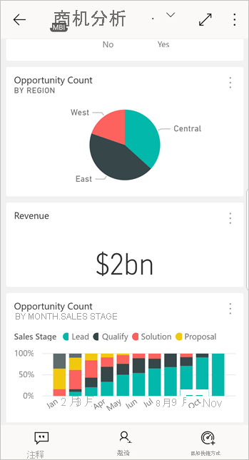
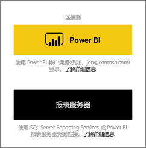
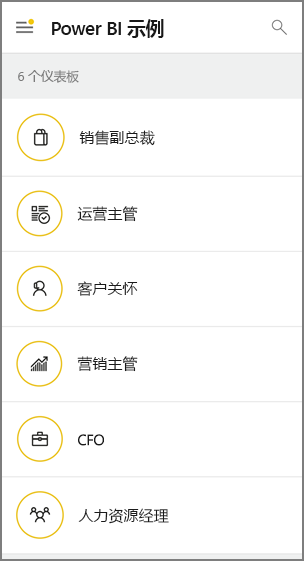

# Android 设备上的 Power BI 移动应用入门
Android 版 Microsoft Power BI 移动应用提供了 Power BI、Power BI 报表服务器和 Reporting Services 的移动 BI 体验。 通过触控移动设备实现的实时访问，可以随时随地查看本地和云中的公司仪表板，并与之进行交互。 然后，可以浏览仪表板中的数据，并通过电子邮件或短信的方式将数据与同事共享。 

可以在 Power BI Desktop 中创建 Power BI 报表，然后发布报表：

* [将报表发布到 Power BI 服务中](../../fundamentals/power-bi-overview.md)，并创建仪表板。
* [在本地将报表发布到 Power BI 报表服务器中](../../report-server/quickstart-create-powerbi-report.md)。

然后，即可在 Android 版 Power BI 应用中与仪表板和报表进行交互，无论它们是在本地还是在云端。

查找 [Power BI 移动应用中的新功能](../../mobile-whats-new-in-the-mobile-apps.md)。

## 先决条件

### 获取应用

从 Google Play [下载 Android 版 Power BI 应用](https://go.microsoft.com/fwlink/?LinkID=544867)。
  
Power BI 可以在多个运行 Android 5.0 操作系统或更高版本的不同 Android 设备上运行。 若要检查设备，请转到“设置”   > “关于设备”   > “Android 版本”  。 

**打开应用时启动**    
即使没有注册或登录，打开该应用后，也可以浏览登录页面，获取有关对 Android 设备上的 Power BI 应用执行的操作的概述。 点击“跳过”  以查看和浏览示例，并获取该应用的亲自实践体验。 无论何时需要，你都可以从仪表板主页[返回到示例](mobile-android-app-get-started.md#try-the-power-bi-and-reporting-services-samples)。

查找 [Power BI 移动应用中的新功能](../../mobile-whats-new-in-the-mobile-apps.md)。

## 在 Web 上注册 Power BI 服务
如果你还未注册，请转到 [Power BI 服务](https://powerbi.com/)注册自己的帐户，以便创建和存储仪表板和报表，并将你的数据集合在一起。 然后，从 Android 设备登录 Power BI，可从任何位置查看你自己的仪表板。

1. 在 Power BI 服务中点击[注册](https://go.microsoft.com/fwlink/?LinkID=513879)创建 Power BI 帐户。
2. 开始[创建自己的仪表板和报表](../../service-get-started.md)。

## 在设备上开始使用 Power BI 应用
1. 在 Android 设备上，从开始屏幕打开 Android 版 Power BI 应用。
   
   
2. 若要登录 Power BI，请点击 Power BI 选项卡并填写登录详细信息  。

    如果你收到 Power BI 无法登录的消息，请参阅[“无法进行身份验证，因为你的企业 SSL 证书不受信任”](mobile-android-app-error-corporate-ssl-account-is-untrusted.md)，了解有关如何解决该问题的详细信息。

   若要登录到 Reporting Services 移动报表和 KPI，请单击“报表服务器”选项卡并填写登录详细信息  。
   
   

## 体验 Power BI 和 Reporting Services 示例
即使没有注册，也可以查看 Power BI 和 Reporting Services 示例并与之交互。

要访问这些示例，请点击导航栏上“更多选项”(…)，然后选择“示例”   。

多个 Power BI 示例后为几个报表服务器示例。
   
   

   
   > [!NOTE]
   > 并非所有功能均可在示例中使用。 例如，无法查看以仪表板为基础的示例报表，则无法与其他人共享这些示例，并且无法收藏这些示例。 
   > 
   >

## 在 Power BI 移动应用中查找内容

点击标头中的放大镜，开始搜索 Power BI 内容。

## 查看你收藏的仪表板和报表
点击导航栏上的“收藏夹”()，查看“收藏夹”页  。 

阅读有关 [Power BI 移动应用中的收藏夹](mobile-apps-favorites.md) 的更多信息。

## Power BI 移动应用的企业支持
组织可以使用 Microsoft Intune 管理设备和应用程序，包括适用于 Android 和 iOS 的 Power BI 移动应用。

使用 Microsoft Intune，组织可以控制各项事务，如要求提供访问 PIN、控制应用程序处理数据的方式，甚至是在未使用应用时加密应用程序数据。

> [!NOTE]
> 如果你在 Android 设备上使用 Power BI 移动应用，并且组织已配置 Microsoft Intune MAM，则会关闭后台数据刷新。 在你下次进入应用时，Power BI 会刷新 Power BI 服务 Web 数据。
> 
> 

详细了解[如何使用 Microsoft Intune 配置 Power BI 移动应用](../../service-admin-mobile-intune.md)。 

## 后续步骤
下面是可使用 Power BI 中的仪表板和报表在 Android 设备版 Power BI 应用中执行的一些其他操作，以及 Power BI 报表服务器或 Reporting Services Web 门户中的报表和 KPI。

### Power BI 仪表板和报表
* 查看[你的应用](../../service-create-distribute-apps.md)。
* 查看你的[仪表板](../../mobile-apps-view-dashboard.md)。
* 浏览[仪表板上的磁贴](../../mobile-tiles-in-the-mobile-apps.md)。
* 打开 [Power BI 报表](../../mobile-reports-in-the-mobile-apps.md)。
* 查看[你的应用](../../service-create-distribute-apps.md)。
* [对磁贴进行批注并共享磁贴](mobile-annotate-and-share-a-tile-from-the-mobile-apps.md)。
* 共享[仪表板](../../mobile-share-dashboard-from-the-mobile-apps.md)。
* 使用 Android 手机[扫描 Power BI QR 代码](../../mobile-apps-qr-code.md)以打开相关仪表板磁贴或报表。 
* 查看[有关 Power BI 帐户更新的通知](../../mobile-apps-notification-center.md)，如同事与你共享的仪表板。

### Power BI 报表服务器/Reporting Services Web 门户中的报表和 KPI
* 在 Android 设备版 Power BI 移动应用中[查看 Web 门户中的报表和 KPI](mobile-app-ssrs-kpis-mobile-on-premises-reports.md)。
* [在 Web 门户中创建 KPI](https://docs.microsoft.com/sql/reporting-services/working-with-kpis-in-reporting-services)。
* [在 Power BI Desktop 中创建报表，然后将报表发布到 Power BI 报表服务器 Web 门户中](../../report-server/quickstart-create-powerbi-report.md)

### 另请参阅
* 从 Android 应用商店[下载 Android 应用](https://go.microsoft.com/fwlink/?LinkID=544867)
* [什么是 Power BI？](../../fundamentals/power-bi-overview.md)
* 是否有任何问题? [尝试咨询 Power BI 社区](https://community.powerbi.com/)

