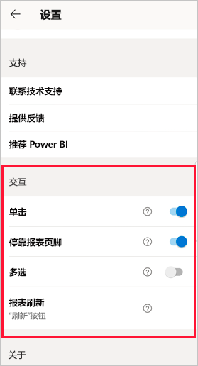
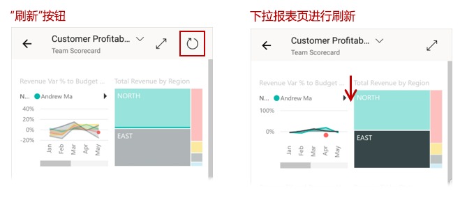
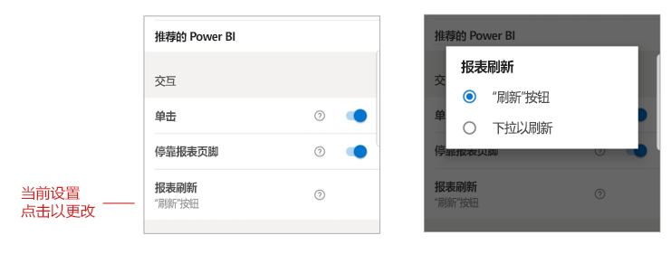

# 配置报表交互设置

## 概览

Power BI 移动应用具有许多可配置的“交互”设置，使你可以控制与数据交互的方式，并定义 Power BI 移动应用中某些元素的行为方式。 下表列出了当前可用的交互设置，以及包含这些设置的设备。

| 设置 | Android 手机 | iPhone | Android 平板电脑  | iPad |
|---------|:-:|:-:|:-:|:-:|
| [报表视觉对象上的单击与双击交互](#single-tap) |✔|✔|||
| [报表视觉对象上的数据点多选与单选](#multi-select) |✔|✔|✔|✔|
| [停靠报表页脚与动态报表页脚](#docked-report-footer) |✔|✔|||
| [按钮启动的报表刷新与下拉以刷新](#report-refresh) |✔||||

若要转到交互设置，请点击个人资料图片以打开[侧面板](./mobile-apps-home-page.md#header)，选择“设置”，并找到“交互”部分。

下面各部分介绍了交互设置。

## 交互设置

### 单击
下载 Power BI 移动应用时，会针对单击交互进行设置。 这意味着，在视觉对象中点击以执行某个操作（如选择切片器项、交叉突出显示、单击链接或按钮等）时，点击会同时选择视觉对象并执行所需操作。

如果愿意，可以关闭双击交互。 随后会使用双击交互。 使用双击交互时，首先点击一个视觉对象以选择它，然后再次点击视觉对象以执行所需操作。

### 多重选择

使用多选选项，可以报表页上选择多个数据点。 如果多选模式已启用，你点击的每个数据点都会添加到其他选定数据点，并且合并结果会自动跨报表页上的所有视觉对象突出显示。 如果多选模式已禁用，当你点击选择数据点时，新选择会替换当前选择。

若要取消选择数据点，请再次点击它。

>[!NOTE]
>Power BI 视觉对象不支持多选。
>
>在下一版报表服务器中，Power BI 报表服务器将支持多选模式。

### 停靠报表页脚

停靠报表页脚设置确定报表页脚是保持停靠（即固定并始终可见）在报表底部，还是基于报表中的操作（如滚动）隐藏和重新显示。

在 Android 手机上，停靠报表页脚设置在默认情况下为“开启”，这意味着报表页脚会停靠并且始终显示在报表底部。 如果更喜欢根据报表中的操作而显示和消失的动态报表页脚，请将设置切换为“关闭”。

### 报表刷新

报表刷新设置定义启动报表刷新的方式。 可以选择使所有报表页眉上具有刷新按钮，或是在报表页面上使用下拉以刷新操作（从上到下稍微下拉）来刷新报表。 下图说明了这两种方法。 

在 Android 手机上，默认情况下会添加刷新按钮。

若要更改报表刷新设置，请转到交互设置中的报表刷新项。 会显示当前设置。 点击值以打开一个弹出窗口，在其中可以选择新值。

## 远程配置

管理员还可以通过应用配置文件使用 MDM 工具来远程配置交互。 通过这种方式，可以标准化整个组织或组织中特定用户组的报告交互体验。 有关详细信息，请参阅[使用移动设备管理配置交互](./mobile-app-configuration.md)。

## 后续步骤
* [与报表进行交互](./mobile-reports-in-the-mobile-apps.md#interact-with-reports)
* [使用移动设备管理配置交互](./mobile-app-configuration.md)
