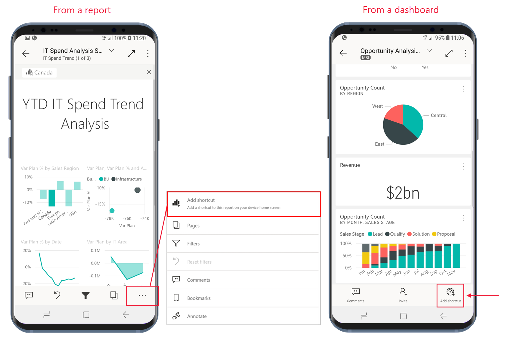

# 在 Power BI Android 应用中使用 Android 应用快捷方式

适用于：

|  |  |
|:--- |:--- |
| Android 手机 |Android 平板电脑 |

适用于 Android 的 Power BI 移动应用提供了两种简单的方法来直接访问所需的报告或仪表板，而无需浏览应用：设备主屏幕快捷方式和应用启动器快捷方式 。
 * **设备主屏幕快捷方式**：可以创建任何报表或仪表板的快捷方式，并将其固定到设备的主屏幕。 报表或仪表板不必位于某个工作区中 - 还可以创建应用内报表和仪表板的快捷方式，甚至创建位于外部 (B2B) 租户上的报表或仪表板的快捷方式。
 * **应用启动器快捷方式**：只需长按设备主屏幕上应用启动器的图标以打开应用启动器，即可直接访问经常查看的报告和仪表板。 快速访问菜单提供三个经常查看的项的快捷方式。 这些项会不时更改 - Power BI 移动应用会跟踪经常查看的内容，并相应地更改快捷方式。

 >[!NOTE]
 >Android 应用快捷方式适用于 Android 8 及更高版本。

## 创建任何报表或仪表板的快捷方式

可以创建任何报表或仪表板的快捷方式。

1. 对于报表，在“操作”菜单上，点击“更多选项...”，然后选择“添加快捷方式” 。 对于仪表板，在“操作”菜单上，点击“添加快捷方式”。

   

   此外，如果 Power BI 应用发现你经常访问一个项，它将建议创建该项的快捷方式。 可通过两种方式添加：
   * 在经常查看的报表和仪表板上，打开项时，“添加快捷方式”选项将显示在横幅中。
   * 如果经常使用某个链接来获取报表（例如，从共享电子邮件、注释等），则在使用此链接几次后，会打开一个窗口，询问是否要创建快捷方式。 选择“是的”将打开“添加快捷方式”对话框（见下文），选择“暂不”将继续转到尝试访问的项目  。
   
   下面将说明这两种体验。

   

 1. 会出现一个显示项名的“添加快捷方式”对话框。 如果需要，可以编辑该名称。 完成后，点击“添加”。

    

1. 系统会要求确认是否要添加快捷方式。 点击“添加”将快捷方式添加到设备的主屏幕。

   

   快捷方式仪表板或报表图标将添加到设备主屏幕，并采用你输入的名称。

   

## 编辑快捷方式名称

对于报表，若要编辑快捷方式的名称，请在“操作”菜单上点击“更多选项...”，然后选择“编辑快捷方式名称”  对于仪表板，点击“添加快捷方式”。 将显示“编辑快捷方式名称”对话框。

 

## 使用 Power BI 移动应用启动器访问经常查看的内容

使用 Power BI 移动应用启动器直接访问经常查看的项。

点击并长按应用程序启动器可显示经常查看的项目的快速访问菜单。 然后点击快捷方式以打开所需的项目。

只需将所需的快捷方式图标拖动到设备主屏幕，即可创建任何列出的项目的永久快捷方式。

## 后续步骤
* [使用 Google Search 查找并访问你的内容](mobile-app-find-access-google-search.md)
* 如果使用的是 iOS，想查找 Siri 快捷方式，请参阅[在 Power BI 移动版 iOS 应用中使用 Siri 快捷方式](mobile-apps-ios-siri-shortcuts.md)。
* [Power BI 移动应用中的收藏夹](mobile-apps-favorites.md)
