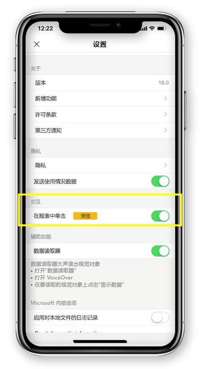

# 将报表交互配置为单击或双击
适用于：

|  |  | 
|:--- |:--- |
| iPhone |Android 手机 |

Power BI 报表是交互式数据视图，使用视觉对象来表示不同的数据发现和见解。

可配置与数据交互的方式。 可决定是要进行单击交互还是双击交互。

* 通过双击交互，第一次点击视觉对象会将其选中，只有在视觉对象中再点击一次才会执行动作本身，例如切片器项选择、交叉突出显示或单击链接、按钮等。

* 通过单击交互，点击一下即可同时选择视觉对象并执行操作。

自 iOS 版 Power BI 应用 18.0 和 Android 版本 112540 起，所有新安装的配置都将单击作为默认行为。
用户如果已在手机上安装 Power BI 且将升级到这些新版本，则可切换到单击模式。

## 更改交互行为

要更改交互行为，可转到应用设置，然后打开/关闭单击交互。

本文同时适用于横向显示的报表和手机报表。

## 后续步骤
* [查看手机优化版 Power BI 报表并与之交互](mobile-apps-view-phone-report.md)
* 是否有任何问题? [尝试咨询 Power BI 社区](https://community.powerbi.com/)

