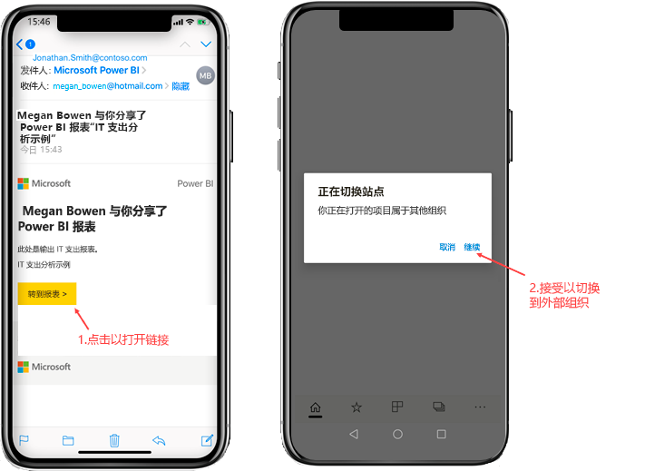
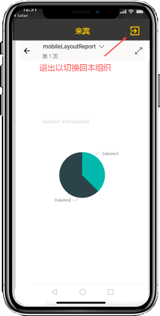
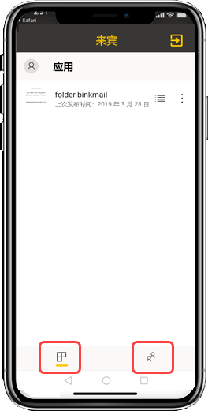

# 查看外部组织与自己共享的 Power BI 内容

Power BI 与 Azure Active Directory 企业到企业 (Azure AD B2B) 集成后，即可将 Power BI 内容安全地分发给组织外的来宾用户。 外部来宾用户也可以使用 Power BI 移动应用访问与其共享的 Power BI 内容。 

适用于：

|  |  |  |  |
|:--- |:--- |:--- |:--- |
| iPhone |iPad |Android 手机 |Android 平板电脑 |

## 访问共享内容

**首先，需要有一个属于外部组织的人员向你共享某个项目。** 若有人[向你共享项目](../../collaborate-share/service-share-dashboards.md)，无论该人员属于与你相同的组织还是某个外部组织，你都将收到一封电子邮件，其中包含指向该共享项目的链接。 在移动设备上打开该链接，开启 Power BI 移动应用。 如果此应用识别出该项目是从外部组织共享的，则该应用将使用你的身份重新连接到对应的外部组织。 然后，应用会加载由该组织与你共享的所有项目。

> [!NOTE]
> 若这是你首次作为外部来宾用户接收到共享的项目，则必须在浏览器中声明邀请。 在 Power BI 应用中无法声明邀请。

只要已连接到外部组织，应用中就会显示一个黑色标头。 此标头表明连接的不是你所属的组织。 若要连接回自己所属的组织，请退出来宾模式。

虽然需要将 Power BI 项目链接连接到外部组织，但在应用切换后，就可以访问与你共享的所有项目（而不仅是从电子邮件中打开的项目）。 若要查看外部组织中可访问的所有项目，请转到应用菜单并选择“与我共享”  。 在“应用”下，还可以找到可以使用的应用  。

## 限制

- 用户必须具有活动的 Power BI 帐户和主租户。
- 用户必须登录自己的 Power BI 主租户，然后才能访问来自外部租户的共享内容。
- Azure AD B2B 和 Power BI 移动版不支持条件访问和其他 Intune 策略。 也就是说应用仅强制实施本组织的策略（如果有）。
- 仅从本组织站点接收推送通知，即使用户作为来宾连接到外部组织时也是如此。 打开通知会将应用重新连接到用户的本组织站点。
- 若用户关闭应用，则应用会在重新打开时自动连接到用户的本组织。
- 在连接到外部组织时，部分操作会被禁用：收藏项目、数据警报、注释和共享。
- 脱机数据在连接到外部组织时不可用。
- 若设备上已安装公司门户应用，则必须注册设备。
