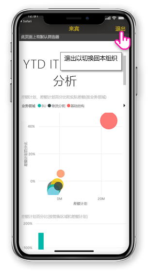
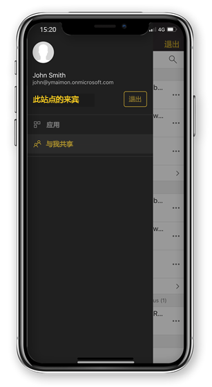

# 查看与你共享的外部组织的 Power BI 内容

Power BI 集成与 Azure Active Directory 企业到企业 (Azure AD B2B) 安全地分发给组织外的来宾用户的 Power BI 内容。 和外部来宾用户可以使用 Power BI 移动应用程序访问与之共享该 Power BI 内容。 

适用于：

|  |  |  |  |
|:--- |:--- |:--- |:--- |
| iPhone |iPad |Android 手机 |Android 平板电脑 |

## 访问共享的内容

**首先，您需要有人与你共享一个项的外部组织。** 当有人[与你共享项](../../service-share-dashboards.md)，同一个组织或外部组织中，您将收到带有指向共享项的链接的电子邮件。 在你的移动设备中的该链接将打开 Power BI 移动应用。 如果应用程序识别出该项目已共享的外部组织，该应用程序重新连接到你的身份与该组织。 应用程序然后加载该组织的与你共享的所有项。

> [!NOTE]
> 如果这是作为外部来宾用户与你共享的第一项，必须声明在浏览器中的邀请。 可以声明不能在 Power BI 应用中的邀请。

只要连接到外部组织，黑色的标头将显示在应用程序。 此标头指示您未连接到本组织。 若要重新连接到本组织，退出从来宾模式。

尽管需要具有 Power BI 项目链接连接到外部组织，您的应用程序切换后，可以访问与你 （不只打开的电子邮件的项） 共享的所有项。 若要查看外部组织中可以访问的所有项，请转到应用菜单并选择**与我共享**。 下**应用**查找应用程序也可以使用。

## 限制

- 在 Azure AD B2B 和 Power BI 移动版中不支持条件性访问和其他 Intune 策略。 这意味着应用程序强制实施仅本组织的策略，如果它们存在。
- 从本组织站点仅接收推送通知 （即使用户连接到外部组织来宾身份）。 打开通知重新连接到用户的本组织站点应用。
- 如果用户关闭应用程序中，当重新打开该应用将自动连接到用户的本组织。
- 如果连接到外部组织，禁用的某些操作： 收藏项，数据警报，批注和共享。
- 脱机数据不可用时连接到外部组织。
- 如果必须在设备上安装的公司门户应用，必须注册你的设备。
