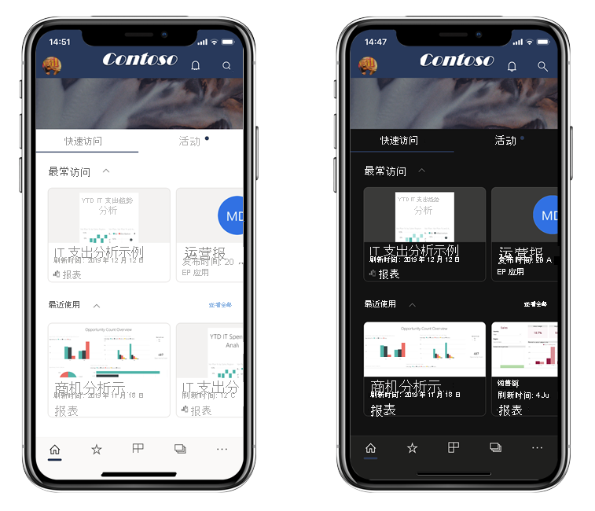
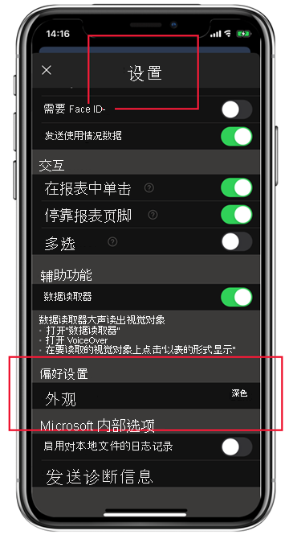

# 深色模式

为了适应个人的查看偏好，适用于 iOS 和 Android 的 Power BI 移动应用支持浅色模式和深色模式。 深色模式可降低屏幕亮度，使你可以更轻松地查看内容。

 在深色模式下，所有应用程序体验都显示为深色背景。 但 Power BI 内容不受影响。 报表、仪表板和应用始终按照设计人员的意图显示。
 
 默认情况下，Power BI 移动应用使用设备的设置来确定要显示的屏幕外观。 如果设备配置了深色模式，应用将以深色模式显示。

>[!NOTE]
>Android 10 上正式提供对 Android 设备上深色模式的设备级别支持。 在运行早期 Android 版本的设备上，Power BI 移动应用中的暗色模式可以通过应用的外观设置进行控制。

若要在浅色模式和暗色模式间切换，或让设备设置确定模式，请转到“设置”页面，向下滚动到“外观”，对其进行单击，然后选择所需的模式。

