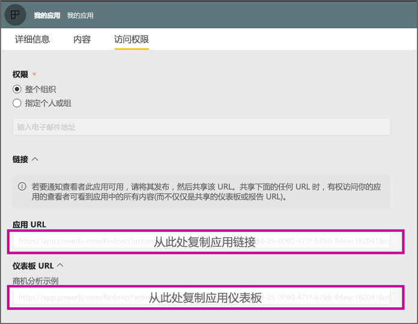

# <a name="create-a-link-to-a-specific-location-in-the-power-bi-mobile-apps"></a>创建指向 Power BI 移动应用中特定位置的链接
可以使用链接直接访问 Power BI 中的特定项：报表、仪表板和磁贴。

在 Power BI 移动版中使用链接主要有两种方案： 

* 从应用外部打开 Power BI，并登录特定内容（报表/仪表板/应用）。 想要从其他应用打开 Power BI 移动版时，这通常是一种集成方案。 
* 在 Power BI 中导航。 通常是你想要在 Power BI 中创建自定义导航。


## <a name="use-links-from-outside-of-power-bi"></a>使用 Power BI 外部的链接
使用 Power BI 应用外部的链接时，需要确保应用可以打开该链接，如果设备上未安装该应用，则为用户提供应用以供安装。 我们已经创建了一个特殊的链接格式，以便完全支持。 此链接格式将确保设备将使用应用打开链接，并且如果设备上未安装该应用，它将使用户能够转到商店以获取它。

链接应以以下形式开头  
```html
https://app.powerbi.com/Redirect?[**QUERYPARAMS**]
```

> [!IMPORTANT]
> 内容是否托管在特定数据中心（如政府、中国等）。链接应以正确的 Power BI 地址开头，如 `app.powerbigov.us` 或 `app.powerbi.cn`。   
>


查询参数有：
* **action**（强制）= OpenApp / OpenDashboard / OpenTile / OpenReport
* **appId** = 如果要打开属于应用的报表或仪表板 
* **groupObjectId** = 如果要打开属于工作区（但不是自己的工作区）的报表或仪表板
* **dashboardObjectId** = 仪表板对象 ID（如果操作是 OpenDashboard 或 OpenTile）
* **reportObjectId** = 报表对象 ID （如果操作是 OpenReport）
* **tileObjectId** = 磁贴对象 ID（如果操作是 OpenTile）
* **reportPage** = 如果要打开特定的报表区域（如果操作是 OpenReport）
* **ctid** = 项组织 ID（与 B2B 方案相关。 如果项属于用户的组织，则可以省略此项。）

**示例：**

* 打开应用链接 
  ```html
  https://app.powerbi.com/Redirect?action=OpenApp&appId=appidguid&ctid=organizationid
  ```

* 打开属于应用一部分的仪表板 
  ```html
  https://app.powerbi.com/Redirect?action=OpenDashboard&appId=**appidguid**&dashboardObjectId=**dashboardidguid**&ctid=**organizationid**
  ```

* 打开属于工作区一部分的报表
  ```html
  https://app.powerbi.com/Redirect?Action=OpenReport&reportObjectId=**reportidguid**&groupObjectId=**groupidguid**&reportPage=**ReportSectionName**
  ```

### <a name="how-to-get-the-right-link-format"></a>如何获取正确的链接格式

#### <a name="links-of-apps-and-items-in-app"></a>应用中的应用和项的链接

对于属于应用的应用和报表以及仪表板，获取链接的最简单方法是转到工作区并选择“更新应用”。 此操作将打开“发布应用”体验，在 “访问”选项卡中，你将找到“链接”部分。 展开该部分后，你将看到可用于直接访问该应用及其所有内容的链接列表。



#### <a name="links-of-items-not-in-app"></a>应用中不存在的项的链接 

对于不属于应用的报表和仪表板，需要从项 URL 中提取 ID。

例如，若要查找包含 36 个字符的仪表板对象 ID，请导航到 Power BI 服务中的特定仪表板。 

```html
https://app.powerbi.com/groups/me/dashboards/**dashboard guid comes here**?ctid=**organization id comes here**`
```

若要查找包含 36 个字符的报表对象 ID，请转到 Power BI 服务中的特定报表。
下面是“我的工作区”报表示例

```html
https://app.powerbi.com/groups/me/reports/**report guid comes here**/ReportSection3?ctid=**organization id comes here**`
```
上述 URL 还包含特定的报表页“ReportSection3”。

下面是来自工作区（不是我的工作区）的报表示例

```html
https://app.powerbi.com/groups/**groupid comes here**/reports/**reportid comes here**/ReportSection1?ctid=**organizationid comes here**
```

## <a name="use-links-inside-power-bi"></a>使用 Power BI 中的链接

Power BI 中的链接在移动应用中与在 Power BI 服务中以同样的方式工作。

如果要添加指向其他 Power BI 项的报表链接，则只需从浏览器地址栏复制该项 URL。 详细阅读[如何向报表中的文本框添加超链接](https://docs.microsoft.com/power-bi/service-add-hyperlink-to-text-box)。

## <a name="use-report-url-with-filter"></a>将报表 URL 与筛选器一起使用
与 Power BI 服务一样，Power BI 移动版应用也支持包含筛选器查询参数的报表 URL。 你可以在 Power BI 移动版应用中打开报表，并将其筛选为特定状态。 例如，此 URL 将打开销售报表并按区域进行筛选

```html
https://app.powerbi.com/groups/me/reports/**report guid comes here**/ReportSection3?ctid=**organization id comes here**&filter=Store/Territory eq 'NC'
```

阅读更多有关[如何生成查询参数以筛选报表](https://docs.microsoft.com/power-bi/service-url-filters)的信息。

## <a name="next-steps"></a>后续步骤
你的反馈有助于我们决定在未来实现什么，所以不要忘记为你希望在 Power BI 移动应用中实现的其他功能投票。 

* [适用于移动设备的 Power BI 应用](mobile-apps-for-mobile-devices.md)
* 关注 Twitter 上的 @MSPowerBI
* 加入 [Power BI 社区](https://community.powerbi.com/)的对话
* [什么是 Power BI？](../../fundamentals/power-bi-overview.md)

