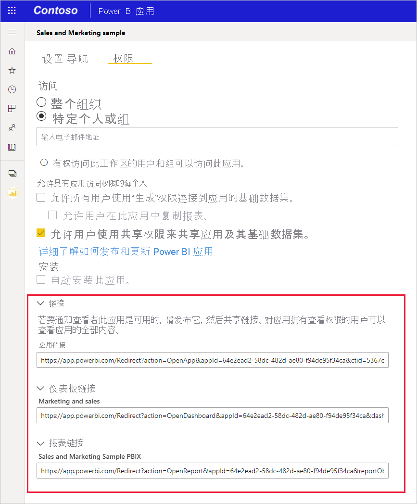

# <a name="create-a-link-to-a-specific-location-in-the-power-bi-mobile-apps"></a>创建指向 Power BI 移动应用中特定位置的链接
您可以使用链接直接访问 Power BI 中的特定项：报表、 仪表板和磁贴。

有在 Power BI 移动中使用链接的两个主要方案： 

* 若要打开从 Power BI**在应用外**，并进入特定内容 （仪表板/报表/应用）。 这通常是集成方案中，当你想要从其他应用程序中打开 Power BI 移动版。 
* 向**导航**Power BI 中。 这是通常在你想要在 Power BI 中创建自定义导航。


## <a name="use-links-from-outside-of-power-bi"></a>使用从 Power BI 外的链接
当使用 Power BI 应用外部的链接时，你想要确保将通过应用程序中，打开它，如果应用未安装在设备上，然后提供用户安装它。 为了支持这一点，我们已创建特殊的链接格式。 此链接格式，将确保此设备正在使用该应用程序以打开该链接，并且如果在设备上未安装该应用程序，它将提供用户转到应用商店获取它。

该链接应以下列开头  
```html
https://app.powerbi.com/Redirect?[**QUERYPARAMS**]
```

> [!IMPORTANT]
> 如果你的内容托管在特殊的数据中心，例如政府，中国，等等。该链接应以正确的 Power BI 地址，如开头`app.powerbigov.us`或`app.powerbi.cn`。   
>


**查询参数**是：
* **操作**（必需） = OpenApp / OpenDashboard / OpenTile / OpenReport
* **appId** = 如果你想要打开报表或仪表板的应用的一部分 
* **groupObjectId** = 如果你想要打开报表或仪表板，其中一部分工作区 （但不是我的工作区）
* **dashboardObjectId** = 仪表板对象 ID （如果 action 是 OpenDashboard 或 OpenTile）
* **reportObjectId** = 报表对象 ID （如果操作为 OpenReport）
* **tileObjectId** = 磁贴对象 ID （如果操作为 OpenTile）
* **reportPage** = 如果你想要打开特定报表部分 （如果操作是 OpenReport）
* **ctid** = 项组织 ID （适用于 B2B 方案。 这可以省略如果项属于用户的组织）。

**示例：**

* 打开应用链接 
  ```html
  https://app.powerbi.com/Redirect?action=OpenApp&appId=appidguid&ctid=organizationid
  ```

* 打开仪表板，属于应用程序 
  ```html
  https://app.powerbi.com/Redirect?action=OpenDashboard&appId=**appidguid**&dashboardObjectId=**dashboardidguid**&ctid=**organizationid**
  ```

* 打开工作区中的报表
  ```html
  https://app.powerbi.com/Redirect?Action=OpenReport&reportObjectId=**reportidguid**&groupObjectId=**groupidguid**&reportPage=**ReportSectionName**
  ```

### <a name="how-to-get-the-right-link-format"></a>如何获取的右侧链接格式

#### <a name="links-of-apps-and-items-in-app"></a>应用程序和应用程序中的项的链接

有关**应用程序和报表和仪表板的应用的一部分**，获取链接的最简单方法是转到应用工作区，然后选择"更新应用"。 这将打开"发布应用"体验，并在访问选项卡，您会发现**链接**部分。 可以使用扩展部分，您将看到该应用程序的列表，并且所有内容都链接直接访问它们。



#### <a name="links-of-items-not-in-app"></a>不在应用中的项的链接 

对于报表和仪表板，不是应用程序的一部分，您需要提取项 URL 中的 Id。

例如，若要查找 36 个字符**仪表板**对象 ID，请导航到 Power BI 服务中的特定仪表板 

```html
https://app.powerbi.com/groups/me/dashboards/**dashboard guid comes here**?ctid=**organization id comes here**`
```

若要查找 36 个字符**报表**对象 ID，请导航到 Power BI 服务中的特定报表。
这是报表的从"我的工作区"示例

```html
https://app.powerbi.com/groups/me/reports/**report guid comes here**/ReportSection3?ctid=**organization id comes here**`
```
在上述 URL 还包含特定报表页 **"ReportSection3"** 。

这是报表的从工作区 （不我的工作区） 示例

```html
https://app.powerbi.com/groups/**groupid comes here**/reports/**reportid comes here**/ReportSection1?ctid=**organizationid comes here**
```

## <a name="use-links-inside-power-bi"></a>使用 Power BI 内的链接

Power BI 中的链接可工作方式与 Power BI 服务完全相同的移动应用中。

如果你想要添加到指向另一个 Power BI 项目报表的链接，可以只从浏览器地址栏中复制该项目 URL。 详细了解[如何向报表中的文本框添加超链接](https://docs.microsoft.com/power-bi/service-add-hyperlink-to-text-box)。

## <a name="use-report-url-with-filter"></a>使用筛选器使用的报表 URL
与 Power BI 服务相同，Power BI 移动应用还支持包含筛选器查询参数的报表 URL。 可以在 Power BI 移动应用中打开报表并筛选到特定状态。 例如，此 URL 打开 Sales 报表，并按区域筛选

```html
https://app.powerbi.com/groups/me/reports/**report guid comes here**/ReportSection3?ctid=**organization id comes here**&filter=Store/Territory eq 'NC'
```

详细了解[如何生成查询参数来筛选报表](https://docs.microsoft.com/power-bi/service-url-filters)。

## <a name="next-steps"></a>后续步骤
你的反馈将帮助我们决定未来要做什么，如果你想在 Power BI 移动应用中看到其他功能，别忘了向我们提出你的建议。 

* [适用于移动设备的 Power BI 应用](mobile-apps-for-mobile-devices.md)
* 关注 Twitter 上的 @MSPowerBI
* 加入 [Power BI 社区](http://community.powerbi.com/)的对话
* [什么是 Power BI？](../../power-bi-overview.md)

