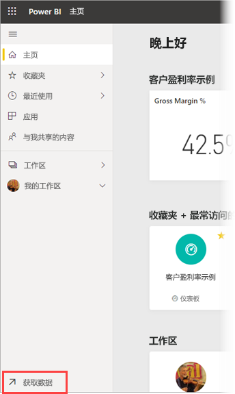
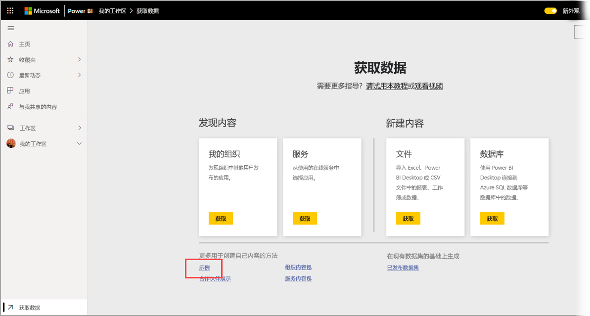
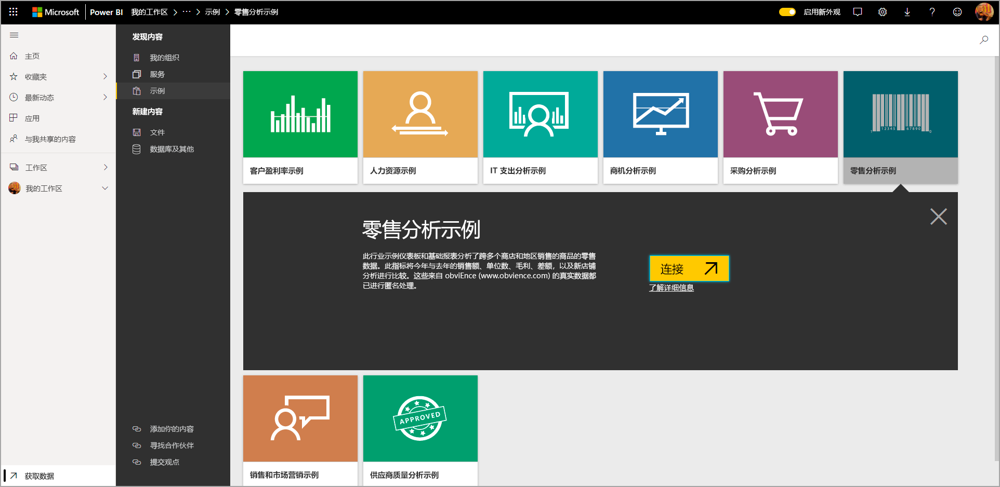
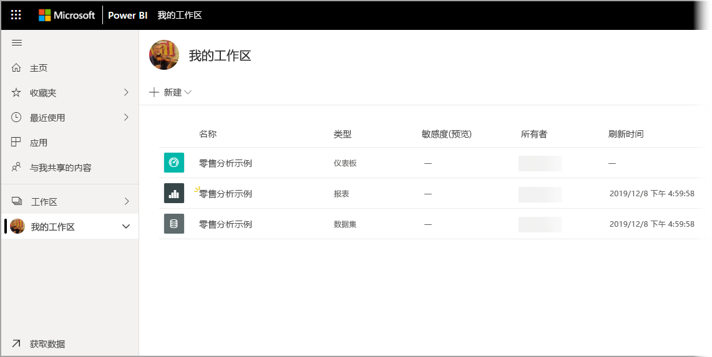

# 将示例下载到 Power BI 服务中的“我的工作区”

此处提供的某些移动应用文档使用示例数据进行说明。 若要在设备上执行操作，可以将示例数据下载到 Power BI 服务帐户，之后可以在设备上的 Power BI 移动版应用中查看它。 本文介绍如何将示例数据下载到 Power BI 服务帐户。 

## 必备组件

必须具有 Power BI 服务帐户才能下载数据。 如果尚未注册 Power BI，请[注册免费试用版](https://app.powerbi.com/signupredirect?pbi_source=web)后再进行操作。

## 下载示例

1. 在浏览器中打开 [Power BI 服务](https://app.powerbi.com)，然后登录。

2. 在导航窗格的左下角选择“获取数据”  。 如果导航窗格处于隐藏状态，并且看不到“获取数据”链接，请单击显示/隐藏导航窗格图标来显示窗格。  
   
    

3. 在“获取数据”页上选择“示例”链接  。
   
   

4. 选择要下载的示例。 请确保选择正在使用调用的教程、快速入门或文章的示例。 选择后，单击“连接”  。
  
   
   
5. Power BI 导入示例，并将新的仪表板、报表和数据集添加到“我的工作区”。
   
   
  
现在你已准备就绪，可在移动设备上查看这些示例。

## 后续步骤
* [快速入门](mobile-apps-quickstart-view-dashboard-report.md)
* 是否有任何问题？ 查看 [Power BI 社区中的“移动应用”部分](https://go.microsoft.com/fwlink/?linkid=839277)
