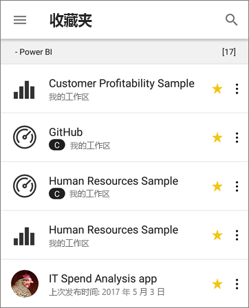
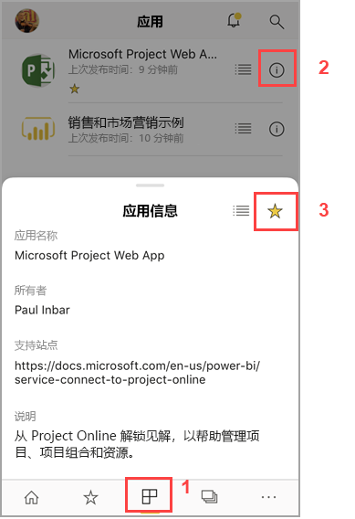
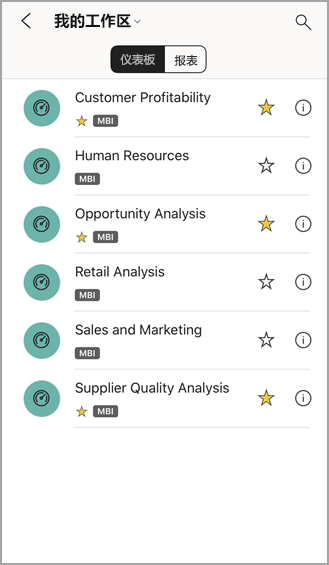
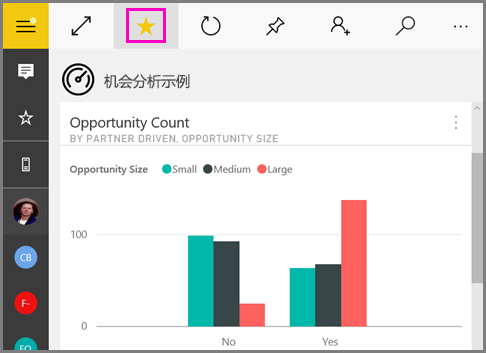
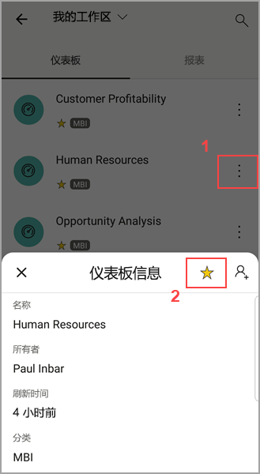
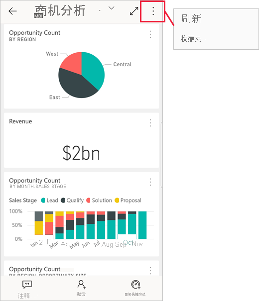
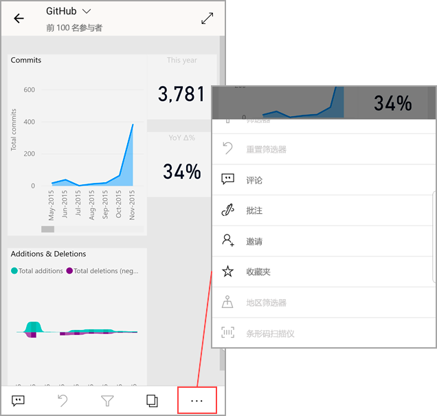

# 在 Power BI 移动应用中收藏和查看
适用于：

|  |  |  |  |  |
|:--- |:--- |:--- |:--- |:--- |
| iPhone |iPad |Android 手机 |Android 平板电脑 |Windows 10 设备 |

>[!NOTE]
>我们将于 2021 年 3 月 16 日终止对使用 Windows 10 移动版的手机提供 Power BI 移动应用支持  。 [了解详细信息](https://go.microsoft.com/fwlink/?linkid=2121400)

了解如何在移动应用中收藏和查看 Power BI 仪表板、报表和应用，以及收藏的本地 Power BI 报表服务器和 Reporting Services KPI 和报表。

在 Power BI 移动应用中进行收藏时，可以在 [Power BI 服务](https://powerbi.com)和所有移动设备中的“收藏夹”页上看到收藏的内容。

要查看“收藏夹”页，请点击导航栏上的“收藏夹”图标：

还可以[在 Power BI 服务中收藏 Power BI 仪表板和应用](../end-user-favorite.md)。 然后，可以在移动应用的“收藏夹”页上看到它们。

可以在 Power BI 报表服务器或 Reporting Services Web 门户上将 KPI 和报表标记为收藏项，然后在移动设备上的一个方便使用的文件夹中查看它们，以及收藏的 Power BI 仪表板。

## 收藏应用
1. 点击底部导航栏上的“应用”图标以显示应用页面。

2. 在 iOS 设备上，点击要收藏的应用名称右侧的信息按钮。 Android 设备上会出现“更多选项”(...)，而不是信息按钮。 

3. 在打开的“应用信息”部分中，点击星形图标。
   
    
   
    此时，该应用会在“收藏夹”页上列出，同时列出的还有其他收藏的仪表板、报表和应用。
   
## 在 iOS 和 Windows 10 移动应用中收藏仪表板或报表
可以从仪表板或报表列表或仪表板或报表本身收藏 Power BI 仪表板或报表。

* 在移动应用的仪表板或报表列表中，点击名称旁的空心五角星 。 五角星会变成黄色 。
  
    
* 如果位于仪表板中，请点击功能区中的空心星形图标 。 如果位于报表中，则星形图标位于“更多选项”(...) 下方  。星形图标  变成黑色。
  
    

## 在 Android 移动应用中收藏仪表板或报表
可以从仪表板或报表列表或仪表板或报表本身收藏仪表板或报表。

* 在移动应用的仪表板或报表列表中，点击名称旁边的垂直“更多选项”(…) 按钮，然后点击出现的“信息”选项卡上的“收藏夹”星形图标  。
  
    

* 位于仪表板中时，点击功能区上的空心星形图标 。 五角星会变成深灰色 。
  
    

* 如果位于报表中，请向下滑动以显示功能区，点击“更多选项”(...)，然后向下滚动查找空心星形图标 ，然后点击该图标  。 星形图标  变成深灰色。
  
    

## 收藏 Power BI 报表服务器/Reporting Services 报表和 KPI
可以在 Power BI 移动应用中查看收藏的 Power BI 报表服务器/Reporting Services 报表和 KPI，但不能在移动应用中收藏它们。 在 [Web 门户中将它们标记为收藏项](../../report-server/tutorial-explore-report-server-web-portal.md#tag-your-favorites)。 

## 后续步骤
* [Power BI 服务中最喜爱的仪表板](../end-user-favorite.md) 
* 是否有任何问题? [尝试咨询 Power BI 社区](https://community.powerbi.com/)

