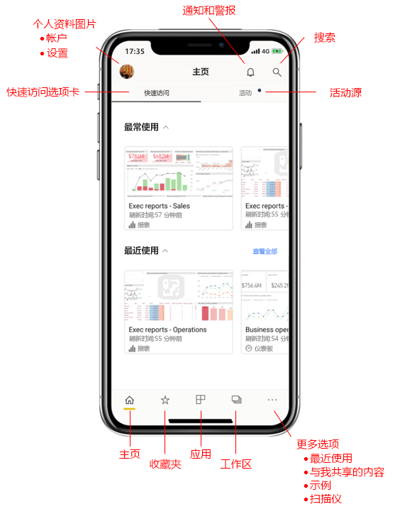
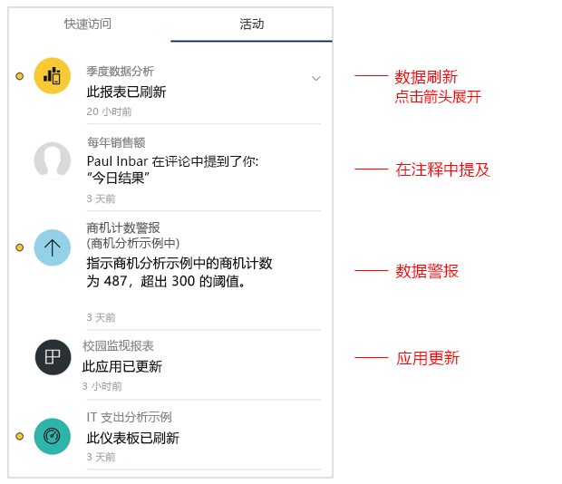
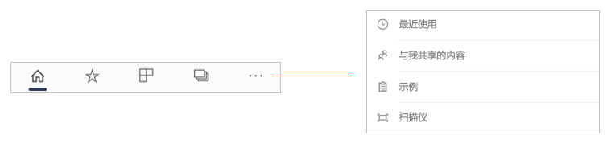
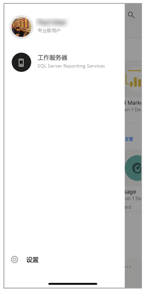
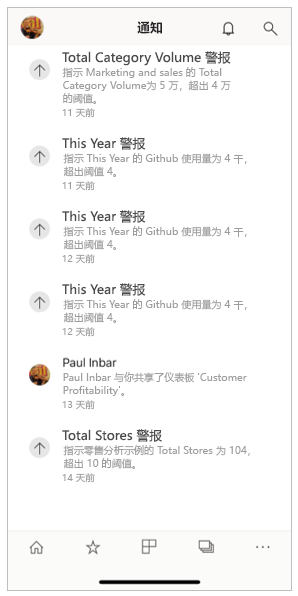

# 移动应用主页快速教程
在本教程中，你将了解 Power BI 移动应用的主页及其提供的导航帮助，以便快速找到所需的内容。

适用于：

|  |  |  |
|:--- |:--- |:--- |
| iPhone | iPad | Android | 

打开 Power BI 移动应用时，将显示主页，可在其中快速访问你最常访问或最近访问的报表、仪表板和应用。 此外，可通过活动源及时了解 Power BI 内容的情况，还可通过方便的导航帮助快速找到所需内容。

 
## 快速访问选项卡

快速访问选项卡会显示你经常查看和最近查看的报表、仪表板和应用，并将这些内容分为两个可折叠部分。 若要查看更多最近查看的项，请在“最近使用”右侧点击“查看全部”  。 

## 活动源

活动源可帮助你跟踪 Power BI 内容的情况。 它会显示所有最新通知、警报、评论和 @mentions。

源中将更新的内容包括：
* **已刷新数据**：收藏夹或最近使用记录中某个报表或仪表板中的基础数据已刷新。
* **新增评论**：有人在你的收藏夹或最近记录中的报表或仪表板中创建评论，或有人在评论中提到你。
* **数据警报**：数据达到你之前在数据警报中设置的[阈值](mobile-set-data-alerts-in-the-mobile-apps.md)。
* **应用更新**：你正在使用的应用的创建者发布该应用的更新。

 点击活动项以跳转到相关位置，以便进一步浏览。

将聚合活动项，将来自同一应用或工作区的所有数据更新分到一个组中。 使用  使用此箭头展开并查看聚合的项。 最近使用的项将始终位于列表顶部。

## 导航栏

在该页底部可找到导航栏。

通过导航栏可快速访问以下内容：

*  **主页** - 返回到主页。
*  **收藏夹** - 已标记为[“收藏”](mobile-apps-favorites.md)的报表、仪表板和应用。
*  **应用** - 帐户中已安装的应用。
*  **工作区** - 将内容创建者正在构建的报表和仪表板汇集到一处的工作文件夹。
*  **最近使用** - 你最近查看的项。
*  **与我共享** - 其他人与你共享的项。
*  **示例** - 可用于了解 Power BI 功能的 Power BI 示例。
*  **扫描仪** - 设备相机，可用作扫描仪以扫描[条形码](mobile-apps-scan-barcode-iphone.md)和 [QR 码](mobile-apps-qr-code.md)。

## 标头

页面顶部的标头显示当前所在的 Power BI 页、报表或仪表板的名称。

标头提供以下导航项：
* **个人资料图片或头像** - 打开侧面板，在这里，你可以[在 Power BI 服务和 Report Server 帐户之间切换](mobile-app-ssrs-kpis-mobile-on-premises-reports.md)，还可访问 Power BI 移动应用设置。

    

* **通知** -打开[通知页](mobile-apps-notification-center.md)，可以在其中查看和使用通知。 通知铃上的点表示你有新的通知。

    

* **搜索** - 搜索订阅中的 Power BI 内容。

    

## 后续步骤
本教程介绍了 Power BI 移动应用主页。 详细了解如何使用 Power BI 移动应用。 
* [浏览仪表板和报表](mobile-apps-quickstart-view-dashboard-report.md)
* [在 Power BI 移动应用中浏览报表](mobile-reports-in-the-mobile-apps.md)
