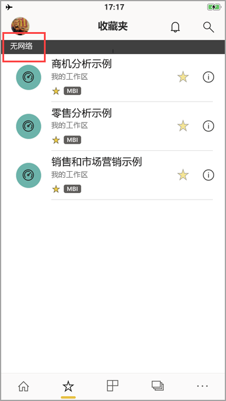

# 在 Power BI 移动应用中查看你的脱机数据
适用于：

|  |  |  |  |  |
|:--- |:--- |:--- |:--- |:--- |
| iPhone |iPad |Android 手机 |Android 平板电脑 |Windows 10 设备 |

>[!NOTE]
>我们将于 2021 年 3 月 16 日终止对使用 Windows 10 移动版的手机提供 Power BI 移动应用支持。 [了解详细信息](/legal/powerbi/powerbi-mobile/power-bi-mobile-app-end-of-support-for-windows-phones)

在移动应用而不是在移动浏览器中查看 Power BI 的一个优点是，未连接到网络时也可以看到你的数据。 

默认情况下，Power BI 经常刷新数据，从而能随时获得最新的业务问题解答，甚至在上下班途中或漫游时也可以。

## 脱机访问数据
你可以在脱机时访问以前从移动应用访问的仪表板，并与之进行交互。

还对以前从移动应用访问的任何 Power BI 报表具有只读访问权限。 可以看到完整的报表，但不能在其上进行筛选、交叉筛选、排序或在其上使用切片器。

>[!NOTE]
> 基于 DirectQuery 的报表不能缓存，也不能脱机使用。

## 后台数据刷新
后台刷新功能会利用 Power BI 服务数据（而非数据源）更新你收藏的仪表板，以及你在过去两周内查看过的仪表板和报表。 如果你已连接 WIFI，后台刷新功能会每 2 小时更新一次。 在其他情况下，如果使用的是 3G 网络，Power BI 会每 24 小时更新一次内容。

可以出于一些目的关闭后台刷新功能。例如，为了避免使用网络。 检查设备上的设置。

> [!NOTE]
> 如果你在 iOS 设备上使用 Power BI 移动应用，并且组织已配置 Microsoft Intune MAM，则会关闭后台数据刷新。 在你下次进入应用时，Power BI 会刷新 Power BI 服务 Web 数据。
> 
> 详细了解[如何使用 Microsoft Intune 配置 Power BI 移动应用](../../admin/service-admin-mobile-intune.md)。 
> 
> 

## 脱机状态指示器
在进入或退出脱机模式时，Power BI 提供明确指示并在缺少脱机时可用的仪表板、报表和磁贴时提供相关指示。

## 限制
要在移动设备上脱机使用 Power BI，可能会遇到以下限制：

* Power BI 可以脱机缓存最多 250 MB 的数据。
* 某些磁贴类型需要有效的服务器连接，因此，在脱机状态下这些磁贴不可用；例如，必应地图磁贴和一些自定义磁贴。
* 在 Power BI 中整个 Excel 工作簿脱机时将不可用。
* 如果你在连接时查看了 Reporting Services 移动报表和 KPI，那么脱机时也可以对其进行查看。 不会在后台刷新报表和 KPI。 而是每次打开它们时将其刷新。
* 在 Power BI 移动应用中，看不到已保存到 Power BI 报表服务器的 Power BI Desktop (.pbix) 文件。 
* 在网络处于脱机状态时，分页报表 (RDL) 不可用。

## 后续步骤
你的反馈有助于我们决定在未来实现什么，所以不要忘记为你希望在 Power BI 移动应用中实现的其他功能投票。 

* [适用于移动设备的 Power BI 应用](mobile-apps-for-mobile-devices.md)
* 关注 Twitter 上的 @MSPowerBI
* 加入 [Power BI 社区](https://community.powerbi.com/)的对话
* [什么是 Power BI？](../../fundamentals/power-bi-overview.md)