# 查看 Power BI 移动应用中的仪表板
适用于：

|  |  |  |  | 
|:--- |:--- |:--- |:--- |:--- |
| [iPhone](mobile-apps-view-dashboard.md#view-dashboards-on-your-iphone) |[iPad](mobile-apps-view-dashboard.md#view-dashboards-on-your-ipad) |[Android 手机](mobile-apps-view-dashboard.md#view-dashboards-on-your-android-phone) |[Android 平板电脑](mobile-apps-view-dashboard.md#view-dashboards-on-your-android-tablet) |

仪表板是公司的生命周期和流程的门户。 仪表板是用于监视业务的当前状态的一个概览性的单一区域。

## 在 Power BI 服务 (https://powerbi.com) 中创建仪表板
**你未在移动应用中创建仪表板。** 

要在移动设备上查看仪表板和报表，则需要在 Web 浏览器中创建或连接它们。 

1. 转到 Power BI 服务 ([https://www.powerbi.com](https://www.powerbi.com)) 和[注册帐户](../../fundamentals/service-self-service-signup-for-power-bi.md)。
2. [自行创建 Power BI 仪表板和报表](../../fundamentals/service-get-started.md)，或者连接到现有 [Power BI 应用](../../connect-data/service-connect-to-services.md)来获取各种服务，例如 [Microsoft Dynamics CRM](../../connect-data/service-connect-to-services.md)。

此处是一个 Power BI 服务中的 Power BI 仪表板：

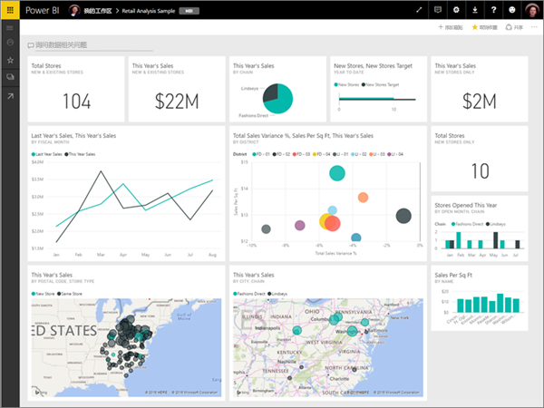

## 在 iPhone 上查看仪表板
1. 打开 iPhone 上的 Power BI 应用并登录。
   
   是否需要从 Apple App Store [下载 iPhone 应用](https://go.microsoft.com/fwlink/?LinkId=522062)？
2. 点击仪表板将其打开。  
   
    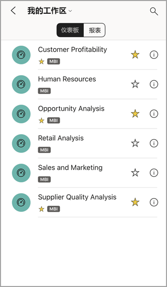
   
   * 黄色星标  表示仪表板已加入收藏夹。 
   * 每个仪表板名称下面的批注（在此示例中为“MBI :::image type="icon" source="././media/mobile-apps-view-dashboard/power-bi-dashboard-ios-medium-classification.png" border="false":::”）表明每个仪表板中的数据是如何分类的。 阅读更多有关 [Power BI 中的数据分类](../../create-reports/service-data-classification.md)。
   
   默认情况下，在 iPhone 上 Power BI 仪表板看起来稍有不同。 所有磁贴大小相同，从顶部到底部一个接一个排列。
   
    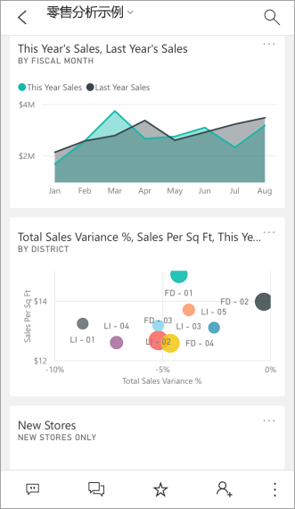
   
   > [!TIP]
   > 如果你是仪表板所有者，则可以在 Power BI 服务中[创建手机专用仪表板纵向模式视图](../../create-reports/service-create-dashboard-mobile-phone-view.md)。 
   > 
   > 
   
    还可以旋转手机，在横向模式下查看仪表板。
   
    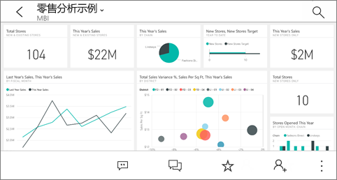
3. 向上和向下轻扫可查看仪表板中的所有磁贴。 你可以：
   
   * [点击一个磁贴](mobile-tiles-in-the-mobile-apps.md)以在焦点模式中打开它，并与之进行交互。
   * 点击星形图标  [来收藏它](mobile-apps-favorites.md)。
   * 点击“邀请” 以[邀请同事](mobile-share-dashboard-from-the-mobile-apps.md)查看你的仪表板。
   * [使用 Apple Watch 对仪表板进行同步](mobile-apple-watch.md)。
4. 若要返回到仪表板列表，点击仪表板标题旁边的箭头，然后点击“**我的工作区**”。
   
   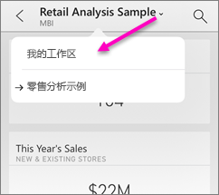

### 在 iPhone 上的横向模式下查看仪表板
只需旋转手机，即可在横向模式中查看仪表板。 仪表板布局从一系列磁贴变为整个仪表板的视图，可以看到仪表板的所有磁贴，与 Power BI 服务中展示的一样。

可以在仪表板的不同区域使用“收缩”手势进行放大和缩小，还可以使用平移来进行导航。 你仍然可以[点击磁贴](mobile-tiles-in-the-mobile-apps.md)以在焦点模式下打开该磁贴，并与你的数据进行交互。

## 在 iPad 上查看仪表板
1. 打开 Power BI 应用。
   
   是否需要首先从 Apple App Store [下载此 iPad 应用](https://go.microsoft.com/fwlink/?LinkId=522062)？
2. 在该应用的顶部点击“仪表板”。  
   
   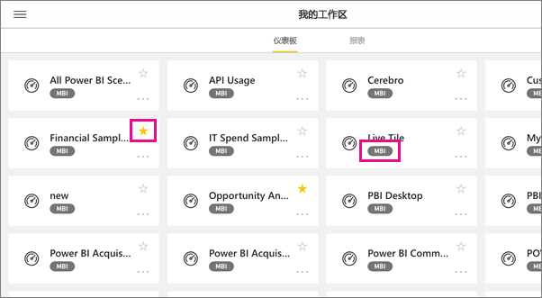
   
   * 黄色星标  表示仪表板已加入收藏夹。 
   * 每个仪表板名称下面的批注（在此示例中为“MBI :::image type="icon" source="././media/mobile-apps-view-dashboard/power-bi-dashboard-ios-medium-classification.png" border="false":::”）表明每个仪表板中的数据是如何分类的。 阅读更多有关 [Power BI 中的数据分类](../../create-reports/service-data-classification.md)。
3. 你可以从工作区中共享仪表板。 依次点击仪表板磁贴右下角的省略号 ( **...** ) 和“**邀请其他人**”。
   
   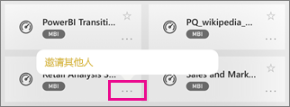
4. 也可以点击仪表板将其打开并查看该仪表板中的磁贴。 在仪表板中，你可以与它进行交互：
   
   * [点击磁贴以](mobile-tiles-in-the-mobile-apps.md)与磁贴交互。
   * [打开磁贴后面的报表](mobile-reports-in-the-mobile-apps.md)。
   * [邀请其他人查看仪表板](mobile-share-dashboard-from-the-mobile-apps.md)。
   * 对磁贴[进行批注并共享其快照](mobile-annotate-and-share-a-tile-from-the-mobile-apps.md)。
5. 若要返回我的工作区，请点击左上角中的仪表板名称，然后点击“**我的工作区**”。
   
   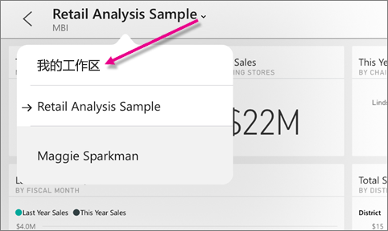

## 在 Android 手机上查看仪表板。
1. 打开 Android 手机上的 Power BI 应用并登录。
   
   需要先[下载 Android 应用](https://go.microsoft.com/fwlink/?LinkID=544867)？
2. 点击仪表板将其打开。   
   
   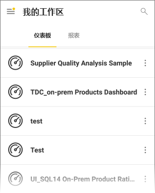

    黄色星标  表示仪表板已加入收藏夹。 

    仪表板名称下面的批注（在此示例中为“MBI :::image type="icon" source="././media/mobile-apps-view-dashboard/power-bi-android-dashboard-medium-classification.png" border="false":::”）表明每个仪表板中的数据是如何分类的。 阅读更多有关 [Power BI 中的数据分类](../../create-reports/service-data-classification.md)。

    在 Android 手机上 Power BI 仪表板看起来稍有不同。 所有磁贴宽度相同，从顶部到底部一个接一个排列。

    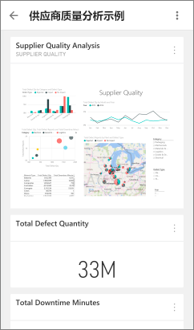

    如果你是仪表板所有者，则可以在 Power BI 服务中[创建手机专用仪表板纵向模式视图](../../create-reports/service-create-dashboard-mobile-phone-view.md)。 

1. 在仪表板上，你可以点击名称旁边的垂直“更多选项”(...) 按钮来邀请同事，刷新或获取有关仪表板的信息：
   
   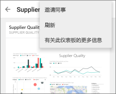
2. 向上和向下轻扫可查看[仪表板中的所有磁贴](mobile-tiles-in-the-mobile-apps.md)。 
3. 若要返回到仪表板主页，请点击仪表板名称，打开痕迹线索，然后点击“**我的工作区**”。   

## 在 Android 平板电脑上查看仪表板
1. 在 Android 平板电脑上，打开并登录 Power BI 应用。
   
   需要先[下载 Android 应用](https://go.microsoft.com/fwlink/?LinkID=544867)？
2. 点击仪表板将其打开。   
   
   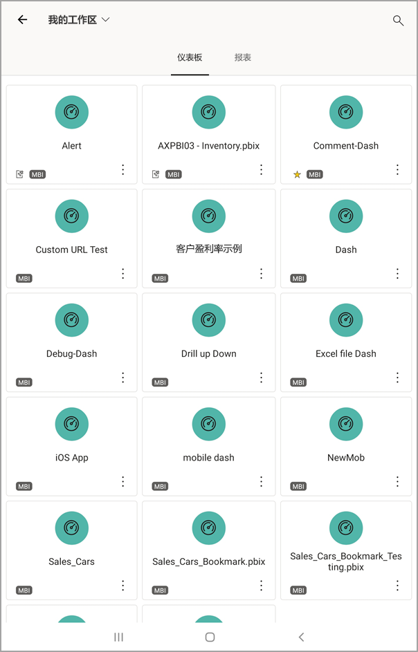
   
   * 黄色星标  显示哪些仪表板已加入收藏夹。 
   * 每个仪表板名称下面的批注（在此示例中为“MBI :::image type="icon" source="././media/mobile-apps-view-dashboard/power-bi-android-dashboard-medium-classification.png" border="false":::”）表明每个仪表板中的数据是如何分类的。 阅读更多有关 [Power BI 中的数据分类](../../create-reports/service-data-classification.md)。
3. 在仪表板上，你可以点击名称旁边的垂直“更多选项”(...) 按钮来邀请同事，刷新或获取有关仪表板的信息：
   
   
4. 向上和向下轻扫可查看[仪表板中的所有磁贴](mobile-tiles-in-the-mobile-apps.md)。 
   
   可以在仪表板的不同区域使用“收缩”手势进行放大和缩小，还可以使用平移来进行导航。 你仍然可以[点击磁贴](mobile-tiles-in-the-mobile-apps.md)以在焦点模式下打开该磁贴，并与你的数据进行交互。
5. 若要返回到仪表板主页上，点击仪表板名称以打开导航路径记录，然后点击“**我的工作区**”：
   
    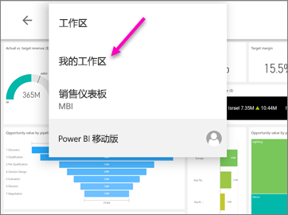

    可以在仪表板的不同区域使用“收缩”手势进行放大和缩小，还可以使用平移来进行导航。 你仍然可以[点击磁贴](mobile-tiles-in-the-mobile-apps.md)以在焦点模式下打开该磁贴，并与你的数据进行交互。

## 在 Power BI 服务中创建仪表板电话视图
如果你是仪表板所有者，则可以 *在 Power BI 服务中* 创建手机专用仪表板纵向模式视图。 

阅读有关[创建仪表板电话视图](../../create-reports/service-create-dashboard-mobile-phone-view.md)的更多信息。

## 后续步骤
* 从 Google play [下载 Android 应用](https://go.microsoft.com/fwlink/?LinkID=544867)  
* [适用于 Power BI 的 Android 应用入门](mobile-android-app-get-started.md)  
* [什么是 Power BI？](../../fundamentals/power-bi-overview.md)
* 是否有任何问题? [尝试咨询 Power BI 社区](https://community.powerbi.com/)
