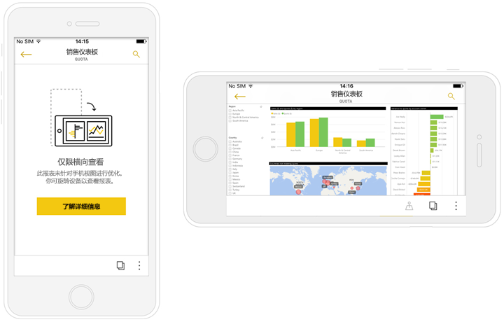
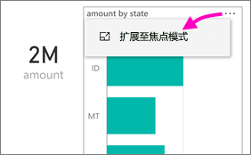
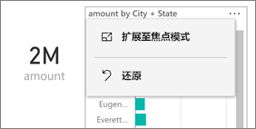
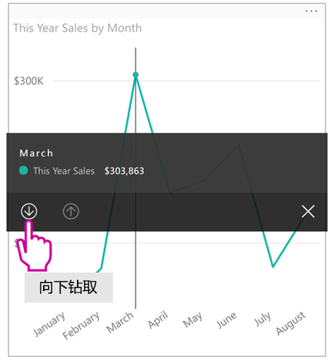
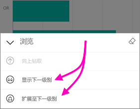
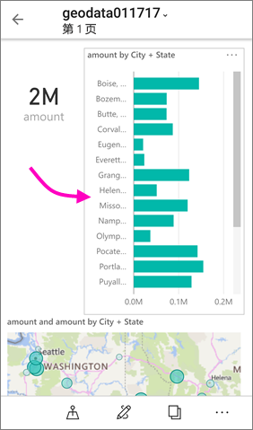
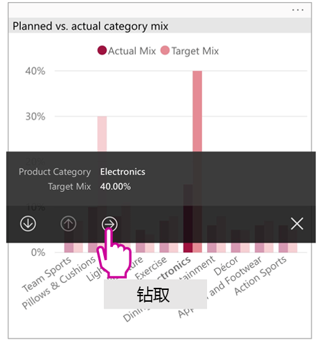
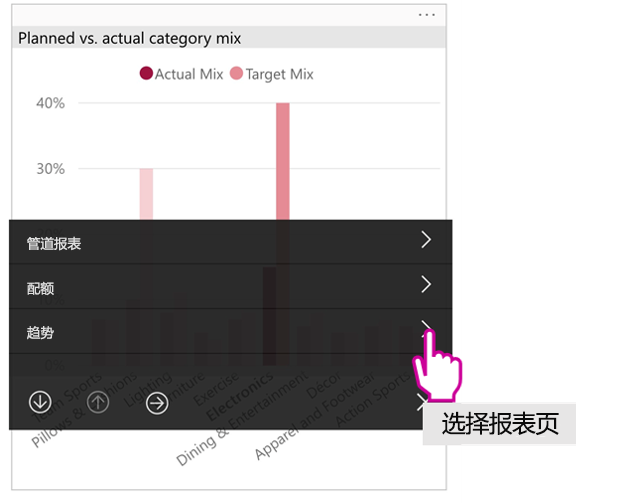

# 查看针对你的手机进行优化的 Power BI 报表

适用于：

|  |  |
|:--- |:--- |
| iPhone |Android 手机 |

在手机上查看 Power BI 报表时，Power BI 会检查以查看报表是否已针对手机进行优化。 如果是，Power BI 会自动以纵向视图打开优化的报表。

如果不存在优化的手机报表，则报表仍将打开，但以非优化的横向视图显示。 即使是更适合在手机上查看的报表，如果翻转手机，报表也会按照原始报表布局，在未优化的视图中打开。 如果只优化了某些页，则你将在纵向视图中看到消息，指示该报表提供横向视图。

Power BI 报表的所有其他功能对更适合在手机上查看的报表仍有效。 阅读可在以下机型中执行的操作的详细信息：

* [iPhone 上的报表](mobile-reports-in-the-mobile-apps.md)。 
* [Android 手机上的报表](mobile-reports-in-the-mobile-apps.md)。

## 筛选手机上的报表页
如果针对手机优化的报表已定义筛选器，则在手机上查看报表时可以使用这些筛选器。 筛选为在 web 上找到报表中筛选的值在手机上打开报表。 还会通过消息提示报表页上有活动筛选器。 可以在手机上更改筛选器。

1. 点击筛选器图标  手机筛选器图标。 
2. 使用基本筛选或高级筛选查看你感兴趣的结果。
   
    

## 交叉突出显示视觉对象
交叉突出显示视觉对象在纵向视图在 Power BI 服务中，并在横向视图中的手机上工作，这种：在一个视觉对象中选择数据时，它会突出显示该页面上其他视觉对象中的相关数据。

阅读有关 [Power BI 中的筛选和突出显示](../../power-bi-reports-filters-and-highlighting.md)的详细信息。

## 选择视觉对象
在手机报表中选择视觉对象时，手机报表突出显示并专注于该视觉对象，以抵消画布笔势。

利用所选的视觉对象，可执行诸如在该视觉对象中滚动的操作。 要取消选择视觉对象，触摸视觉对象区域之外的任意位置即可。

## 在焦点模式下打开视觉对象
手机报表也提供焦点模式下：获取 visual 的单个更大的视图并更轻松地浏览。

* 在手机报表中，点击视觉对象右上角的省略号 ( **...** ) >“**扩展至焦点模式**”。
  
    

你在焦点模式下所执行的操作将被传递到报表画布，反之亦然。 例如，如果突出显示视觉对象中的一个值，然后返回到整个报表，报表将筛选为视觉对象中突出显示的值。

由于屏幕大小的限制，一些操作仅在焦点模式下可用：

* **向下钻取**视觉对象中显示的信息。 阅读以下有关手机报表中[向下钻取和向上钻取](mobile-apps-view-phone-report.md#drill-down-in-a-visual)的详细信息。
* 对视觉对象中的值进行**排序**。
*  还原：清除针对视觉对象所采取的浏览步骤，并还原为报表创建时的定义集。
  
    若要清除视觉对象中的所有浏览，请点击省略号 ( **...** ) >“**还原**”。
  
    
  
    还原是可用在报表级别，清除所有视觉对象，从探索或视觉对象级别、 清除前者将从选定的视觉对象。   

## 在视觉对象中向下钻取
如果在视觉对象中定义了层次结构级别，则可以向下钻取视觉对象中显示的详细信息，然后备份。 在 Power BI 服务或 Power BI Desktop 中，[向视觉对象添加向下钻取功能](../end-user-drill.md)。

有几种类型的向下钻取：

### 向下钻取的值
1. 长时间点击视觉对象中的数据点 （tap 和 hold）。
2. 工具提示将显示，且如果定义层次结构，则通过然后的工具提示页脚将显示向下的钻取和向上箭头。
3. 点击向下钻取的向下箭头

    
    
4. 点击向上钻取的向上箭头。

### 向下钻取到下一级别
1. 在手机报表中，点击右上角的省略号 ( **...** ) >“**扩展至焦点模式**”。
   
    
   
    在本示例中，柱线显示状态的值。
2. 点击左下角的“浏览”图标  在左下方。
   
    
3. 点击“**显示下一个级别**”或“**扩展至下一级别**”。
   
    
   
    现在，柱线显示城市的值。
   
    
4. 如果点击左上角的箭头，则返回到值仍扩展至较低级别的手机报表。
   
    
5. 若要向上返回到原始级别，请再次点击省略号 ( **...** ) >“**还原**”。
   
    

## 一个值从钻取
钻取连接与其他报表页在一个报表页中的值。 当你从钻取数据点到另一个报表页时，数据点值用于页上，通过筛选钻好，否则它将在所选数据的上下文中。
报表作者可以[定义钻取](https://docs.microsoft.com/power-bi/desktop-drillthrough)在创建报表时。

1. 长时间点击视觉对象中的数据点 （tap 和 hold）。
2. 工具提示将显示，且如果定义钻取，则通过然后的工具提示页脚将显示钻取箭头。
3. 点击钻取的箭头

    

4. 选择的报表页后，可以钻取

    

5. 使用后退按钮，在要返回到从启动页上的应用程序标头。

## 后续步骤
* [创建针对 Power BI 手机应用的优化报表](../../desktop-create-phone-report.md)
* [在 Power BI 中创建仪表板电话视图](../../service-create-dashboard-mobile-phone-view.md)
* [创建优化为适应任意大小的响应式视觉对象](../../visuals/desktop-create-responsive-visuals.md)
* 更多问题？ [尝试咨询 Power BI 社区](http://community.powerbi.com/)

