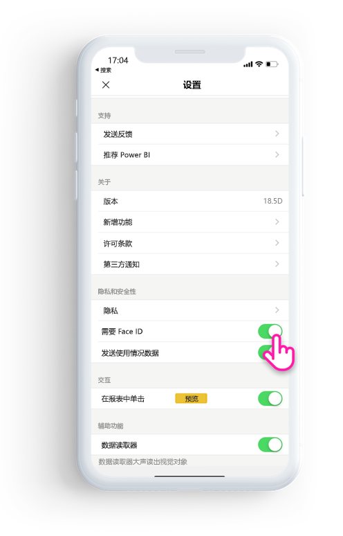
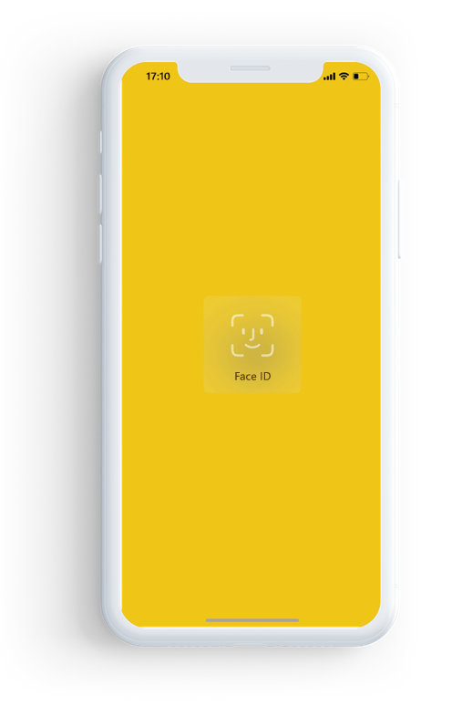

# 使用 Face ID、Touch ID 或密码来保护 Power BI 应用 

在许多情况下，Power BI 中管理的数据为保密数据，需要对其进行保护并仅允许授权用户访问。 

Power BI iOS 应用允许通过配置其他标识来保护数据。 每次启动应用时，或将应用从后台唤醒到前台时，都需要提供 Face ID、Touch ID 或密码。

|  |  |
|:--- |:--- |
| iPhone |iPad |

## 在应用设置中启用 Face ID、Touch ID 或密码

若要在 Power BI 中使用其他标识，请转到应用设置的“隐私和安全”下  。 你将看到用来基于设备功能启用 Face ID、Touch ID 或密码的选项。

打开此设置后，每次启动 Power BI 或将其从后台唤醒时，它都会要求提供 ID 才允许访问应用。 

要求提供 Face ID、Touch ID 或密码的决定由 iOS 根据设备功能做出。 如果设备支持 Face ID，则需要使用 Face ID。 如果设备支持 Touch ID，则需要使用 Touch ID。 如果两者均不受支持，则需要提供密码。

## 使用 MDM 强制实施 Face ID、Touch ID 或密码

某些组织具有安全策略和合规性要求，会强制提供其他标识才允许访问业务敏感数据。 

Power BI 移动版 iOS 应用允许管理员通过推送来自 Microsoft Intune 和其他移动设备管理 (MDM) 解决方案的应用配置设置来控制该设置。 管理员可以使用应用保护策略为所有用户或一组用户启用此设置。

|密钥  |类型  |说明  |
|---------|---------|---------|
| com.microsoft.powerbi.mobile.ForceDeviceAuthentication | 布尔 | 默认值为 False。  设置为 True 时，应用将强制用户使用 Face ID、Touch ID 或密码来识别自己，然后才允许查看应用中的任何 Power BI 数据。 未在其设备上配置 Face ID、Touch ID 或密码的用户将需要先对其进行配置，然后才能访问 Power BI。  |

## 后续步骤

[使用 MDM 远程配置 Power BI iOS 应用](mobile-app-configuration.md)
