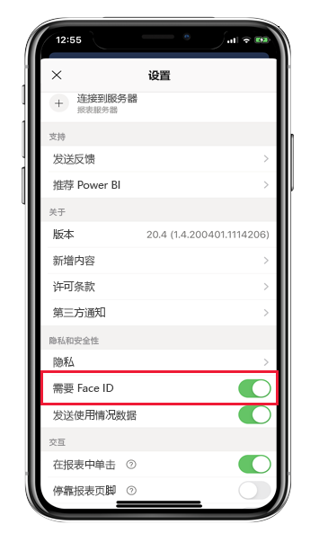
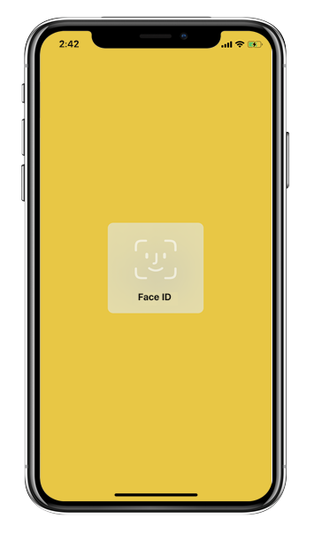
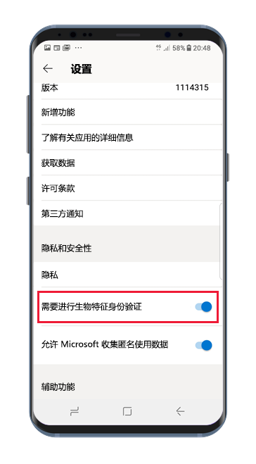
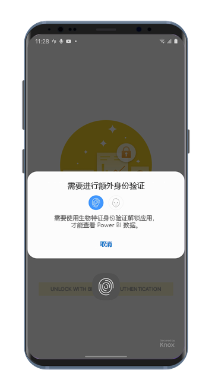

# 使用 Face ID、Touch ID、密码或生物特征数据来保护 Power BI 应用 

在许多情况下，Power BI 中管理的数据为保密数据，需要对其进行保护并仅允许授权用户访问。 

适用于 iOS 和 Android 的 Power BI 应用允许通过配置其他标识来保护数据。 然后，每次启动应用程序或转为在前台运行时，都需要进行验证。 在 iOS 上，这意味着提供 Face ID、Touch ID 或密码。 在 Android 上，这意味着提供生物识别数据（指纹 ID）。

适用于：

|  |  |  |  |
|:--- |:--- |:--- |:--- |
|iPhone |iPad |Android 手机 |Android 平板电脑 |

## 在 iOS 中启用 Face ID、Touch ID 或密码

若要在适用于 iOS 的 Power BI 移动设备中使用其他标识，请转到应用设置的“隐私和安全”下  。 你将看到用来启用 Face ID、Touch ID 或密码的选项。 显示的选项取决于设备的功能。

启用此设置后，每次启动应用或将其从后台唤醒时，它都会要求提供 ID 才允许访问应用。

系统要求提供的 ID 类型取决于设备的功能。 如果设备支持 Face ID，则需要使用 Face ID。 如果设备支持 Touch ID，则需要使用 Touch ID。 如果两者均不受支持，则需要提供密码。 下图显示了 Face ID 身份验证屏幕。

## 在 Android 上启用生物识别数据（指纹 ID）

若要在适用于Android 的 Power BI 移动设备中使用其他标识，请转到应用设置的“隐私和安全”下  。 你将看到启用生物识别数据的选项。

启用此设置后，每次启动 Power BI 或将其从后台唤醒时，它都会要求提供生物特征数据（指纹 ID）才允许访问应用。

下图显示了指纹身份验证屏幕。

>[!NOTE]
>若要使用移动应用的“需要生物识别认证”设置，需要先在 Android 设备上设置生物识别方法。 如果设备不支持生物识别方法，将无法使用此移动应用设置来保护对 Power BI 数据的访问。
>
>如果管理员已为移动应用[远程打开安全访问](#mdm-enforcement-of-secure-access-to-your-power-bi-mobile-app)，你需要在自己的设备上设置生物识别方法才能访问该应用（如果尚未设置）。 如果设备不支持生物识别方法，则远程设置不会对你产生影响。 对移动应用的访问仍处于不安全的状态。

## MDM 强制实施对 Power BI 移动应用的安全访问。

某些组织具有安全策略和合规性要求，会强制提供其他标识才允许访问业务敏感数据。

为支持此功能，Power BI 移动应用允许管理员通过推送来自 Microsoft Intune 和其他移动设备管理 (MDM) 解决方案的应用配置设置来控制移动应用安全访问设置。 管理员可以使用应用保护策略为所有用户或一组用户启用此设置。 有关详细信息，请参阅[使用 MDM 远程配置 Power BI 移动应用](mobile-app-configuration.md#data-protection-settings-ios-and-android)。

## 后续步骤
* [使用 MDM 远程配置 Power BI 移动应用](mobile-app-configuration.md)
