# <a name="using-oauth-to-connect-to-power-bi-report-server-and-ssrs"></a>使用 OAuth 连接到 Power BI 报表服务器和 SSRS

可使用 OAuth 连接到 Power BI 报表服务器和 Reporting Services，以显示移动报表或 KPI。 了解如何将环境配置为支持 OAuth 对 Power BI 移动应用进行身份验证以连接到 Power BI Report Server 和 SQL Server Reporting Services 2016 或更高版本。

观看 Adam 如何使用 OAuth 从 Power BI 移动连接到 SSRS：


<iframe width="560" height="350" src="https://www.youtube.com/embed/okzPAI2uUek" frameborder="0" allowfullscreen></iframe>


> [!NOTE]
> iOS 和 Android 应用现支持查看在使用 WAP 进行身份验证的 Power BI 报表服务器中托管的 Power BI 报表。

## <a name="requirements"></a>要求

Windows Server 2016 是 Web 应用程序代理 (WAP) 和 Active Directory 联合身份验证服务 (ADFS) 服务器的必备组件。 无需具备 Windows 2016 功能级别的域。

## <a name="domain-name-services-dns-configuration"></a>域名服务 (DNS) 配置

公用 URL 将是 Power BI 移动应用要连接到的 URL。 例如，可能如下所示。

```https
https://reports.contoso.com
```

需要将报表的 DNS 记录指向 Web 应用程序代理 (WAP) 服务器的公用 IP 地址  。 还需要为 ADFS 服务器配置公用 DNS 记录。 例如，可能为 ADFS 服务器配置了以下 URL。

```https
https://fs.contoso.com
```

需要将 fs 的 DNS 记录指向 Web 应用程序代理 (WAP) 服务器的公用 IP 地址，因为会将其作为 WAP 应用程序的一部分发布  。

## <a name="certificates"></a>证书

需要为 WAP 应用程序和 ADFS 服务器配置证书。 这些证书都必须是移动设备可以识别的有效证书颁发机构的一部分。

## <a name="reporting-services-configuration"></a>Reporting Services 配置

Reporting Services 端没有太多要配置的。 我们只需确保具备有效的服务主体名称 (SPN) 来使 Kerberos 身份验证正常进行，并且已启用 Reporting Services 服务器以进行协商身份验证。

### <a name="service-principal-name-spn"></a>服务主体名称 (SPN)

SPN 是使用 Kerberos 身份验证的服务的唯一标识符。 需要确保报表服务器存在正确的 HTTP SPN。

有关如何为报表服务器配置正确的服务主体名称 (SPN) 的信息，请参阅[为报表服务器注册服务主体名称 (SPN)](https://msdn.microsoft.com/library/cc281382.aspx)。

### <a name="enabling-negotiate-authentication"></a>启用协商身份验证

若要使报表服务器可以使用 Kerberos 身份验证，需要将报表服务器的身份验证类型配置为 RSWindowsNegotiate。 可在 rsreportserver.config 文件中执行此操作。

```xml
<AuthenticationTypes>  
    <RSWindowsNegotiate />  
    <RSWindowsKerberos />  
    <RSWindowsNTLM />  
</AuthenticationTypes>
```

有关详细信息，请参阅[修改 Reporting Services 配置文件](https://msdn.microsoft.com/library/bb630448.aspx)和[在报表服务器上配置 Windows 身份验证](https://msdn.microsoft.com/library/cc281253.aspx)。

## <a name="active-directory-federation-services-adfs-configuration"></a>Active Directory 联合身份验证服务 (ADFS) 配置

需要在环境中的 Windows 2016 服务器上配置 ADFS。 可通过服务器管理器并在“管理”下选择“添加角色和功能”完成配置。 有关详细信息，请参阅 [Active Directory 联合身份验证服务](https://technet.microsoft.com/windows-server-docs/identity/active-directory-federation-services)。

### <a name="create-an-application-group"></a>创建应用程序组

在“AD FS 管理”屏幕上，需要为 Reporting Services 创建一个应用程序组，其中将包含 Power BI 移动应用的信息。

可以按照以下步骤创建应用程序组。

1. 在“AD FS 管理”应用上，右键单击“应用程序组”，并选择“添加应用程序组…”  

   

2. 在“添加应用程序组”向导中，为应用程序组提供“**名称**”，并选择“**访问 Web API 的本机应用程序**”。

   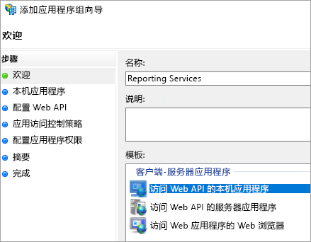

3. 选择“下一步”  。

4. 为正在添加的应用程序提供“**名称**”。 

5. “**客户端 ID**”将会自动生成，对于 iOS 和 Android 会输入 484d54fc-b481-4eee-9505-0258a1913020。 

6. 需要添加以下“重定向 URL”： 

   **适用于 Power BI Mobile – iOS 的条目：**  
   msauth://code/mspbi-adal://com.microsoft.powerbimobile  
   msauth://code/mspbi-adalms://com.microsoft.powerbimobilems  
   mspbi-adal://com.microsoft.powerbimobile  
   mspbi-adalms://com.microsoft.powerbimobilems

   **Android 应用只需要以下步骤：**  
   urn:ietf:wg:oauth:2.0:oob

   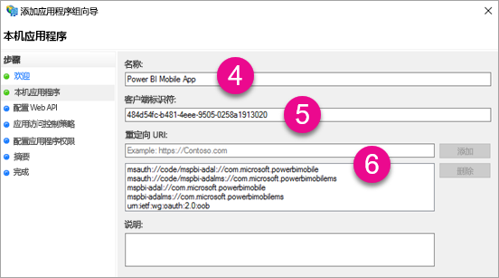
7. 选择“下一步”  。

8. 提供报表服务器的 URL。 该 URL 是将命中 Web 应用程序代理的外部 URL。 格式应如下所示。

   > [!NOTE]
   > 此 URL 区分大小写！

   *https://< report server url >/*

   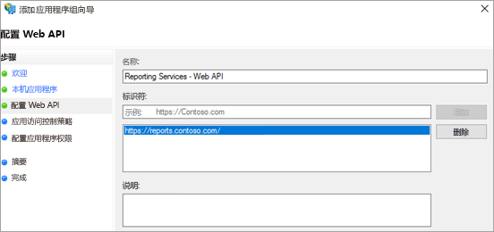
9. 选择“下一步”  。

10. 选择符合组织需求的访问控制策略  。

    

11. 选择“下一步”  。

12. 选择**下一步**。

13. 选择“下一步”  。

14. 选择“**关闭**”。

完成后，应看到应用程序组的属性如下所示。

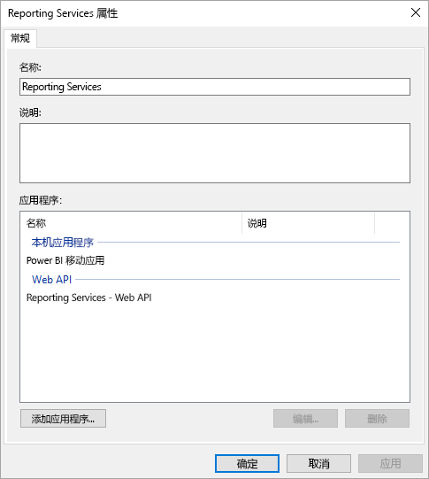

## <a name="web-application-proxy-wap-configuration"></a>Web 应用程序代理 (WAP) 配置

需要在环境中的服务器上启用 Web 应用程序代理（角色）Windows 角色。 必须在 Windows 2016 服务器上执行此过程。 有关详细信息，请参阅 [Windows Server 2016 中的 Web 应用程序代理](https://technet.microsoft.com/windows-server-docs/identity/web-application-proxy/web-application-proxy-windows-server)及[发布使用 AD FS 预身份验证的应用程序](https://technet.microsoft.com/windows-server-docs/identity/web-application-proxy/publishing-applications-using-ad-fs-preauthentication#a-namebkmk14apublish-an-application-that-uses-oauth2-such-as-a-windows-store-app)。

### <a name="constrained-delegation-configuration"></a>约束委派配置

为了从 OAuth 身份验证转换到 Windows 身份验证，需要结合使用约束委派和协议转换。 这是 Kerberos 配置的一部分。 我们已在 Reporting Services 配置中定义了 Reporting Services SPN。

我们需要在 Active Directory 内的 WAP 服务器计算机帐户上配置约束委派。 如果不具备访问 Active Directory 的权限，则需要与域管理员合作。

若要配置约束委派，需要执行以下步骤。

1. 在已安装 Active Directory 工具的计算机上，启动“**Active Directory 用户和计算机**”。

2. 找到 WAP 服务器的计算机帐户。 默认情况下，它会位于计算机容器中。

3. 右键单击 WAP 服务器并转到“属性”  。

4. 选择“**委派**”选项卡。

5. 选择“**仅信任此计算机来委派指定的服务**”然后选择“**使用任意身份验证协议”** 。

   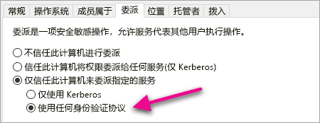

   此操作设置了此 WAP 服务器计算机帐户的约束委派。 然后我们需要指定允许该计算机委派到的服务。

6. 在服务框下选择“**添加…** ” 。

   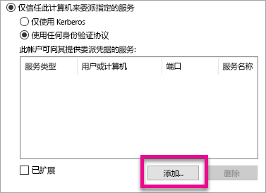

7. 选择“**用户或计算机…** ”

8. 输入用于 Reporting Services 的服务帐户。 此帐户是在 Reporting Services 配置中将 SPN 添加到其中的帐户。

9. 选择 Reporting Services 的 SPN，然后选择“**确定**”。

   > [!NOTE]
   > 你可能只能看到 NetBIOS SPN。 如果同时存在 NetBIOS 和 FQDN SPN，实际上会同时选中这两个。

   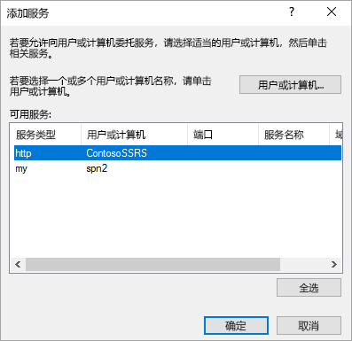

10. 选中“**已展开**”复选框后结果应如下所示。

    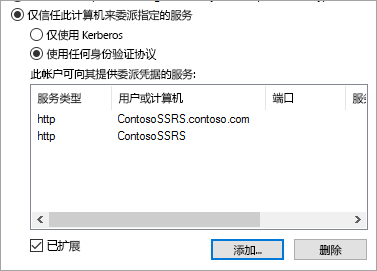

11. 选择“确定”。 

### <a name="add-wap-application"></a>添加 WAP 应用程序

可以在“报表访问管理控制台”中发布应用程序，但我们需要通过 PowerShell 构建应用程序。 以下是添加应用程序的命令。

```powershell
Add-WebApplicationProxyApplication -Name "Contoso Reports" -ExternalPreauthentication ADFS -ExternalUrl https://reports.contoso.com/ -ExternalCertificateThumbprint "0ff79c75a725e6f67e3e2db55bdb103efc9acb12" -BackendServerUrl https://ContosoSSRS/ -ADFSRelyingPartyName "Reporting Services - Web API" -BackendServerAuthenticationSPN "http/ContosoSSRS.contoso.com" -UseOAuthAuthentication
```

| 参数 | 注释 |
| --- | --- |
| **ADFSRelyingPartyName** |在 ADFS 内创建的作为应用程序组的一部分的 Web API 名称。 |
| **ExternalCertificateThumbprint** |用于外部用户的证书。 此证书在移动设备上有效且来自受信任的证书颁发机构，这一点很重要。 |
| **BackendServerUrl** |从 WAP 服务器指向报表服务器的 URL。 如果 WAP 服务器位于外围网络中，则需要使用完全限定的域名。 请确保可以从 WAP 服务器上的 Web 浏览器命中此 URL。 |
| **BackendServerAuthenticationSPN** |创建的作为 Reporting Services 配置一部分的 SPN。 |

### <a name="setting-integrated-authentication-for-the-wap-application"></a>为 WAP 应用程序设置集成身份验证

添加 WAP 应用程序后，需要将 BackendServerAuthenticationMode 设置为使用 IntegratedWindowsAuthentication。 若要进行设置，需要 WAP 应用程序的 ID。

```powershell
Get-WebApplicationProxyApplication "Contoso Reports" | fl
```


运行以下命令，使用 WAP 应用程序的 ID 设置 BackendServerAuthenticationMode。

```powershell
Set-WebApplicationProxyApplication -id 30198C7F-DDE4-0D82-E654-D369A47B1EE5 -BackendServerAuthenticationMode IntegratedWindowsAuthentication
```


## <a name="connecting-with-the-power-bi-mobile-app"></a>连接 Power BI 移动应用

在 Power BI 移动应用中，需要连接到 Reporting Services 实例。 若要执行此操作，需要提供 WAP 应用程序的“**外部 URL**”。

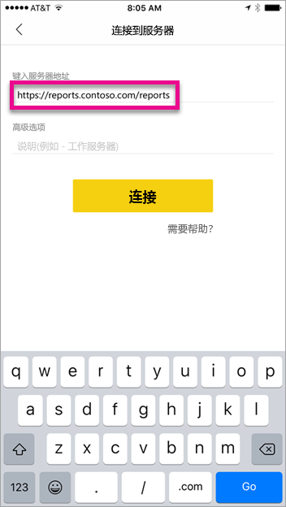

选择“连接”  后，将定向到 ADFS 登录页。 输入域的有效凭据。

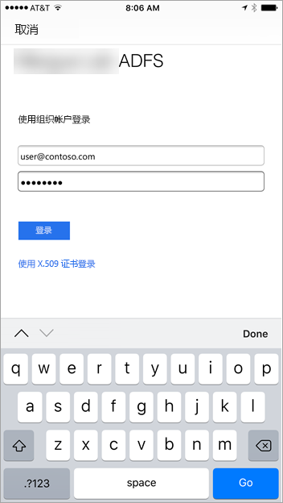

选择“登录”后，将看到 Reporting Services 服务器中的元素  。

## <a name="multi-factor-authentication"></a>多重身份验证

可以启用多重身份验证为环境启用其他安全功能。 若要了解详细信息，请参阅[配置 AD FS 2016 和 Azure MFA](https://technet.microsoft.com/windows-server-docs/identity/ad-fs/operations/configure-ad-fs-2016-and-azure-mfa)。

## <a name="troubleshooting"></a>故障排除

### <a name="you-receive-the-error-failed-to-login-to-ssrs-server"></a>收到错误消息“无法登录 SSRS 服务器”

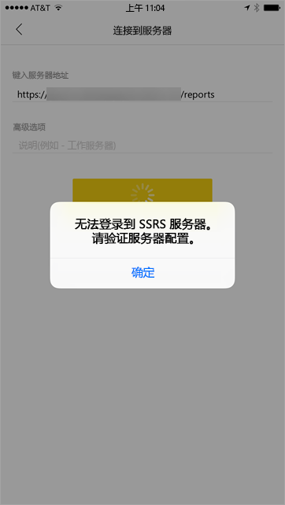

可以设置 [Fiddler](https://www.telerik.com/fiddler) 作为移动设备的代理，来查看请求的进度。 若要为手机设备启用 Fiddler 代理，需要在运行 Fiddler 的计算机上安装[适用于 iOS 和 Android 的 CertMaker](https://www.telerik.com/fiddler/add-ons)。 加载项来自 Telerik for Fiddler。

如果使用 Fiddler 登录成功，则 WAP 应用程序或 ADFS 服务器的证书可能存在问题。 

## <a name="next-steps"></a>后续步骤

[为报表服务器注册服务主体名称 (SPN)](https://msdn.microsoft.com/library/cc281382.aspx)  
[修改 Reporting Services 配置文件](https://msdn.microsoft.com/library/bb630448.aspx)  
[在报表服务器上配置 Windows 身份验证](https://msdn.microsoft.com/library/cc281253.aspx)  
[Active Directory 联合身份验证服务](https://technet.microsoft.com/windows-server-docs/identity/active-directory-federation-services)  
[Windows Server 2016 中的 Web 应用程序代理](https://technet.microsoft.com/windows-server-docs/identity/web-application-proxy/web-application-proxy-windows-server)  
[发布使用 AD FS 预身份验证的应用程序](https://technet.microsoft.com/windows-server-docs/identity/web-application-proxy/publishing-applications-using-ad-fs-preauthentication#a-namebkmk14apublish-an-application-that-uses-oauth2-such-as-a-windows-store-app)  
[配置 AD FS 2016 和 Azure MFA](https://technet.microsoft.com/windows-server-docs/identity/ad-fs/operations/configure-ad-fs-2016-and-azure-mfa)  
更多问题？ [尝试参与 Power BI 社区](https://community.powerbi.com/)
