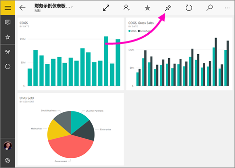

# 从 Power BI 移动应用将仪表板固定到 Windows 10“开始”屏幕
可以将 Power BI 仪表板从适用于 Windows 10 的 Power BI 移动应用固定到 Windows “开始”屏幕。 如果点击“开始”屏幕中的磁贴，仪表板会在适用于 Windows 10 的 Power BI 移动应用中打开。

>[!NOTE]
>我们将于 2021 年 3 月 16 日终止对使用 Windows 10 移动版的手机提供 Power BI 移动应用支持  。 [了解详细信息](/legal/powerbi/powerbi-mobile/power-bi-mobile-app-end-of-support-for-windows-phones)

## 将仪表板固定到“开始”屏幕以作为磁贴
1. 打开仪表板。
2. 点击“固定到“开始”屏幕”  。
   
   
   
   转到设备的“开始”屏幕以查看磁贴。
   
   

## 后续步骤
* 从 Windows 应用商店中[下载适用于 Windows 10 的 Power BI 移动应用](https://go.microsoft.com/fwlink/?LinkID=526478)  
* [适用于 Windows 10 的 Power BI 移动应用入门](mobile-windows-10-phone-app-get-started.md)  
* [什么是 Power BI？](../../fundamentals/power-bi-overview.md)
* 是否有任何问题? [尝试咨询 Power BI 社区](https://community.powerbi.com/)