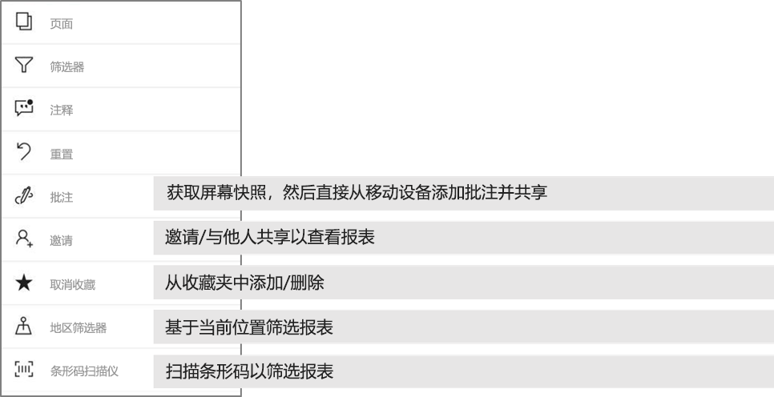

# 在 Power BI 移动应用中浏览报表
适用于：

|  |  |  |  |  |
|:--- |:--- |:--- |:--- |:--- |
| iPhone |iPad |Android 手机 |Android 平板电脑 |Windows 10 设备 |

Power BI 报表是交互式数据视图，使用视觉对象来表示不同的数据发现和见解。 在 Power BI 移动应用中查看报表是三步流程中的第三步。

1. [在 Power BI Desktop 中创建报表](../../desktop-report-view.md)。 甚至可以在 Power BI Desktop 中[优化报表，使之更适合在手机中显示](mobile-apps-view-phone-report.md)。 
2. 将这些报表发布到 Power BI 服务 [(https://powerbi.com)](https://powerbi.com) 或 [Power BI 报表服务器](../../report-server/get-started.md)。  
3. 然后，与 Power BI 移动应用中的报表进行交互。

## 在移动应用中打开 Power BI 报表
Power BI 报表存储在移动应用中的不同位置，具体取决于从何处获取。 可以位于“应用”、“与我共享”、“工作区”（包括“我的工作区”）或报表服务器中。 有时，可以通过相关仪表板转到报表；有时，其中也会列出报表。

在“列表”和“菜单”中，你会发现报表名称旁边有一个图标，该图标可以帮助你了解此项是报表。 

 

Power BI 移动版应用中的报表有两个图标：

*  表示将在应用中以横向显示的报表，其外观与其在浏览器中相同。

*  表示包含至少一个手机优化报表页的报表，该报表将以纵向显示。 

注意：如果以横向放置手机，即使报表页已存在手机布局，也将始终以横向布局显示。 

若要从仪表板转到报表，依次点击磁贴右上角的省略号 (...) 和“打开报表”  。
  
  
  
  并非所有磁贴都包含报表打开选项。 例如，通过在问答框中提问而创建的磁贴就无法在获得点击后打开报表。 
  
## 与报表进行交互
在应用中打开报表后，就可以开始使用该报表。 可以对报表及其数据执行许多操作。 在报表页脚中，可以找到能够对报表执行的操作；通过点击和长按报表中显示的数据，还可以对数据进行切片和切块。

### 使用点击和长按
点击等同于鼠标单击。 因此，如果要基于数据点交叉突出显示报表，请点击该数据点。
点击切片器值，使该值处于选中状态，并按该值来切分报表的其余部分。 点击链接、按钮或书签将根据作者定义的操作对其进行激活。

你可能已经注意到，点击视觉对象时会出现一个边框。 在边框的右上角可以找到省略号 (...)。点击它将显示一个菜单，其中包含可对该视觉对象执行的操作。

### 工具提示和钻取操作

长按（点击并按住）数据点时，工具提示将显示此数据点所代表的值。 

如果报表作者配置了报表页工具提示，则默认工具提示将替换为报表页工具提示。

> [!NOTE]
> 大于 640 像素和 320 视区的设备支持报表工具提示。 如果设备较小，则应用使用默认工具提示。

报表作者可以定义各报表页间数据和关系的层次结构。 层次结构允许从视觉对象和值向下钻取、向上钻取以及钻取过其他报表页。 因此，长按某个值时，除工具提示外，相关的钻取选项也将显示在页脚中。 

通过钻取，Power BI 会在你点击视觉对象的特定部分时，转到报表中的另一页，筛选出点击的值  。  报表作者可定义一个或多个钻取操作，每个操作分别转到不同页面。 在这种情况下，可选择所需的钻取操作。 使用返回按钮返回到上一个报表页。

了解如何[在 Power BI Desktop 中添加钻取](../../desktop-drillthrough.md)。
   
   > [!IMPORTANT]
   > 在 Power BI 移动版应用中，仅可通过单元格值（而不可通过列和行标题）启用对矩阵和表视觉对象的钻取。
   
   
   
### 在报表页脚使用操作
报表页脚包含可对当前报表页或整个报表执行的操作。 页脚可以快速访问最有用的操作，且所有操作都可以从省略号 (...) 访问。

可从页脚执行的操作包括：
1) 将报表筛选器和交叉突出显示选项重置回其原始状态。
2) 打开对话窗格，查看或添加对此报表的注释。
3) 打开筛选器窗格，查看和修改当前应用于报表的筛选器。
4) 列出此报表中的所有页。 点击页名称将加载并显示该页。
通过从屏幕边缘向中心轻扫在表页间移动。
5) 查看所有报表操作。

#### 所有报表操作
点击报表页脚中的 ... 选项，将显示可对报表执行的所有操作。 

某些操作可能会被禁用，因为这些操作依赖于特定的报表功能。
例如：
1) 如果作者按地理数据对报表中的数据进行分类，则启用了“按当前位置筛选”  。 [了解如何标识报表中的地理数据](https://docs.microsoft.com/power-bi/desktop-mobile-geofiltering)。
2) 只有当报表中的数据集被标记为条形码时，才会启用“扫描以按条形码筛选报表”  。 [如何在 Power BI Desktop 中标记条形码](https://docs.microsoft.com/power-bi/desktop-mobile-barcodes)。 
3) 只有在用户有权与他人共享此报表时才会启用“邀请”  。 只有当你是报表所有者，或所有者授予你重新共享权限时，你才有此权限。
4) 如果组织中存在禁止从 Power BI 移动版应用共享的 [Intune 保护策略](https://docs.microsoft.com/intune/app-protection-policies)，则可能会禁用“批注并共享”  。 

## 后续步骤
* [查看手机优化版 Power BI 报表并与之交互](mobile-apps-view-phone-report.md)
* [创建手机优化版报表](../../desktop-create-phone-report.md)
* 是否有任何问题？ [尝试咨询 Power BI 社区](http://community.powerbi.com/)

