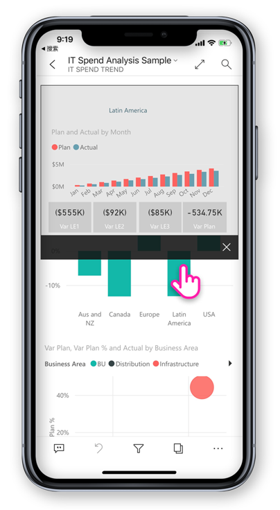

# Power BI 移动应用中的新功能
有关相关的“新增功能”的信息，请参阅：

* [适用于移动应用的 Power BI 工作组日志](https://powerbi.microsoft.com/blog/tag/mobile/)
* [Power BI Desktop 中的新增功能](../../desktop-latest-update.md)  
* [Power BI 服务中的最近更新](../../service-whats-new.md)  

## 2019 年 8 月

### Azure Active Directory (AD) 应用程序代理的安全访问

我们与 Azure Active Directory 团队合作，将 Power BI 移动应用程序与 Azure Active Directory (AAD) 应用程序代理相集成。 通过此配置，你可以连接到 Power BI 移动版应用的企业边界内托管的报表服务器，而无需设置复杂的本地配置。 详细了解[Power BI 移动版与 Azure AD 应用程序代理的集成](https://powerbi.microsoft.com/blog/access-on-prem-report-server-from-your-power-bi-mobile-app-with-azure-active-directory-application-proxy/)。 了解[如何配置 Azure AD 应用程序代理和 Power BI](https://docs.microsoft.com/en-us/azure/active-directory/manage-apps/application-proxy-integrate-with-power-bi)。

## 2019 年 7 月

### 报告页工具提示

现在在移动应用中查看报表时，支持报表页工具提示。 只需按住一个与报表工具提示绑定的视觉对象，即可显示该工具提示。  

> [!NOTE]
> 大于 640 像素和 320 视区的设备支持报表工具提示。 小型设备使用默认工具提示。

## 2019 年 6 月

### 现可在 Android 中使用条形码扫描功能
现可使用 Android（手机和平板电脑）上的 Power BI 应用扫描印在产品或商店货架上的条形码，以显示按扫描值筛选的相关 Power BI 报表。 查看关于[使用条形码筛选数据](mobile-apps-scan-barcode-iphone.md)的详细信息。

### 支持通过 ADFS 配置托管在 PBI-RS 中的 PBIX 报表（iOS、Android）

现还可在 Power BI 移动应用中访问通过 ADFS 配置托管在 PBI-RS 中的 Power BI 报表 (PBIX)。

## 2019 年 5 月

### Siri 快捷方式支持 (iOS)
用户可以为其 Power BI 报表和仪表板创建 Siri 快捷方式，然后直接从 Siri 语音界面打开它们。 [了解如何使用 Power BI iOS 应用中的 Siri 快捷方式](https://powerbi.microsoft.com/blog/introducing-siri-integration-with-power-bi-mobile-ios-app-preview/)。

### 设备搜索 (iOS)
将 Power BI 与 iOS 设备搜索 (Spotlight) 相集成。 在 iPhone 或 iPad 中搜索内容现在也包括 Power BI 项目。 当用户使用设备本机搜索时，符合搜索条件的 Power BI 报表、仪表板、应用、工作区和人员也将在结果中列出。 [访问博客文章以了解详细信息](https://powerbi.microsoft.com/blog/introducing-siri-integration-with-power-bi-mobile-ios-app-preview/)。

### 单击报表交互 - GA

单击功能现已正式发布，将成为新用户的默认触摸交互功能。 用户仍然可以将其关闭并在应用设置中设为双击。

### 增强的条件访问保护（iOS、Android）

我们已与 AAD [新的基于应用保护的条件访问功能](https://docs.microsoft.com/azure/active-directory/conditional-access/app-protection-based-conditional-access)集成，通过在应用应用策略之前限制对 Power BI 的访问来提高安全性。

### 设备保护 (iOS)

用户可以使用设备内置保护来保护 Power BI，即，要求使用 Face ID、Touch ID 或密码来访问 Power BI。 这可以由用户使用应用设置来控制，也可以由管理员使用 Intune 和任何其他 MDM 工具来控制。 [了解详细信息](https://docs.microsoft.com/power-bi/consumer/mobile/mobile-ios-native-secure-access)。

### 单页报表幻灯片放映 (Windows)

幻灯片放映中的单页报表也支持自动刷新。 因此，如果报表的基础数据源发生更新，我们将获取它并更新页面中的数据。

## 2019 年 4 月

### 关键影响因素视觉对象 

关键影响因素视觉对象现已在移动应用上提供。 借助此视觉对象，只需轻点几下即可对数据执行关键驱动因素分析。

### 向报表内容添加注释（Android 和 iOS）

现在可以使用注释在报表页面和视觉对象上进行协作以及分享反馈。 阅读[此博客中](https://powerbi.microsoft.com/blog/announcing-report-commenting-for-power-bi-service-and-mobile/)有关 Power BI 服务和移动版中的报表注释的详细信息。 

### 借助全屏模式使视图最大化（Android 和 iOS）

我们添加了新按钮，可用于删除报表页眉和页脚，为你提供最大的空间来查看报表，从而让你控制何时专注于你的数据。

## 2019 年 3 月

### 在 Power BI 应用中支持外部来宾用户（iOS 和 Android）

你可直接在应用内访问从其他组织共享给你的 Power BI 内容（也称为 B2B）。 请在[此处](https://powerbi.microsoft.com/blog/power-bi-mobile-apps-now-support-azure-ad-b2b-guest-users/)详细阅读了解 Power BI 移动应用 B2B。

### 借助幻灯片放映强化 Windows 演示模式 (Windows)

借助[幻灯片放映](https://powerbi.microsoft.com/blog/enhancing-presentation-mode-with-slideshow-in-windows-power-bi-app/)，可使用办公室的公共显示屏来全屏运行 Power BI 报表（该模式会自动翻页）。  

### 通过 ADFS 和 WAP 配置支持 PBI-RS 报表（仅限 iOS）

现在可以从 Power BI iOS 应用访问通过 ADFS 配置托管在 PBI-RS 中的 Power BI 报表 (PBIX)。

### 启用与报表视觉对象的单击交互

我们对报表交互进行了更改，现在只需点击一次视觉对象、按钮或切片器便可立即与其数据交互。 用户不再需要点击视觉对象选中它，然后再次点击与其交互，而只需点击一下即可。

> [!NOTE]
> 现有用户需要在应用设置中启用此行为。 有关详细信息，请参阅[如何配置单击报表交互](https://docs.microsoft.com/power-bi/consumer/mobile/mobile-app-single-tap)一文。

## 2019 年 1 月 - 2 月
 
### Visio 视觉对象

在 Visio 视觉对象中启用单一登录 (SSO)，以便在应用中查看具有 Visio 视觉对象的报表时不需要额外的登录步骤。 

### Power BI 移动版 Windows 应用将提供仪表板评论功能

可以直接向仪表板和特定磁贴添加备注来讨论你的数据，查看仪表板的任何人都将看到你的备注。 

## 2018 年 12 月

### 筛选器现可用于横向报表 

现在，除了手机报表以外，报表的筛选器窗格还可用于横向报表。

## 2018 年 11 月

### 新式视觉对象标头 

使用全新“新式视觉对象标头”的报表将不再分配标头空间，这样空白空间就会减少，以腾出更多空间来展示可视化效果。

### 增强演示模式 (Windows)

适用于 Surface Hub 和 Windows 10 设备的增强演示模式。  用户可畅享增强 Surface Hub 会议室体验，包括使用改进后的演示和协作工具，以及无边框的大屏幕优化视图。这样一来，用户便能重点关注数据。 演示模式还提供诸如墨迹书写的工具，可帮助你有效地显示并讨论数据。 可在[此处](https://powerbi.microsoft.com/blog/presentation-mode-in-power-bi-windows-app/)阅读有关演示模式的详细信息。

### 平板电脑（iOS 和 Android）中的纵向报表布局

我们现在使用手机报表布局（若有）在平板电脑上以纵向模式显示报表。 阅读有关[如何在 Power BI 服务或 Power BI Desktop 中创建手机布局](https://docs.microsoft.com/power-bi/desktop-create-phone-report/)的详细信息。

### 支持报表查询字符串 

打开包含查询字符串的报表链接现在将在移动应用中打开，并根据查询字符串中定义的条件进行预筛选。 了解有关[如何使用查询字符串创建报表 URL](https://docs.microsoft.com/power-bi/service-url-filters/) 的详细信息。  

### 共享凭据（现在为 Android）

从移动应用登录到 Power BI 从未如此简单。 借助共享凭据，我们通过在设备上使用其他 Office 365 应用凭据在 Power BI 服务中对用户进行身份验证，简化了登录过程。

### 应用内 URL（现在为 Android） 

报表中指向其他 Power BI 项目的链接现在可直接在应用内打开。 这样，用户就能够生成自定义导航流，例如，从报表链接到仪表板内。

### 显示数据和复制值

报表视觉对象操作菜单 (...) 现在包含以表格形式显示基础数据的选项。 一旦在表中，即可长时间点击以选择并复制该表中的值（假定没有 Intune 策略限制复制）。

## 2018 年 10 月

### 分页报表预览（所有设备）

现在可以在 Power BI 服务中使用分页报表。 有权访问 Power BI 服务中的分页报表的用户也可以从他们的移动应用中访问这些报表。 

请阅读 Power BI [有关移动应用中的分页报表的博客文章](https://powerbi.microsoft.com/blog/power-bi-paginated-reports-also-available-in-power-bi-mobile-apps-preview/)。

### 共享凭据 (iOS)

从移动应用登录到 Power BI 从未如此简单。 借助共享凭据，我们通过在设备上使用其他 Office 365 应用凭据在 Power BI 服务中对用户进行身份验证，简化了登录过程。

### 应用内 URL (iOS) 

报表中指向其他 Power BI 项目的链接现在可直接在应用内打开。 这样，用户就能够生成自定义导航流，例如，从报表链接到仪表板内。

### iOS12 和 watchOS 5 支持 

我们已更新 iOS 版 Power BI 应用，支持与移动设备和 Watch 上的新操作系统无缝协作。

## 2018 年 9 月

### 在浏览器中编辑手机报表（所有设备）

现在可以为已在 Power BI 服务而不是 Power BI Desktop 中发布的报表创建手机报表布局。 可在浏览器中在编辑模式下进行创建。

### 仪表板注释（iOS 和 Android） 

可以直接向仪表板和特定磁贴添加备注来讨论你的数据，查看仪表板的任何人都将看到你的备注。 此外，还可通过 @mentioning 他们，将组织中的其他人拉到对话中。 已 @mentioned 过的人会收到一则推送通知，其中包含发送其移动电话的消息。

当前可用于 iOS 和 Android 设备。 Windows 支持即将推出。

阅读 Power BI [有关仪表板注释的博客文章](https://powerbi.microsoft.com/blog/announcing-dashboard-comments-in-power-bi/)。

### 单一登录 (Windows)

单一登录 (SSO) 是适用于 Windows 的 Power BI 移动版的最需要的功能之一。 现在，你使用主组织帐户既可以登录到已加入域的 Windows 移动设备，也可以无缝登录到 Power BI 服务。 详细了解 [SSO 和 Windows 移动应用](mobile-windows-10-app-single-sign-on-sso.md)。

## 前几个月

### 2018 年 7 月

#### 仅 iOS 和 Android

**共享的筛选器**

现在可以接收包含共享筛选器和切片器的报表。

**背景图像支持**

在移动设备上以横向模式查看报表时，可以看到在 Web 上的 Power BI 中查看到的相同背景图像。

### 2018 年 6 月

#### 全画布报表

加载报表后，顶部和底部操作条很快就会消失，因此，可以同时查看多个报表。

#### 增加了手机报表画布的大小

我们增加了手机报表画布的大小，提供更多空间容纳更多视觉对象。

### 2018 年 5 月

#### 移动钻取：所有移动应用

可以在移动应用中从选定数据点钻取到另一报表页，前提是报表作者已定义此操作。 

#### “后退”按钮：所有移动应用

现在，如果通过轻扫手势、在操作栏中选择报表页或使用钻取功能来浏览整个报表，“后退”按钮会返回到刚才浏览的上一页。 

#### 仪表板主题：所有移动应用

如果报表作者在 Power BI 服务中自定义仪表板主题，移动应用中的仪表板外观也会随之变化。 不过，看不到背景图像。

#### iOS：远程配置 Power BI iOS 移动应用对报表服务器的访问权限

现在，你的 IT 管理员可以使用 MDM 工具配置 Power BI iOS 移动应用对报表服务器的访问权限。 有关详细信息，请参阅[远程配置 Power BI iOS 移动应用对报表服务器的访问权限](../../report-server/configure-powerbi-mobile-apps-remote.md)。

#### Power BI for Mixed Reality 应用（预览版）

Power BI for Mixed Reality 应用现已在 Microsoft Store 上架。 可以沉浸在虚拟世界中查看仪表板和报表，或将它们放在环境的上下文中的特定位置查看。 有关详情，请观看新发布的 [Power BI for HoloLens 简介](https://www.youtube.com/watch?v=J_X_nOFUBss)视频，或阅读与新推出的 [Power BI for Mixed Reality 应用](mobile-mixed-reality-app.md)相关的文章。

### 2018 年 4 月

#### 移动下钻取和向上钻取

现在可以在移动设备上向下钻取和向上钻取以深入了解报表视觉对象。 若要访问此新功能，点击并按住，以便在报表视觉对象上打开工具提示菜单，然后点击“钻取”按钮来深入探索数据。 有关[在移动应用中向上和向下钻取](https://powerbi.microsoft.com/blog/drill-down-up-in-power-bi-mobile-apps/)的详细信息。

#### 永久筛选器

我们最近更新了报表筛选器和切片器，因此会自动从 Web 上的 Power BI 保存到 Power BI 移动应用。 现在，在移动应用中设置的筛选器和切片器都将自动保存到 Web 上的 Power BI。

### 2018 年 3 月

#### Power BI for Mixed Reality 应用（预览版）

在最近的数据跟随活动中，我们创建了 Power BI for Mixed Reality 应用。 可以沉浸在虚拟世界中查看仪表板和报表，或将它们放在环境的上下文中的特定位置查看。 详细阅读关于新的 [Power BI for Mixed Reality 应用](mobile-mixed-reality-app.md)的内容。

#### 在外部共享报表和仪表板

直接从应用与组织外部用户共享仪表板和报表。 外部共享已对组织帐户和社交帐户启用。 

#### 永久性筛选器

如果在 Power BI 网页版中设置筛选器和切片器，选择的筛选器也会保存到移动应用中，以便用户能够从上次停下的地方继续操作。

#### 在 iPad 上刷新报表

现在，iPad 应用中有 Power BI 报表刷新按钮。

### 2018 年 2 月

#### 共享报表

现在可以共享直接来自移动应用的报表。 详细阅读[共享来自移动应用的仪表板和报表](mobile-share-dashboard-from-the-mobile-apps.md)

#### 改进的工具提示

点击并按住报表视觉对象以访问工具提示时，现在可以用手指在此视觉对象上拖动，浏览每个数据点的详细信息。

### 2018 年 1 月

#### 报表收藏夹

将报表标记为收藏，以便它们可以出现在“收藏夹”  页上。 阅读有关 [Power BI 移动应用中的收藏夹](mobile-apps-favorites.md) 的更多信息。

#### 查看共享的报表

现在，如果有人与你共享报表，此报表将与仪表板一起列在“与我共享的内容”  页上。

#### 改进的超链接支持

现在可以点击自定义视觉对象中的链接，在移动浏览器中将其打开。

#### Intune 集成 (Android)

支持使用 Intune 移动设备管理的条件访问。

### 2017 年 12 月

#### 改进了安全管理 

我们已添加对 Android 设备条件访问 (CA) 和 Microsoft Intune 移动设备管理 (MDM) 的支持，以更好地保护组织数据的安全。 在 iOS 设备上也可使用。

#### 改进了权限管理

我们做出了一些更改，实现了对数据集、仪表板和报表的用户权限的更精细管理。

#### 已自动安装应用

完全不需要在 Power BI 中安装某些应用。 组织中的 Power BI 应用创建者可创建包含仪表板和报表集合的  应用。 然后，他们可发布应用，并将其设置为在 Power BI 服务和 Power BI 移动应用中自动安装。 当某应用设置为自动安装时，它就会自动显示在  “应用”菜单中：

### 2017 年 11 月
#### iPhone X 优化

我们已针对 iPhone X 优化了应用布局，便于你在每台设备上都可浏览到简洁明快的数据。

### 2017 年 10 月
#### Android 中的电话报表筛选器

如果在 Power BI Desktop 中创建包含电话优化页面的报表，并且报表具有筛选器，那么现可在 Android 上的电话报表中应用这些筛选器。 详细了解 Android 上适用于 Power BI 报表的筛选器。

#### 在报表中显示数据

现在，你可以将报表中的视觉对象切换到表视图，以查看数据后面的数字。 要访问此功能，请点击报表上视觉对象菜单中的“显示数据”，或展开的视觉对象操作菜单上的新建图标。

### 2017 年 9 月
#### iPhone 中的电话报表筛选器
如果在 Power BI Desktop 中创建包含电话优化页面的报表，并且报表具有筛选器，那么现在可以在 iPhone 上的电话报表中应用这些筛选器。 详细了解 [iPhone 上适用于 Power BI 报表的筛选器](https://powerbi.microsoft.com/blog/filters-coming-for-phone-reports-on-ios/)。

### 2017 年 8 月
#### 支持 iOS 代理设置
现在可以在 Power BI iOS 移动应用中设置代理设置。 这意味着，Power BI 现在能够通过移动设备上的 VPN 连接正常工作，方便更多用户和组织随时随地安全地利用 Power BI 的功能。

### 2017 年 7 月
请参阅 [2017 年 7 月移动应用功能摘要](https://powerbi.microsoft.com/blog/power-bi-service-and-mobile-july-feature-summary/#ios-preview)

#### iOS 设备
**iOS 上全新的问答体验（预览版）** ：现在可以使用自然语言获取限定范围的见解，而不单单是收到问题答案。 即使不确定要查找什么，问答依然能够主动呈现与数据相关的见解。 与 Microsoft Research 团队协作开发的全新手机问答体验在我们的产品内展现了功能强大的技术。 请试学教程[在 iOS 移动应用中咨询有关数据的问题](mobile-apps-ios-qna.md)。

### 响应式视觉对象
**手机报表和仪表板的响应式视觉对象**：可以将仪表板或报表中的视觉对象设置为响应式  ，即动态缩放，尽可能显示最多的数据和见解，无论屏幕大小如何。 请阅读[有关响应式视觉对象的博客](https://powerbi.microsoft.com/blog/power-bi-desktop-july-feature-summary-2/#responsiveVisuals)。

### 2017 年 6 月
#### 所有设备
**收藏应用**：已可以收藏仪表板。 最近，[Power BI 中添加了应用](../../service-create-distribute-apps.md)，现在也可以收藏应用了。 

### 2017 年 5 月
#### 所有设备
**新菜单：与我共享** - 转到移动应用菜单中的“与我共享”，查看已与你共享的所有内容。

**新菜单：应用** - 应用是组织生成的仪表板和报表集合，用于交付关键指标以实现更快速方便的数据驱动型决策。

详细了解[组织 Power BI 内容的方法](mobile-apps-quickstart-view-dashboard-report.md)。

#### iOS 和 Android 设备
 Power BI 报表服务器预览 - 在本地创建和发布 Power BI 报表。 然后，[在你的 iOS 或 Android 移动设备中查看并与之交互](mobile-app-ssrs-kpis-mobile-on-premises-reports.md)。 

### 2017 年 4 月
请阅读 [2017 年 4 月移动应用功能摘要](https://powerbi.microsoft.com/blog/power-bi-mobile-apps-feature-summary-march-april-2017/)

#### 所有设备
 手机报表的背景色 - 定义了 Power BI Desktop 中报表的背景色后，手机报表将具有相同的背景色。 有关[优化手机的报表页](../../desktop-create-phone-report.md)的详细信息。

 开发移动友好型自定义视觉对象 - 阅读此[开发人员指南](https://github.com/Microsoft/PowerBI-visuals/blob/master/Tutorial/MobileGuideline.md)，了解在移动设备上创建外观精美、运行良好的自定义视觉对象的提示。

#### iOS 设备
 与数据对话 - 通过说话提问 - 现在，你可以通过说话而不是键入信息来[使用问答功能询问数据相关问题](mobile-apps-ios-qna.md)。 

### 2017 年 3 月
请参阅 [2017 年 3 月移动应用功能摘要](https://powerbi.microsoft.com/blog/power-bi-mobile-apps-feature-summary-march-2017/)。

#### 所有设备
切片器交互 

我们改进了时间切片器的触摸交互。

#### iOS 设备
 使用问答功能询问数据相关问题，然后向我们提供反馈 - 尝试使用问答功能就你的数据提问，然后通过笑脸或皱眉表情符号给予评价，让我们了解你对我们服务的感受如何。

 使用 3D Touch 执行常见操作 - 在 iPhone 6s 或更高版本的主屏幕上按住 Power BI 应用图标可以查看通知、执行搜索和访问最近使用的仪表板。

 支持从右向左书写的语言 - Power BI 移动应用现在支持从右向左书写的语言。 在此上下文中，“从右向左书写语言”指的是希伯来语和阿拉伯语书写系统，该系统从右向左书写，而且需要上下文调整。 请查看 [Power BI 移动应用中支持的语言](mobile-apps-supported-languages.md)列表。

#### Android 设备
连接多台 SSRS 服务器  

现在可以同时连接最多五台 SQL Server Reporting Services (SSRS) 服务器。

请求仪表板的访问权限  

如果你对不具备访问权限的仪表板的 QR 代码进行扫描，现在可以提交直接从移动应用程序进行访问的请求。

### 2017 年 2 月
#### 所有设备
滚动浏览更为简单  

现在可以触摸图表本身（而不是触摸一侧的滚动条）来滚动浏览报表中的条形图和柱形图。

#### iOS 设备
使用问答这一预览功能就你的数据提问  

借助问答功能，可以用自己的话就你的数据提问，然后 Power BI 会回答你的问题。 问答已在 http://powerbi.com 上的 Power BI 服务中提供。 现在它也在 [iPhone 或 iPad 上的移动应用中提供](mobile-apps-ios-qna.md)。

连接多台 SSRS 服务器  

现在可以同时连接最多五台 SQL Server Reporting Services (SSRS) 服务器。

#### Android 平板电脑
现在适用于 Android 平板电脑的 Power BI 移动应用  全局可用。 [Android 平板电脑上的的 Power BI](mobile-android-app-get-started.md)入门。

#### iOS 和 Android 设备
 仪表板磁贴的新菜单 - 导航到基础报表，展开该磁贴，或管理警报，所有这些操作均可直接通过仪表板磁贴上的菜单来执行。 

对于横向模式下的 iOS 手机、Android 手机和 Android 平板电脑而言，此菜单是一项新功能。 它已在纵向模式下的 Windows 和 Android 手机上应用。

### 2017 年 1 月
请参阅 [2017 年 1 月移动应用博客的功能摘要](https://powerbi.microsoft.com/blog/power-bi-mobile-apps-feature-summary-january-2017)。

#### 所有设备
 加载表和矩阵中超过 100 行的数据 - 现在，如果仪表板或报表上有大型表或矩阵，我们会在磁贴中显示尽可能多的数据。 然后，可以在焦点模式下向下滚动加载其他行。

 手机报表 - 公开发布 - Power BI 手机报表现已公开发布。 在 Power BI Desktop 中，可以为手机阅读器定制现有报表的纵向视图。 详细了解如何[在 Power BI Desktop 中创作移动报表](../../desktop-create-phone-report.md)和[手机报表体验](mobile-apps-view-phone-report.md)。

#### iOS
 使用 Active Directory 联合身份验证服务 (ADFS) 预览进行 SSRS 身份验证 - 现在可以使用组织帐户从移动设备登录本地 SQL Server Reporting Services 服务器。 详细详细如何[使用 OAuth 连接 SSRS 服务器](mobile-oauth-ssrs.md)。

#### Android
 使用 Active Directory 联合身份验证服务 (ADFS) 预览进行 SSRS 身份验证 - 现在可以使用组织帐户从移动设备登录本地 SQL Server Reporting Services 服务器。 详细详细如何[使用 OAuth 连接 SSRS 服务器](mobile-oauth-ssrs.md)。

**经过改进的新增功能：快速批注并共享见解** - 批注并共享功能现已完全适用于 Android 设备。 使用改进后的菜单，不仅可以更轻松快速地批注并共享见解，还可直接从 Power BI 应用共享经过批注的报表。

### 2016 年 12 月
请参阅 [2016 年 12 月移动应用博客功能摘要](https://powerbi.microsoft.com/blog/power-bi-mobile-apps-feature-summary-december-2016)。

#### 所有设备
脱机后台刷新 

若要确保脱机时可以访问最新数据，我们在应用程序后台执行刷新以便你的业务信息保持最新状态，即使在一段时间内未对其进行访问。 若要确保某些仪表板始终保持最新状态，只需将其标记为收藏。 了解更多有关 [Power BI 移动应用中的脱机功能](mobile-apps-offline-data.md)的信息。

#### iOS 设备
批注和共享 

现在可以从适用于 iOS 的 Power BI 移动应用批注并共享磁贴、报表或可视化效果。 

* [在 iPhone 上](mobile-annotate-and-share-a-tile-from-the-mobile-apps.md)
* [在 iPad 上](mobile-annotate-and-share-a-tile-from-the-mobile-apps.md)

请求仪表板的访问权限 

如果你对不具备访问权限的仪表板的 QR 代码进行扫描，现在可以提交直接从移动应用程序进行访问的请求。

映像磁贴上的自定义 URL 

如果映像磁贴具有由仪表板所有者定义的自定义 URL，点击磁贴时你将直接转到该 URL，而无需在焦点模式下打开磁贴。 

#### iPhone
Apple Watch 改进 

现在可以刷新直接来自 Watch 应用的 Apple Watch 数据。 在仪表板索引页中，深按以刷新你的数据。 （Power BI 移动应用程序必须在 iPhone 后台运行才能使之生效）。

#### Android
映像磁贴上的自定义 URL 

如果映像磁贴具有由仪表板所有者定义的自定义 URL，点击磁贴时你将直接转到该 URL，而无需在焦点模式下打开磁贴。 此外，包含预定义的自定义 URL 的仪表板磁贴现在可以使读者重定向到应用内的报表。

### 2016 年 11 月
请参阅 [2016 年 11 月 Power BI 移动应用功能摘要](https://powerbi.microsoft.com/blog/power-bi-mobile-apps-feature-summary-november-2016/)。

#### Android 平板电脑
**适用于 Android 平板电脑的 Power BI 移动应用** 是的，现处于预览阶段。

* 体验[适用于 Android 平板电脑的 Power BI 移动应用](mobile-android-app-get-started.md)
* [在 Android 平板电脑上浏览 Reporting Services 移动报表和 KPI](mobile-app-ssrs-kpis-mobile-on-premises-reports.md)

#### Android 设备
**预览阶段：Intune 移动应用程序管理** - 对于使用 Android 设备的 Power BI Pro 用户，Power BI 对 Microsoft Intune 移动应用程序管理器 (MAM) 的支持现已处于预览阶段。 

收藏夹  - 在 Android 设备上将常用仪表板添加到收藏夹，然后在一个方便访问的位置上集中查看所有[常用 Power BI 仪表板和 Reporting Services 移动报表及 KPI](mobile-android-app-get-started.md#view-your-favorite-dashboards-kpis-and-reports)。 

#### iOS 设备
链接  - 现可单击磁贴和可视化效果中的 URL，并在浏览器中打开这些 URL。

#### Windows 设备
在地图中以当前所在位置为中心  - 重点关注你位置附近的数据

### 2016 年 9 月/10 月
请参阅 [2016 年 10 月 Power BI 移动应用功能摘要](https://powerbi.microsoft.com/blog/power-bi-mobile-apps-feature-summary-october-2016/)。

#### 所有设备
收藏为登录页  - 如果你已收藏任一仪表板，则登录页将是你收藏的仪表板。 

改进了导航  - 主导航采用全新外观，导航组移到了组目录中。 

报表和仪表板性能改进  - 改进了在 Power BI 移动应用中加载报表和仪表板的体验。

改进了警报通知  - 数据驱动警报通知现在详细说明了是什么触发了警报以及为什么会触发。

#### iPhone 上的 iOS
Apple Watch 刷新改进  - Apple Watch 移动应用已针对 Watch OS3 进行了改进。

#### Android 手机
新增手动刷新磁贴功能  - 现在可以手动刷新仪表板磁贴。 对于基于 DirectQuery 的磁贴，这样做会检索数据集中的最新数据。

#### Windows 10 手机
地理筛选  - 现在可以在 Windows 10 手机上根据当前地理位置筛选报表，只查看所需的数据。

SandDance 可视化效果  - 现可在 Surface Hub 中使用此自定义可视化效果

### 2016 年 8 月
#### 所有手机
收藏夹  - 可在所有 Power BI 移动应用中查看最喜爱的仪表板，并在适用于 iOS 和 Windows 10 设备的 Power BI 移动应用中管理收藏夹列表。 详细了解有关 [Power BI 移动应用中的收藏夹](mobile-apps-favorites.md)的信息。

仪表板数据分类  - 可查看仪表板所有者已向其仪表板分配的数据分类。 阅读有关[分类仪表板](../../service-data-classification.md)的更多信息。

数据驱动警报  - 以预设的方式对 KPI、仪表和卡磁贴进行数据更改时，通过警报通知。 了解以下内容的详细信息：

* [适用于 Android 手机的 Power BI 应用上的警报](mobile-set-data-alerts-in-the-mobile-apps.md)。 
* [适用于 iOS 的 Power BI 应用上的警报](mobile-set-data-alerts-in-the-mobile-apps.md)。 
* [适用于 Windows 10 设备的 Power BI 应用上的警报](mobile-set-data-alerts-in-the-mobile-apps.md)。

#### iPhone 和 iPad 上的 iOS
iPad 上的焦点模式下的全屏磁贴  - 现在，在 iPad 上点击某个磁贴时，该磁贴会在焦点模式下全屏打开（占据整个 iPad 屏幕大小）。

手动刷新磁贴  - 可通过打开适用于 iOS 的 Power BI 移动应用中的仪表板并从屏幕顶部下拉来手动刷新磁贴。 

支持 Intune MAM  - 新增对 Microsoft Intune 移动应用管理 (MAM) 功能的支持。

详细了解 [Power BI 移动应用上的 Microsoft Intune](../../service-admin-mobile-intune.md)。

#### Windows 10 设备
全屏和演示模式  - 在 Surface Hub 上的演示模式下显示报表，并在 Windows 10 设备上的全屏模式下显示仪表板、报表和磁贴。

### 2016 年 7 月
#### 所有手机
现在，你可以在 Power BI 服务中[创建手机专用仪表板纵向模式视图](../../service-create-dashboard-mobile-phone-view.md)。 

#### Android 手机
收藏夹选项卡  - 从单个位置访问所有喜欢的仪表板。

改进的安全管理  - 特定仪表板中显示的业务数据选择风险分类。

改进的警告和横幅  - 我们改进了移动应用的警告和横幅。

报表页的 QR 码  - 服务中生成的 QR 码将链接到特定页，而不是整个报表。

改进的警报  - 根据设备的区域设置对数据驱动警报的格式进行设置。

#### iPhone 和 iPad 上的 iOS
改进的安全管理  - 特定仪表板中显示的业务数据选择风险分类。

移动见解  - 查看簇状柱形图磁贴上的汇总数据（最大值、最小值和总和）。

改进的手动刷新  - 现在可以手动刷新仪表板磁贴。 对于基于直接查询的磁贴，将从数据模型中检索最新数据。

改进的警告和横幅  - 我们改进了移动应用的警告和横幅。

报表页的 QR 码  - 服务中生成的 QR 码将链接到特定页，而不是整个报表。

一般性改进  - 我们改进了移动应用中的磁贴的错误消息。

#### Windows 10 设备
改进的安全管理  - 特定仪表板中显示的业务数据选择风险分类。

改进的警告和横幅  - 我们改进了移动应用的警告和横幅。

### 2016 年 6 月
有关详细信息，请参阅 [June Power BI mobile apps blog post](https://powerbi.microsoft.com/blog/power-bi-mobile-apps-update-june-2016/)（Power BI 移动应用博客文章 - 6 月）。

#### QR 码现可在增强现实 (iOS) 中显示
现在，扫描由 Power BI 服务生成的 QR 码时，磁贴将呈现在增强现实中。 

查看关于[连接到现实生活中的数据](mobile-apps-data-in-real-world-context.md)的详细信息。

#### 使用条形码 (iPhone) 筛选数据
现在可以扫描印在产品或商店货架上的条形码，以显示按扫描值筛选的相关 Power BI 报表。 

查看关于[使用条形码筛选数据](mobile-apps-scan-barcode-iphone.md)的详细信息。

#### SQL Server 2016 Reporting Services 移动报表
现在你可以从 Reporting Services KPI 或移动报表钻取到其他移动报表或任何自定义 URL。

#### 通知中心
Power BI 移动应用中的通知中心将显示与你共享的新数据或仪表板，或你所属的组发生的更改。

### 2016 年 5 月
#### iOS 设备和 Android 手机
* QR 码  现也可用于报表  。 使用 Power BI 应用扫描图码，可直接转到相关报表，而无需任何导航或搜索。
* **为 SQL Server 2016 Reporting Services 改进了数据管理功能** - 减少了设备的加载时间和数据流量消耗。
* **SQL Server 2016 主题移动报表** - 请查看设备上的移动报表主题。
* **地理位置筛选** - 通过当前位置筛选报告。

### 2016 年 4 月
有关更多详细信息，请参阅 [April Power BI Mobile Apps blog（Power BI 移动应用博客 - 4 月）](https://powerbi.microsoft.com/blog/power-bi-mobile-apps-update-april-2016/)。

#### 所有应用
* 在报表切片器中选择多个选项。

#### Android 移动应用
* 现在在 Android 手机上可使用 SQL Server 2016 **[Reporting Services 移动报表](mobile-app-ssrs-kpis-mobile-on-premises-reports.md)** 。
* 报表库  - 在报表库中直接打开报表。
* NTLM 身份验证  - 支持 SQL Server 2016 Reporting Services 中的移动报表。

#### 适用于 Windows 10 设备的 Power BI 应用
* 演示模式  - 在 Power BI 应用中以演示模式显示 Power BI 仪表板和报表。
* 现在在 Windows 10 设备上可使用 SQL Server 2016 **[Reporting Services 移动报表](mobile-app-windows-10-ssrs-kpis-mobile-reports.md)** 。
* 当鼠标悬停在仪表板磁贴时，可查看数据工具提示  。

### 2016 年 3 月
阅读[2016 年 3 月的 Power BI 移动应用博客](https://powerbi.microsoft.com/blog/power-bi-mobile-apps-update-march-2016/)。

#### iPhone 移动应用
Apple Watch  - 在[Apple Watch](mobile-apple-watch.md)上查看 Power BI 磁贴和 KPI。

iOS 9.0 和更高版本  - 为了适应 Power BI 中的可能的最佳体验和新功能，我们现在仅支持运行 iOS 9.0 和更高版本的设备。

全局搜索  - 新增“最近查看”列表和全局搜索功能，以便你可以快速找到所需数据。

报表库  - 在报表库中直接打开报表。

脱机时保持数据最新  - 当联机时新的后台刷新功能可自动更新缓存数据，因此即使[在脱机状态下](mobile-apps-offline-data.md)你也可以拥有最新数据。 

必应和 R 磁贴  - 在焦点模式下打开必应和 R 磁贴。

#### Android 移动应用
SQL Server 2016 移动报表和 KPI  - [查看 SQL Server 2016 移动报表和 KPI](mobile-app-ssrs-kpis-mobile-on-premises-reports.md)，并在 SSRS 文件夹之间导航。

查看报表  - 从仪表板上的磁贴中打开报表。

脱机时保持数据最新  - 当联机时新的后台刷新功能可自动更新缓存数据，因此即使[在脱机状态下](mobile-apps-offline-data.md)你也可以拥有最新数据。 

#### 适用于 Windows 10 设备的 Power BI 应用
快速访问  - 通过“最近查看”列表和全局搜索功能快速访问仪表板、报表和组，以便你找到所需的数据。

必应和 R 磁贴  - 在焦点模式下打开必应和 R 磁贴。

在开始屏幕上添加更多动态磁贴  - [将 KPI 和行卡片作为动态磁贴固定到开始屏幕](mobile-pin-dashboard-start-screen-windows-10-phone-app.md)，以便你可以快速浏览所有关键指标。

收缩缩放  - 在平板电脑上使用收缩缩放手势，以便更加详细地检查仪表板。

通知  - 使用新数据更新数据集、报表和仪表板时获得通知。

报表库  - 在报表库中直接打开报表。

### 2016 年 2 月
#### Android
[在 Android 手机上使用横向模式查看仪表板](mobile-apps-view-dashboard.md#view-dashboards-on-your-android-phone)。 

#### 适用于 Windows 10 设备的 Power BI 应用
[在 Windows 10 手机上查看报表](mobile-reports-in-the-mobile-apps.md)。

[在 Windows 10 移动仪表板上快速洞察数据](mobile-tiles-in-the-mobile-apps.md) - 共享磁贴快照或直接从仪表板中打开报表。

### 2016 年 1 月
2015 年 12 月发布的新的[适用于 Windows 10 手机的 Power BI 应用](mobile-windows-10-phone-app-get-started.md)已包括所有一月份的改进功能。 现在正在向其他适用于移动设备的 Power BI 应用推出这些改进功能。 阅读有关以下改进功能的博客文章。

实时数据支持  - 仪表板可实时自动刷新，因此不需要手动刷新它们。

脱机状态指示器  - 当没有信号时，你会看到仪表板顶部有一个脱机状态指示器。

访问缓存数据  - 缓存数据不再会过期，所以在脱机时你可以无限期地访问缓存数据。

R 磁贴和 Web 小组件  - 在移动设备上的仪表板中查看新磁贴类型。

必应仪表板  - 在 Power BI 服务中，你现在可以[使用必应搜索结果创建仪表板](../../service-connect-to-services.md)，并在移动设备上查看它们。

将报表页作为磁贴固定到仪表板  - 现在可以在 Power BI 服务中将整个报表页固定到仪表板，所以可以在 iPhone 或 Android 手机上的 Power BI 应用中查看报表页。

### 2015 年 12 月
凭借一些重要的新增功能和更新，Power BI 团队强势收官 2015 年。

#### iOS 中的 SQL Server 2016 Reporting Services 移动报表
现在，你可以在 iOS 设备上（iPad 或 iPhone）的 Power BI 应用中查看 SQL Server 移动报表。 阅读更多资料：

* [适用于 iOS 的 Power BI 应用上的 SQL 16 SSRS](http://blogs.msdn.com/b/powerbi/archive/2015/12/30/sql-16-ssrs-on-power-bi-app-for-ios.aspx) 博客文章
* [在 iPhone 和 iPad 应用中查看 SQL Server 移动报表和 KPI](mobile-app-ssrs-kpis-mobile-on-premises-reports.md) 文档

#### 适用于 Windows 10 手机的 Power BI 应用
适用于 Windows 10 手机的新 Power BI 应用针对触控和移动工作效率进行了优化。 浏览仪表板和报表、邀请同事查看数据，并通过电子邮件分享见解以便和你的团队建立联系。 你还可以[将 Power BI 仪表板固定到 Windows 手机的开始屏幕](mobile-pin-dashboard-start-screen-windows-10-phone-app.md)。

* 阅读[适用于 Windows 10 手机的 Power BI 应用博客文章](http://blogs.msdn.com/b/powerbi/archive/2015/12/30/announcing-the-power-bi-app-for-windows-10-mobile.aspx)。
* [适用于 Windows 10 手机的 Power BI 应用入门](mobile-windows-10-phone-app-get-started.md)。

#### 其他新增功能：
阅读 [Power BI 移动应用 12 月博客文章](http://blogs.msdn.com/b/powerbi/archive/2015/12/30/power-bi-mobile-apps-update-_2d00_-december-2015.aspx)以获取更多详细信息。

* 当同事与你共享仪表板时收到通知。 (iOS)
* 在仪表板中查看固定的整个报表页。 （iOS 和 Android）
* [扫描 QR 代码](http://blogs.msdn.com/b/powerbi/archive/2015/12/08/bridge-the-gap-between-your-physical-world-and-your-bi-using-qr-codes.aspx)并直接转到 Android 手机上的相关磁贴。

### 2015 年 11 月
阅读 [2015 年 11 月 Power BI 移动博客文章](http://blogs.msdn.com/b/powerbi/archive/2015/11/24/power-bi-mobile-apps-update-_2d00_-november-2015.aspx)。

#### 所有 Power BI 移动应用
* 全新的欢迎体验。
* 改进的图表数据容量。

#### iOS 和 Android 移动应用
* 现在，企业可以[使用 Microsoft Intune 来配置适用于 iOS 和 Android 的 Power BI 移动应用](../../service-admin-mobile-intune.md)以管理设备和应用程序。

#### iPhone 移动应用
* [直接从 iPhone 将图片磁贴添加到仪表板](mobile-iphone-app-get-started.md)。
* [在 Power BI 服务中创建 QR 代码](../../service-create-qr-code-for-tile.md)，然后在 iPhone 上扫描 QR 代码以便在特定磁贴中打开 Power BI 应用。

#### 适用于 Windows 设备的 Power BI 应用
* [直接从磁贴链接到特定的 URL](../../service-dashboard-edit-tile.md#hyperlink)。

### 2015 年 10 月
阅读 [10 月中旬的 Power BI 移动博客文章](http://blogs.msdn.com/b/powerbi/archive/2015/10/21/power-bi-mobile-mid-october-updates-are-here.aspx)。

#### 所有 Power BI 移动应用
* 具有基于百分比的 y 轴的折线图现在根据实际数据计算可视化范围。 现在该图从图表的最低数据点开始，而不是从默认值开始。
* 折线图、柱形图和条形图现在可以具有数据标签。 
  
    

#### iPhone
* 时刻关注组的最新仪表板 -- 每当团队成员将仪表板添加到你的一个组时，就会在 iPhone 上收到通知。
  
    
* 你现在可以水平查看仪表板，只需旋转你的手机。 阅读更多有关 [iPhone 应用中的横向模式](http://blogs.msdn.com/b/powerbi/archive/2015/11/02/enjoy-the-landscape-with-the-power-bi-iphone-app.aspx)的内容。
  
    

### 2015 年 9 月
Power BI 移动应用中的改进 -- Android、iOS（iPhone 和 iPad）和 Windows。 阅读 [9 月中旬的 Power BI 移动博客文章](http://blogs.msdn.com/b/powerbi/archive/2015/09/23/power-bi-mobile-mid-september-updates-are-here.aspx)。

#### Android
* 支持组工作区 - 与组工作区中的同事协作。 
* 支持未经身份验证的用户 - 对于用户未能或无法登录应用的少数情况，我们添加了快速、便利的途径来联系支持部门和发送反馈。
* 改善了使用基于角色的安全性访问仪表板时的用户体验。          
* 改进了图表的数据格式设置和所有仪表板磁贴的对齐方式。 

#### iOS（iPhone 和 iPad）
* 新增及改进的导航功能 - 新增的抽屉式导航可以最大化屏幕的实际空间，并改进整个应用的导航。 
* 组工作区 - 与组工作区中的同事协作。 
* 身份验证过程升级质量、性能和功能方面的提升改进了应用程序身份验证过程，其中包括对 SSO（单一登录）的支持。 
* 改进了折线图磁贴的数据的表示形式，以更好地压缩 x 轴。
* 改善了使用基于角色的安全性时的用户体验。
* 矩形图磁贴的触控优化 - 现在你可以轻松滚动矩形数据并轻松、直观地查看其所有数据。
* 改进了图表的数据格式设置和仪表板磁贴的对齐方式。 
* 取消了对 iOS 7 的支持 - 为了维护 Power BI 的最高安全标准，我们将不再支持安装 iOS 7 的设备。 要求安装 iOS 8 和更高版本。 
* 在应用中新增发送反馈和评级功能 - 在应用中增加了发送反馈和提供评级的功能，因此，我们可以增强社区对我们的路线图的影响，并且非常容易和直接地从应用中发现并反馈问题。

#### Windows
* 改进了焦点模式下地图磁贴的呈现方式以最大化屏幕的实际空间。
* 改善了使用基于角色的安全性访问仪表板时的用户体验。 
* 新增了一项功能可让你向后和向前浏览仪表板磁贴，直接在焦点模式下浏览它们，而无需返回到仪表板选择下一个磁贴。
* 其他稳定性和性能改进。 

