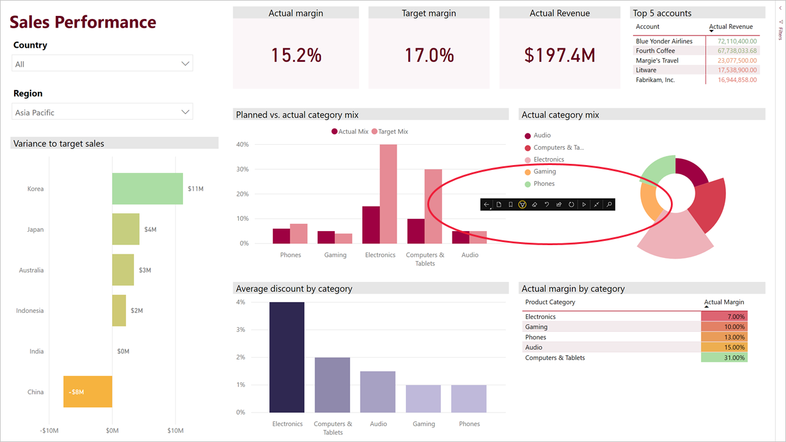

# 在 Windows 10 Surface Hub 设备上使用演示模式查看报表和仪表板
可以使用演示模式在 Windows 10 设备和 Surface Hub 上全屏显示报表和仪表板。 对于在会议中或在办公室内专用投影仪上显示 Power BI，甚至仅将小屏幕上的空间最大化，演示模式都很有用。

在演示模式下：
* 所有“镶边”（如导航栏和菜单栏）都将消失，让你可以更轻松地专注于报表数据。
* 可使用操作工具栏与数据进行交互和控制演示。
* 可以播放在页面、书签或页面和书签之间自动循环的幻灯片。

>[!NOTE]
>我们将于 2021 年 3 月 16 日终止对使用 Windows 10 移动版的手机提供 Power BI 移动应用支持。 [了解详细信息](/legal/powerbi/powerbi-mobile/power-bi-mobile-app-end-of-support-for-windows-phones)

## 使用演示模式
在 Power BI 移动应用中，点击“全屏”图标，转到全屏模式。
 应用镶边将消失，操作工具栏显示在屏幕底部或左右两侧（取决于屏幕大小）。

点击工具栏以执行以下操作：

| 图标 | 操作 |
|------|--------|
||返回上一页。 长按图标会弹出痕迹导航窗口，可导航到报表或仪表板的包含文件夹。|
||翻页以转到演示文稿中报表的另一页。|
||应用书签以显示书签捕获的数据的特定视图。 可以应用个人书签和报表书签。|
||使用 Surface 触控笔在报表页上绘制和批注时，可选择墨迹颜色。|
||可擦除使用 Surface 触控笔在报表页上绘制和批注的墨迹。          |
||重置为默认视图并清除任何筛选器、切片器或在演示期间可能进行的任何其他数据视图更改。|
||与同事共享演示文稿视图的图像。 此图像将包含你在演示过程中使用 Surface 触控笔进行的任何批注。|
||刷新报表。|
||播放幻灯片，隐藏操作栏并开始播放。 可以使用选择器选择在页面、书签或页面和书签之间自动切换。 默认情况下，幻灯片每 30 秒在页面之间自动切换一次。 可以在[“设置”>“选项”](#slideshow-settings)中更改这些设置。 请参阅有关幻灯片的[更多详细信息](#slideshows)|
||退出演示模式。|
||搜索 Power BI 中的其他项目。|

可以分离工具栏并将其拖至屏幕的任何位置。 在使用大屏幕的情况下，有时需要专注于报告中的某个特定区域，并且希望此区域旁边有可用工具，这种时候使用此操作就会很方便。 只需将手指放在工具栏上，并将它滑动到报表画布上即可。

## 幻灯片

可以播放幻灯片来自动遍历演示文稿。 可以将幻灯片设置为在页面、书签或页面和书签之间循环切换。 在幻灯片播放过程中，具有[自动页面刷新](../../create-reports/desktop-automatic-page-refresh.md)的报表页将继续按配置自动刷新，以确保始终显示最新的数据。

在操作工具栏上选择“播放”按钮时，幻灯片将开始放映。 此时将显示一个控制器，可以通过该控制器暂停幻灯片或更改正在播放的内容：页面、书签或页面和书签。

 控制器显示当前显示的视图的名称（页面或书签和页面）。 在上面的图像中，我们看到在名为“销售”的报表中，我们正在浏览“销售业绩”页的“亚太”书签。 

默认情况下，幻灯片仅会以每 30 秒一个页面的速度遍历各页面。 可以更改[幻灯片放映设置](#slideshow-settings)中的默认行为。

### 启动时自动播放幻灯片

可以将 Power BI 移动应用设置为在任何时候启动时都自动开始播放幻灯片。 在创造无需手动干预即可在公共显示屏中运行报表的体验时，此选项非常有用。 有关设置自动播放报表的详细信息，请参阅[幻灯片放映设置](#slideshow-settings)。

### 幻灯片放映设置

默认情况下，幻灯片仅会以每 30 秒一个页面的速度遍历各页面。 可转到“设置”>“选项”来更改此默认行为，如下所示。 还可以启用自动播放并选择要播放的报表。

1. 选择“设置”图标。

1. 打开“选项”选项卡。

1. 如有需要，可更改幻灯片将循环播放的内容（页面、书签或两者兼有）的默认设置，以及幻灯片的转换频率。

1. 如果希望在应用启动时自动开始播放报表，请打开切换并选择“选择报表”。 你将能够搜索有权访问的报表。

## 后续步骤
* [在 Power BI 服务中的全屏模式下显示仪表板和报表](../end-user-focus.md)
* 是否有任何问题? [尝试咨询 Power BI 社区](https://community.powerbi.com/)