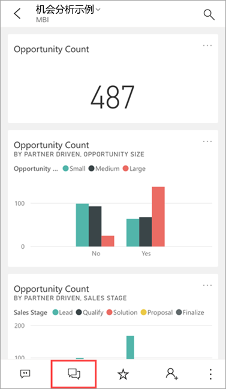
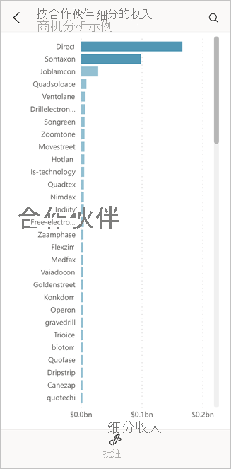
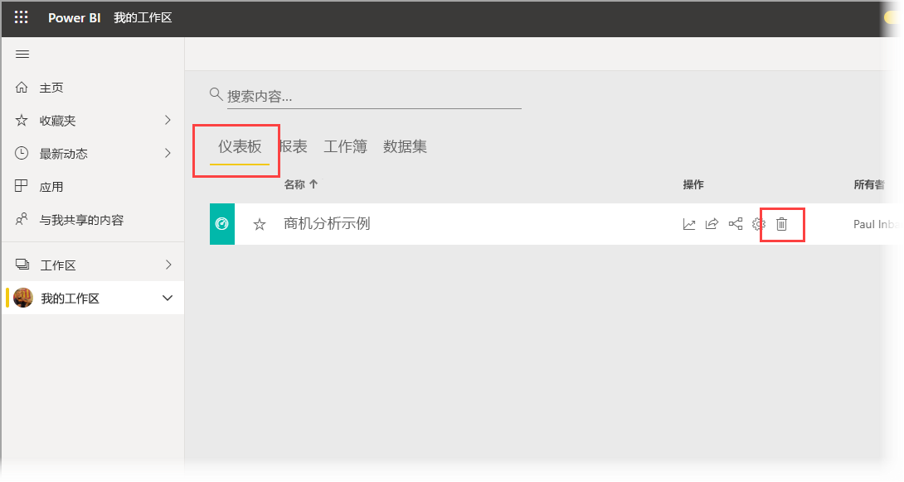
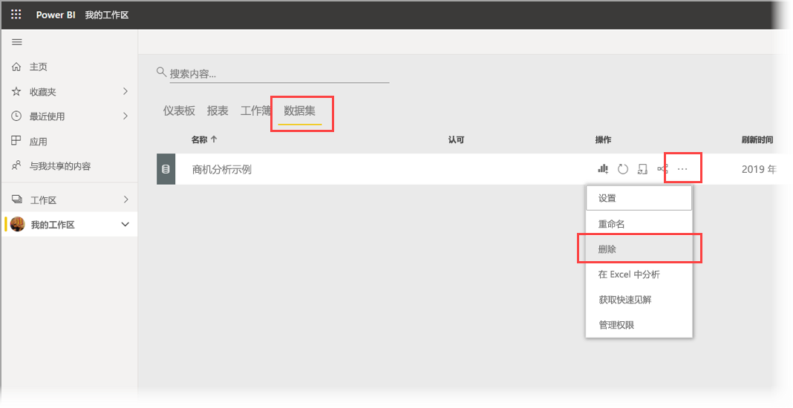

# 教程：在 Power BI iOS 应用中向常见问题虚拟分析师询问关于数据的问题

了解数据的最简单方式是用自己的话咨询有关数据的问题。 在本教程中，在 iPad 或 iPhone 上的 Microsoft Power BI 移动应用中向问答虚拟分析师询问关于示例数据的问题并查看特别推荐的见解。 

适用于：

|  |  |
|:--- |:--- |
| iPhone |iPad |

问答虚拟分析师是可在 [Power BI 服务](https://powerbi.com) 中访问基础常见问答数据的对话 BI 体验。 它会提供数据见解建议，你可以键入或说出自己的问题。

在本教程中，你将执行下列操作：

> [!div class="checklist"]
> * 安装 iOS 版 Power BI 移动应用
> * 下载 Power BI 示例仪表板和报表
> * 查看移动应用建议的特别推荐的见解

## 先决条件

* 注册 Power BI  ：如果未注册 Power BI，请[免费注册](https://app.powerbi.com/signupredirect?pbi_source=web)后再进行操作。
* **安装 iOS 版 Power BI 应用**：从 Apple App Store [下载 iOS 应用](https://apps.apple.com/app/microsoft-power-bi/id929738808)到 iPad、iPhone 或 iPod Touch。 以下版本支持 iOS 版 Power BI 应用：
  * 操作系统为 iOS 11 或更高版本的 iPad。
  * 操作系统为 iOS 11 或更高版本的 iPhone 5 及更高版本。 
  * 操作系统为 iOS 11 或更高版本的 iPod Touch。
* **下载示例数据**：第一步是将“机会分析示例”下载到 Power BI 服务  。 有关如何执行此操作的说明，请参阅[将示例下载到 Power BI 服务中的“我的工作区”](./mobile-apps-download-samples.md)。

完成先决条件并下载示例数据后，即可查看 iOS 设备上的示例。

## 尝试“特别推荐的见解”
1. 在 iPhone 或 iPad 上，打开 Power BI 应用，并使用在浏览器中的 Power BI 服务中所用的 Power BI 帐户凭据进行登录。

2. 在主页导航栏上，点击“工作区”图标  。

    

3. “工作区”页打开后，点击“我的工作区”，然后点击“机会分析示例”仪表板将其打开   。

3. 在“机会分析示例”仪表板上，点击操作菜单上的问答虚拟分析师图标。

    

    问答虚拟分析师推荐了一些可快速上手的见解。

    

3. 点击“特别推荐的见解”  。

4. 问答虚拟分析师推荐了一些见解。 向右滚动，再点击“见解 2”  。

    

   此时，问答虚拟分析师会显示“见解 2”。

    

5. 点击图表，在焦点模式下打开它。

    

6. 点击左上角的箭头，可返回到问答虚拟分析师体验。

## 清理资源

完成教程后，可以删除“机会分析示例”仪表板、报表和数据集。

1. 打开 Power BI 服务（[Power BI 服务](https://app.powerbi.com)）并登录。

2. 在导航窗格中，选择“我的工作区”  。

3. 单击“仪表板”选项卡，然后在“机会分析示例”行中单击垃圾箱。

    

    现在，选择“报表”选项卡，然后执行相同操作。

4. 现在，选择“数据集”选项卡，单击“更多选项”(...)，然后选择“删除”   。

    

## 后续步骤

你已在 iOS 版 Power BI 移动应用中尝试常见问题虚拟助手。 了解有关 Power BI 服务中常见问题的详细信息。
> [!div class="nextstepaction"]
> [Power BI 服务中的问答](../end-user-q-and-a.md)