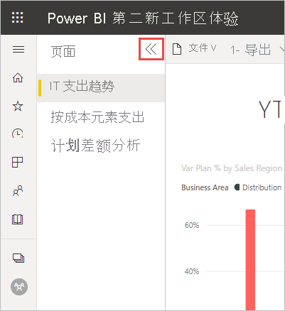

# Power BI 服务的新外观

Power BI 服务 (app.powerbi.com) 的新外观使报表查看和交互更加容易。 新外观更便捷，它基于你对其他 Microsoft 产品的熟悉程度。 在整个 Power BI 服务中，我们通过转换成浅色主题并更新图标使得报表内容成为主要的关注点。 

正在查找有关 Power BI Desktop 中新外观的信息  ？ 请参阅[在 Power BI Desktop 中使用更新后的功能区](../create-reports/desktop-ribbon.md)。

下面概述了新外观中相较原外观的变化。 有关详细信息，请参阅编号部分：

正在寻找特定的操作？ 请参阅[全新外观：操作位于何处？](service-new-look-where-actions.md)

## 1.页的垂直列表 
在“阅读”视图中，报表页名称位于垂直窗格的列表中。 这种存放方式类似于 Word 和 PowerPoint 中的导航，能突出显示报表，使得其不容易被忽略。 可以增加或减小报表区域其余部分的空间：重设垂直窗格的大小，或选择双箭头将其完全关闭。

如果你具有报表的编辑权限，则可以对其进行设置，使页名称位于底部，就像它们在报表“编辑”视图中一样。 有关详细信息，请参阅“更改 Power BI 报表的设置”文章中的[设置“页面”窗格](../create-reports/power-bi-report-settings.md#set-the-pages-pane)。

## 2.简化的操作栏 

更新后的操作栏位于报表顶部，显示了报表使用者最常用、最重要的命令。 导出、共享、在 Teams 中聊天以及订阅变得更容易。 

## 3.报表命令位于何处？

我们没有从旧外观中删除任何功能。 选择“更多选项(…)”以使用其他更高级的命令。 请参阅[全新外观：操作位于何处？](service-new-look-where-actions.md)以了解详细信息。

## 4.新筛选器体验

默认情况下，可以看到报表的新“筛选器”窗格具有新的外观。 当鼠标悬停在视觉对象的“筛选器”图标上时，你可看到影响该视觉对象的所有筛选器和切片器。

## 查看报表详细信息 

在顶部横幅中，可快速查看“上次刷新日期”和“联系信息”等详细信息。  打开菜单可以查看报表的其他详细信息。 甚至可以向报表所有者发送电子邮件。

## 未更改报表编辑模式 

我们保留了与桌面版中类似的创作体验。 新外观更改仅适用于阅读视图。

## 仪表板的“新外观”体验 

仪表板还具有简化的操作栏。 为了实现一致的体验，这与报表和应用类似，但保留了功能上的差异。 下面是仪表板中的操作的演练。
 

## 后续步骤

- [在 Power BI Desktop 中使用更新后的功能区](../create-reports/desktop-ribbon.md)
- [面向使用者的 Power BI](end-user-consumer.md)
