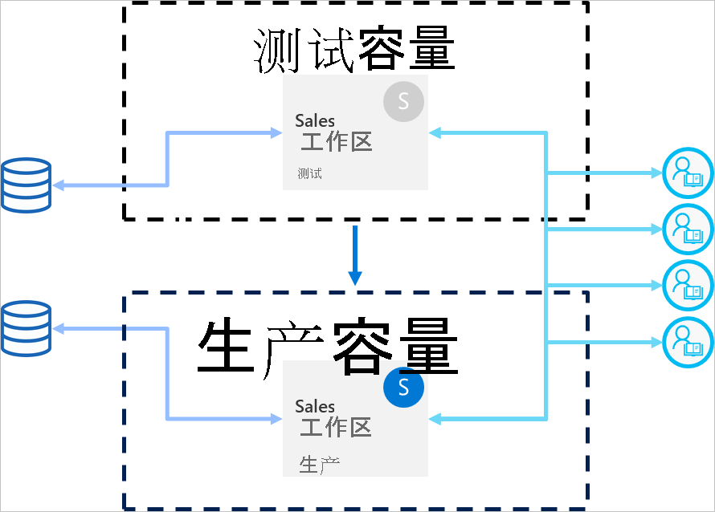

# 部署管道最佳做法

本文为在整个生命周期内管理其内容的 BI 创建者提供了指导。 它侧重于将部署管道用作 BI 内容生命周期管理工具。

本文分为四个部分：

* 内容准备 - 准备进行生命周期管理的内容。

* 开发 - 了解在开发管道开发阶段创建内容的最佳方式。

* 测试 - 了解如何使用部署管道测试阶段来测试环境。

* 生产 - 使内容可供使用时，利用部署管道生产阶段。

## 内容准备

准备内容，以便在其整个生命周期中进行持续管理。 在执行以下任何操作之前，请务必查看本节中的信息：

* 将内容发布到生产环境

* 开始为特定工作区使用部署管道

* 发布工作

### 将每个工作区视作一个完整的分析包

理想情况下，工作区应该包含组织中某个方面（如部门、业务部门、项目或纵向）的完整视图。 这样，不同用户可以更轻松地管理权限，并可以按照计划的时间表来控制整个工作区的内容发布。  

如果使用的是在整个组织中使用的[集中式数据集](../connect-data/service-datasets-across-workspaces.md)，建议创建两种类型的工作区：

* 建模和数据工作区 - 这些工作区将包含所有的集中式数据集

* 报表工作区 - 这些工作区将包含所有从属报表和仪表板

### 规划权限模型

部署管道是一个 Power BI 对象，它有自己的[权限](deployment-pipelines-process.md#permissions)。 此外，管道包含工作区，这些工作区有自己的权限。

为了实现安全且简单的工作流，请计划能访问管道每个部分的人员。 要考虑的一些注意事项包括：

* 谁应该有权访问管道？

* 有权访问管道的用户可以在每个阶段执行哪些操作？

* 谁在测试阶段审核内容？

* 测试阶段审阅者是否应该有权访问管道？

* 谁来监督生产阶段的部署？

* 要分配哪个工作区？

* 要把你的工作区分配到哪个阶段？

* 是否需要对所分配工作区的权限进行修改？

### 将不同的阶段连接到不同的数据库

生产数据库应始终稳定且可用。 最好不要用 BI 创建者为其开发或测试数据集生成的查询重载生产数据库。 生成单独的数据库以进行开发和测试。 这有助于保护生产数据，而且不会使用整个生产数据量来重载开发数据库，这会降低运行速度。

>[!NOTE]
>如果组织使用的是[共享的集中式数据集](../connect-data/service-datasets-share.md)，则可以跳过此建议。

### 在模型中使用参数

由于不能在 Power BI 服务中编辑数据集数据源，建议使用[参数](/power-query/power-query-query-parameters)来存储连接详细信息，如实例名和数据库名，而不是使用静态连接字符串。 这样，你便可以在后续阶段通过 Power BI 服务 Web 门户管理连接，或者[使用 API](/rest/api/power-bi/datasets/updateparametersingroup)。

在部署管道中，可以配置参数规则，以便为开发、测试和生产阶段设置特定值。

如果不为连接字符串使用参数，则可以定义数据源规则，来为给定的数据集指定一个连接字符串。 但是，在部署管道中，并不是所有数据源都支持这一点。 要验证可为数据源配置规则，请参阅[数据集规则限制](deployment-pipelines-get-started.md#dataset-rule-limitations)。

参数还有其他的用途，例如对查询、筛选器和报表中显示的文本进行更改。

## Development

本部分提供有关如何处理部署管道开发阶段的指导。

### 使用 Power BI Desktop 编辑报表和数据集

考虑将 Power BI Desktop 作为本地开发环境。 Power BI Desktop 允许用户试用、浏览和查看报表和数据集的更新。 完成上述操作后，可以将新版本上传到开发阶段。 由于以下原因，建议在 Desktop 中编辑 .pbix 文件（而不是在 Power BI 服务中编辑）：

* 如果所有的修改都在同一个工具上进行，则可以更轻松地与其他创建者一起对同一个 .pbix 文件开展合作。

 * 进行在线更改，下载 .pbix 文件，然后再次上传，创建报表和数据集副本。

* 可以使用版本控制来使 .pbix 文件保持最新状态。

### .pbix 文件的版本控制

如果要管理报表和数据集的版本历史记录，请使用 [Power BI 与 OneDrive 的自动同步](../collaborate-share/service-connect-to-files-in-app-workspace-onedrive-for-business.md)。 这将使文件更新为最新版本。 它还可以让你在需要时检索旧版本。

>[!NOTE]
>仅对部署管道开发阶段中的 .pbix 文件使用与 OneDrive（或任何其他存储库）的自动同步。 不要将 .pbix 文件同步到部署管道测试和生产阶段。 这将会造成跨管道部署内容的问题。

### 将建模开发与报表和仪表板开发分离开来

对于企业级部署，建议将数据集开发与报表和仪表盘的开发分离开来。 若要仅对报表或数据集进行更改，请使用部署管道选择性部署选项。  

这种方法应该从 Power BI Desktop 开始，方法是为数据集和报表创建一个单独的 .pbix 文件。 例如，可以创建一个数据集 .pbix 文件，并将其上传到开发阶段。 稍后，报表作者可以只为报表创建一个新的 .pbix，并使用实时连接[将其连接到已发布的数据集](../connect-data/service-datasets-discover-across-workspaces.md)。 该技术允许不同的创建者分别进行建模和可视化，并独立将其部署到生产环境中。

通过[共享数据集](../connect-data/service-datasets-share.md)，还可以跨工作区使用此方法。

### 使用 XMLA 读/写功能管理模型

将建模开发与报表和仪表盘开发分离开来，以便可以使用高级功能，如源代码管理、合并差异更改和自动化流程等。 这些更改应该在开发阶段完成，这样才能将最终确定的内容部署到测试和生产阶段。 这样，在将更改部署到生产阶段之前，它们会和其他依赖项一起经历一个统一的过程。

可以通过在外部工作区中管理[共享数据集](../connect-data/service-datasets-share.md)，使用 XMLA r/w 功能，将建模开发与可视化效果分开。 共享数据集可以连接到在多个管道中管理的不同工作区中的多个报表。

## 测试

本部分提供有关如何处理部署管道测试阶段的指导。

### 模拟生产环境

除了验证新报表或仪表板看起来没有任何问题之外，从最终用户的角度查看它们的表现也很重要。 部署管道测试阶段允许你模拟真实的生产环境进行测试。

确保在测试环境中解决以下三个因素：

* 数据量

* 使用量

* 类似于生产环境的容量

测试时，可以使用与生产阶段相同的容量。 然而，这可能会使生产在负载测试期间不稳定。 为避免生产不稳定，使用资源中与生产容量类似的另一个容量，进行测试。 为了避免产生额外的费用，可以使用 [Azure A 容量](../developer/embedded/azure-pbie-create-capacity.md)来仅支付测试时间的费用。

### 使用包含实际数据源的数据集规则

如果使用测试阶段来模拟实际数据使用情况，建议把开发和测试数据源分开。 开发数据库应相对较小，测试数据库应尽量与生产数据库相似。 在测试阶段使用[数据源规则](deployment-pipelines-get-started.md#step-4---create-dataset-rules)切换数据源。

控制从数据源中导入的数据量，如果你在测试阶段使用的是生产数据源，这会非常有用。 为此，在 Power BI Desktop 中为数据源查询添加一个参数。 使用参数规则来控制导入的数据量，或编辑参数的值。
如果不想重载容量，也可以使用此方法。

### 测量性能

在模拟生产阶段时，[检查报表负载和交互](../guidance/monitor-report-performance.md)，找出你所做的修改是否影响到它们。

还需要[监视容量中的负载](../admin/service-admin-premium-monitor-capacity.md)，以便可以在进入生产环境之前捕获极端负载。  

>[!NOTE]
>建议在将更新部署到生产阶段后，再次监视容量负载。

### 检查相关项

相关时间可能会受到数据集或报表变化的影响。 在测试过程中，请确认所做更改不会影响或破坏现有项目的性能，这可能取决于更新的项目。

可以使用工作区[沿袭视图](../collaborate-share/service-data-lineage.md)轻松找到相关的项目。

### 测试应用

如果要通过应用向最终用户发布内容，请在应用的新版本投入生产之前，对新版本进行审核。 由于每个部署管道阶段都有自己的工作区，因此，可以轻松地发布和更新应用，以用于开发和测试阶段。 这将使你能够从最终用户的角度来测试应用。

>[!IMPORTANT]
>部署过程不包括更新应用内容或设置。 若要应用对内容或设置的更改，需要在所需的管道阶段手动更新应用。

## 生产

本部分提供有关部署管道生产阶段的指导。

### 管理可部署到生产环境的人员

由于应谨慎处理到生产环境的部署，因此，最好让特定人员管理此敏感操作。 但是，你可能希望特定工作区的所有 BI 创建者都可以访问管道。 这可以使用生产[工作区权限](deployment-pipelines-process.md#permissions)进行管理。  

若要在两个阶段之间部署内容，用户需要对这两个阶段具有成员或管理员权限。 确保只有要部署到生产环境中的人员才具有生产工作区权限。 其他用户可以有生产工作区参与者或查看者的角色。 他们将能够从管道内看到内容，但无法进行部署。

此外，应该限制对管道的访问权限，只对属于内容创建过程一部分的用户启用管道权限。

### 设置规则，确保生产阶段的可用性

[数据集规则](deployment-pipelines-get-started.md#step-4---create-dataset-rules)是确保生产中的数据始终连接在一起并可供用户使用的强大方式。 应用数据集规则后，就可以在保证最终用户不受干扰地看到相关信息的情况下运行部署。

确保你为数据源和数据集中定义的参数设置生产数据集规则。

### 更新生产应用

在管道中部署会更新工作区内容，但不会自动更新相关的应用。 如果使用的是内容分发应用，在部署到生产后不要忘记更新应用，这样最终用户就可以立即使用最新版本。  

### 快速修复内容

如果生产环境中出现需要快速修复的 Bug，请不要将新的 .pbix 版本直接上传到生产阶段，也不要在 Power BI 服务中进行在线修改。 在测试和开发阶段已经有内容的情况下，反向部署到这两个阶段是不可能的。 此外，不先测试就部署修复程序并不是一种好的做法。 因此，处理这个问题的正确方法是在开发阶段实现修补程序，并将其推送到部署管道的其他阶段。 这样，可以在将修补程序部署到生产环境之前，检查修复程序是否有效。 跨管道部署，只需几分钟时间。

## 后续步骤

>[!div class="nextstepaction"]
>[部署管道简介](deployment-pipelines-overview.md)

>[!div class="nextstepaction"]
>[开始使用部署管道](deployment-pipelines-get-started.md)

>[!div class="nextstepaction"]
>[了解部署管道过程](deployment-pipelines-process.md)

>[!div class="nextstepaction"]
>[解决部署管道问题](deployment-pipelines-troubleshooting.md)